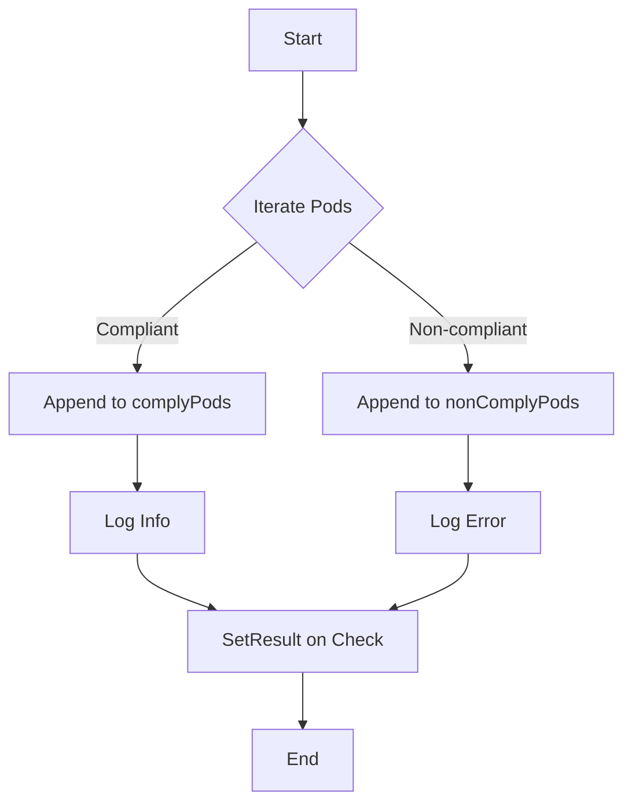

test1337UIDs`

| | |
|-|-|
| **Package** | `accesscontrol` (tests) |
| **File** | `suite.go:981` |
| **Signature** | `func test1337UIDs(c *checksdb.Check, env *provider.TestEnvironment)` |

### Purpose
`test1337UIDs` validates that every pod in the cluster is running with a `securityContext.runAsUser` value of **1337**.  
It gathers all pods from the provided `TestEnvironment`, splits them into compliant and non‑compliant lists, creates a detailed report for each pod, and sets the final result on the supplied compliance check.

### Inputs
| Parameter | Type | Description |
|-----------|------|-------------|
| `c` | `*checksdb.Check` | The compliance check instance that will receive the test outcome. |
| `env` | `*provider.TestEnvironment` | Provides access to cluster state, notably the list of all pods (`env.Pods`) and helper functions for logging and error handling. |

### Output / Side‑Effects
- **Logging**: Calls `LogInfo` and `LogError` to emit informational and error messages during execution.
- **Report Generation**: For each pod it creates a `PodReportObject` (via `NewPodReportObject`) containing the pod’s name, namespace, and compliance status.
- **Check Result**: Invokes `c.SetResult()` once all pods have been processed. The result indicates pass/fail based on whether any non‑compliant pods were found.

### Key Dependencies
| Dependency | Role |
|------------|------|
| `IsRunAsUserID` | Checks a pod’s security context to see if the run‑as user ID equals 1337. |
| `NewPodReportObject` | Constructs a report entry for a pod. |
| `c.SetResult` | Records the final pass/fail status of the check. |
| `env.Pods` (implied) | Collection of all pods inspected during the test. |

### Workflow
1. **Log Start** – emits an informational log indicating that UID compliance checking has begun.
2. **Iterate Pods** – loops over every pod in `env.Pods`.
3. **Compliance Check** – uses `IsRunAsUserID` to determine if the pod’s `runAsUser` equals 1337.
4. **Report Construction** – appends a compliant or non‑compliant `PodReportObject` to the appropriate slice (`complyPods`, `nonComplyPods`).
5. **Log Errors** – if any error occurs while creating a report object, logs it via `LogError`.
6. **Set Result** – after processing all pods, calls `c.SetResult()` with aggregated data.

### Placement in Package
Within the `accesscontrol` test suite, `test1337UIDs` is one of several pod‑level compliance checks that enforce Kubernetes security best practices. It operates on a shared `TestEnvironment`, allowing it to be run as part of an automated regression or CI pipeline without modifying cluster state.

### Suggested Mermaid Diagram

---
