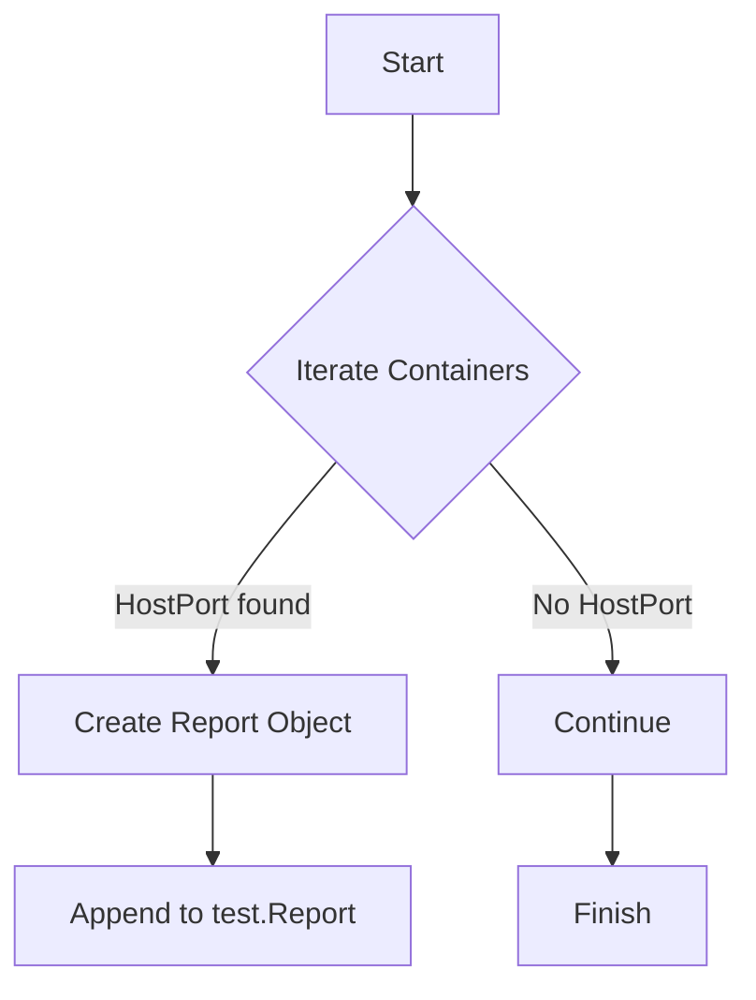

testContainerHostPort`

| Aspect | Detail |
|--------|--------|
| **Package** | `accesscontrol` – part of the Certsuite test suite that validates Kubernetes access‑control policies. |
| **Signature** | `func(test *checksdb.Check, env *provider.TestEnvironment)` |
| **Purpose** | Verify that none of the containers running in the tested cluster are configured with privileged host‑port mappings (i.e., they do not expose ports on the node’s network stack). |

### Inputs

| Parameter | Type | Role |
|-----------|------|------|
| `test` | `*checksdb.Check` | Holds metadata for the current test run (ID, name, etc.). The function populates this object with a report of any violations. |
| `env` | `*provider.TestEnvironment` | Provides access to the test environment, including container lists and helper functions. |

### Output

The function does **not** return a value; it mutates the supplied `test` object by appending one or more `ContainerReportObject`s that describe any discovered host‑port configurations.

### Key Dependencies & Calls

| Called Function | Responsibility |
|-----------------|----------------|
| `LogInfo`, `LogError` | Emit debug information during execution. |
| `NewContainerReportObject()` | Creates a structured report entry for each container. |
| `SetType()`, `AddField()`, `SetResult()` | Populate the report with metadata (e.g., container name, port number, result status). |

The function also uses standard library helpers (`append`, `Itoa`, type conversions) to format data.

### Algorithm Overview

1. **Iterate Containers**  
   Walk through all containers returned by `env.GetContainers()` (the actual call is hidden in the test harness).

2. **Check Host Port Configuration**  
   For each container, inspect its port mappings. If a mapping uses `HostPort` instead of `ContainerPort`, it indicates that the container exposes a host‑level port.

3. **Report Violations**  
   - Create a new report object for each offending container.  
   - Add relevant fields (`containerName`, `hostPort`) and set the result to `"FAIL"`.  
   - Append this object to `test.Report`.

4. **Log Summary**  
   Emit informational logs indicating how many containers were inspected and whether any violations were found.

### Side Effects

- Mutates the supplied `*checksdb.Check` by adding report entries.
- Emits log output via the test harness; no external state is changed.

### Integration in the Package

`testContainerHostPort` is one of several *access‑control* tests that run during Certsuite’s evaluation phase. It is invoked automatically from a higher‑level suite runner (e.g., `beforeEachFn`). The results are aggregated into a comprehensive report used to surface security posture gaps in Kubernetes workloads.

---

#### Suggested Mermaid Diagram

This diagram illustrates the decision path taken when a container is inspected.
