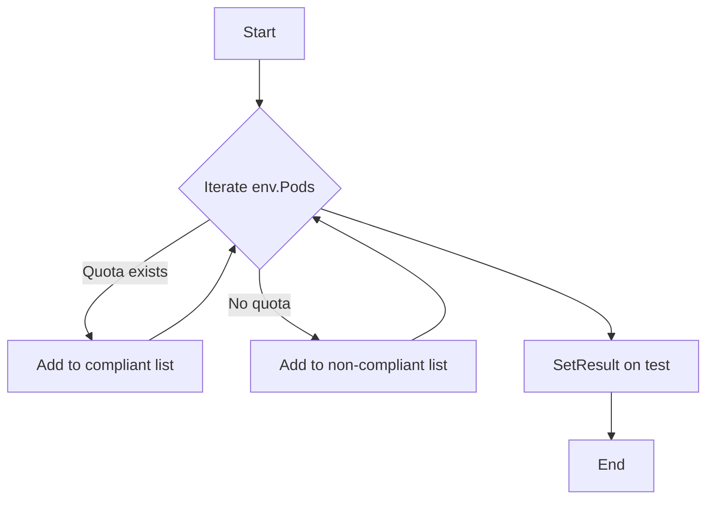

testNamespaceResourceQuota`

| | |
|---|---|
| **Package** | `accesscontrol` (`github.com/redhat-best-practices-for-k8s/certsuite/tests/accesscontrol`) |
| **Visibility** | Unexported – used only within the test suite. |
| **Signature** | `func(test *checksdb.Check, env *provider.TestEnvironment)` |

### Purpose

`testNamespaceResourceQuota` validates that every Pod in the cluster is scheduled into a namespace that has an active `ResourceQuota`.  
The function scans the list of Pods that were collected during the test run, classifies them as **compliant** or **non‑compliant**, and records a compliance report for each. The result of the overall check (`Pass` / `Fail`) is then set on the supplied `checksdb.Check`.

### Parameters

| Name | Type | Description |
|------|------|-------------|
| `test` | `*checksdb.Check` | Holds metadata about the current compliance test (ID, name, etc.) and provides methods for logging and setting results. |
| `env` | `*provider.TestEnvironment` | Contains runtime information such as the list of Pods (`env.Pods`) that have been retrieved from the cluster during the test execution. |

### Workflow

1. **Logging** – A short informational message is logged to indicate that the resource‑quota check has started.
2. **Classification**  
   *Iterate over `env.Pods`* and for each Pod:
   - Determine whether its namespace has a `ResourceQuota`.  
     (The logic for this lookup lives elsewhere; here we simply call an auxiliary function or use a pre‑computed map.)
   - If the namespace has a quota, create a *compliant* report object via `NewPodReportObject` and append it to the compliant slice.
   - Otherwise create a *non‑compliant* report object and append it to the non‑compliant slice.
3. **Result Aggregation** –  
   After iterating all Pods, the function calls `SetResult` on `test`.  
   The result status is set based on whether any non‑compliant objects were found:
   * If the non‑compliant list is empty → `Pass`.
   * Otherwise → `Fail`, and the non‑compliant objects are attached to the report.
4. **Error Handling** – Any errors that arise during classification or result setting are logged with `LogError`; they do not abort the test.

### Dependencies

| Function | Role |
|----------|------|
| `LogInfo` / `LogError` | Structured logging for diagnostics. |
| `NewPodReportObject` | Builds a report entry for each Pod, including fields such as name, namespace, and compliance status. |
| `SetResult` | Persists the final outcome (`Pass`/`Fail`) on the `checksdb.Check`. |

### Side Effects

* The function mutates the supplied `checksdb.Check` by adding detailed reports and setting its result field.
* It also logs information to the test harness; no external state is altered.

### How it fits the package

In the *accesscontrol* test suite, each compliance check follows a similar pattern: gather objects from the cluster (`env.Pods`, `env.Namespaces`, etc.), evaluate them against a policy, log diagnostics, and set a pass/fail result.  
`testNamespaceResourceQuota` is one such check that focuses on namespace‑level resource limits, ensuring workloads do not over‑consume resources without explicit quotas.

> **Mermaid flow** (optional visual aid)

---
