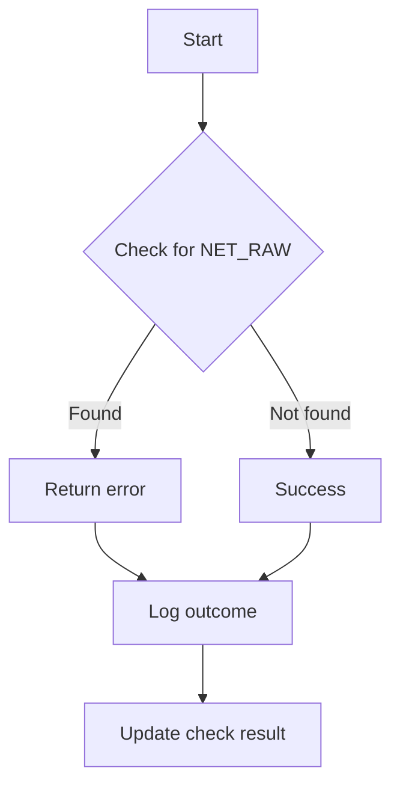

testNetRawCapability`

| Item | Details |
|------|---------|
| **Package** | `accesscontrol` (`github.com/redhat-best-practices-for-k8s/certsuite/tests/accesscontrol`) |
| **Exported** | No – internal test helper |
| **Signature** | `func(*checksdb.Check, *provider.TestEnvironment)()` |

### Purpose
`testNetRawCapability` is a helper used by the access‑control test suite to verify that a container does **not** possess the Linux *NET_RAW* capability.  
The function runs inside the context of a single test case (represented by `*checksdb.Check`) and uses the current test environment (`*provider.TestEnvironment`) for logging and result reporting.

### Inputs
| Parameter | Type | Role |
|-----------|------|------|
| `check` | `*checksdb.Check` | Holds metadata about the test (e.g., ID, name) that will be updated with the outcome. |
| `env`   | `*provider.TestEnvironment` | Provides access to the test runner’s logger and result‑setting helpers. |

### Key Dependencies
| Dependency | Usage |
|------------|-------|
| `GetLogger()` | Obtains a structured logger tied to the current check, used for debugging output. |
| `SetResult(check, err)` | Records the outcome of the capability check (success or error) in the test database. |
| `checkForbiddenCapability("NET_RAW")` | The core logic that inspects the pod/container runtime configuration and returns an error if the NET_RAW capability is present. |

### Side‑Effects
* Logs diagnostic information via the logger from `env`.
* Updates the provided `check` record with a pass/fail result through `SetResult`.

### Flow

### Integration in the Test Suite
`testNetRawCapability` is invoked by higher‑level test functions (e.g., `TestCapabilities`) to assert that pods created during a test do not inadvertently gain privileged network capabilities. It fits into the package’s overall strategy of validating Kubernetes security contexts against Red Hat best practices.

--- 

*If any referenced symbols (`checkForbiddenCapability`, `GetLogger`, `SetResult`) are missing from this view, they belong to other files in the same package and provide the actual capability inspection, logging, and result‑setting logic.*
