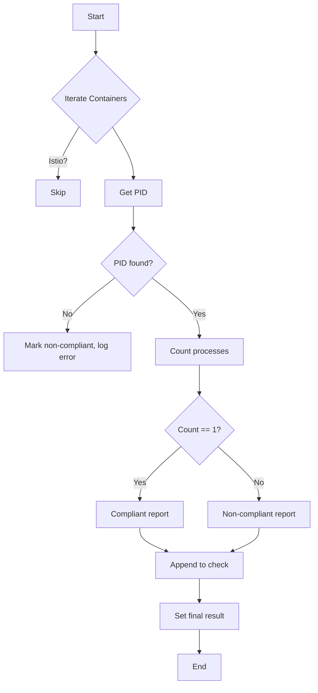

testOneProcessPerContainer`

| Feature | Detail |
|---------|--------|
| **Location** | `github.com/redhat-best-practices-for-k8s/certsuite/tests/accesscontrol/suite.go:768` |
| **Visibility** | unexported (package‑private) |
| **Signature** | `func (*checksdb.Check, *provider.TestEnvironment)` |

### Purpose
The function verifies that every container in the cluster runs **exactly one process**, excluding Istio proxy containers.  
It scans all running containers, counts processes per PID namespace, and records compliant/non‑compliant results in a check report.

### Parameters
| Name | Type | Description |
|------|------|-------------|
| `chk` | `*checksdb.Check` | The compliance check object to populate with findings and final result. |
| `env` | `*provider.TestEnvironment` | Provides access to the test environment, e.g., client holders for API calls. |

### Workflow
1. **Logging** – Starts with an informational log.
2. **Container enumeration**  
   * Retrieves all containers from the current namespace via `GetClientsHolder(env).Containers()`.
3. **Istio proxy filtering** – Containers identified as Istio proxies (`IsIstioProxy`) are skipped.
4. **Process counting per container**  
   * For each remaining container:
     1. Resolve its PID in the host namespace using `GetPidFromContainer`.
     2. Count processes inside that PID’s namespace with `getNbOfProcessesInPidNamespace`.
     3. Create a `ContainerReportObject` indicating whether the count equals one.
5. **Result aggregation** –  
   * If any container has more than one process, the check result is set to **NonCompliant**; otherwise **Compliant**.
6. **Error handling** – All errors during lookup or counting are logged and cause the container to be marked non‑compliant.

### Key Dependencies
| Dependency | Role |
|------------|------|
| `LogInfo`, `LogError` | Structured logging of progress, successes, and failures. |
| `IsIstioProxy` | Excludes Istio sidecars from analysis. |
| `GetPidFromContainer` | Maps container name to host PID. |
| `getNbOfProcessesInPidNamespace` | Counts processes in a given PID namespace. |
| `NewContainerReportObject`, `Error` | Builds per‑container report entries and attaches them to the check. |
| `SetResult` | Finalizes the compliance status on the `Check`. |

### Side Effects
* **No state mutation** – The function only reads from clients and writes results to the provided `Check`.
* **Logging side effects** – Emits informational or error logs during execution.

### Package Context
Within the *accesscontrol* test suite, this helper is invoked as part of a larger compliance check that ensures pod isolation. It complements other functions that validate namespace restrictions, RBAC rules, and network policies by guaranteeing that containers do not inadvertently run multiple processes, which could violate least‑privilege principles.

### Suggested Mermaid Diagram

This function is a focused, read‑only analysis routine that bridges container runtime introspection with compliance reporting.
