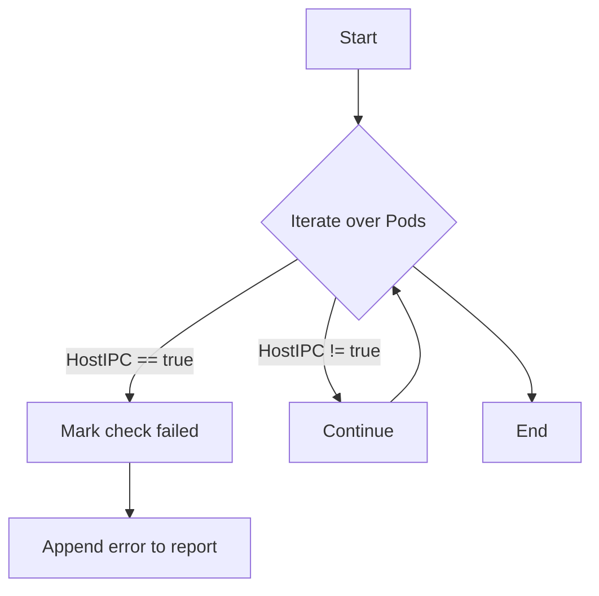

testPodHostIPC`

| Item | Details |
|------|---------|
| **Package** | `accesscontrol` (github.com/redhat-best-practices-for-k8s/certsuite/tests/accesscontrol) |
| **File** | `suite.go:488` |
| **Visibility** | Unexported (`testPodHostIPC`) |
| **Signature** | `func(*checksdb.Check, *provider.TestEnvironment)` |
| **Purpose** | Validate that a Pod’s `hostIPC` field is not set to `true`. The check ensures that the pod does **not** share its IPC namespace with the host, which would be a security violation. |

## Parameters

| Name | Type | Description |
|------|------|-------------|
| `c` | `*checksdb.Check` | The test result object that will receive status updates (`SetResult`) and metadata (report objects). |
| `env` | `*provider.TestEnvironment` | Contextual information about the cluster, such as a list of Pods to inspect. This is provided by the test harness. |

## Behaviour

1. **Logging**  
   - At start: `LogInfo("Starting pod hostIPC test")`.  
   - After completion: `LogInfo("Pod hostIPC test completed")`.

2. **Pod Iteration**  
   The function iterates over all Pods in the environment (`env.Pods`). For each Pod:
   - A report object is created with `NewPodReportObject(pod, c)`.
   - If `pod.Spec.HostIPC` is `true`, it records a failure:
     * `SetResult(false)` on the check.
     * Appends an error message to the report via `append(report.ErrorMessages, ...)`.

3. **Success Path**  
   If no Pod has `HostIPC: true`, the check remains successful (`c.SetResult(true)`) and no errors are added.

4. **Side‑Effects**  
   - The function mutates the passed `*checksdb.Check` by setting its result status and adding report objects.
   - It logs informational messages via the test harness logging functions.
   - No external state is modified beyond the check object.

## Dependencies

| Dependency | Role |
|------------|------|
| `LogInfo`, `LogError` | Logging utilities from the test framework. |
| `append` | Standard Go slice operation to add error messages. |
| `NewPodReportObject` | Helper that creates a structured report for a single Pod. |
| `SetResult` | Marks the overall outcome of the check (`true` or `false`). |

## Integration in the Test Suite

- **Registration**: The test is registered during suite initialization (likely via `beforeEachFn`) so it runs as part of the automated access‑control checks.
- **Scope**: It belongs to the *Pod* level tests, focusing on namespace isolation rules.
- **Interaction with other tests**:  
  - It shares the same `checksdb.Check` object used by other Pod checks (e.g., `testPodHostNetwork`, `testPodSecurityContext`).  
  - The report objects produced here are aggregated into a comprehensive test report that can be consumed by CI pipelines or dashboards.

## Mermaid Flow Diagram (Suggested)

This diagram visualizes the decision path for each Pod: if `hostIPC` is set, the test fails; otherwise it proceeds until all Pods are checked.
