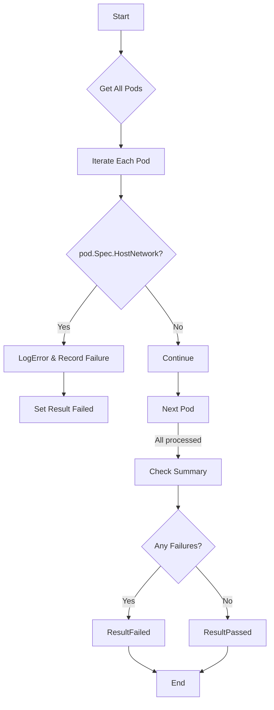

testPodHostNetwork`

**Package:** `accesscontrol` – `suite.go`

> **Purpose**  
> Verify that no pod in the cluster is configured with the *host network* (`hostNetwork: true`) option, which would expose pod containers directly to the host’s networking stack and bypass normal Kubernetes isolation.

---

## Signature

```go
func testPodHostNetwork(check *checksdb.Check, env *provider.TestEnvironment)
```

| Parameter | Type | Description |
|-----------|------|-------------|
| `check`   | `*checksdb.Check` | The check record that will be updated with the result of this validation. |
| `env`     | `*provider.TestEnvironment` | Test harness containing the current Kubernetes client, logger, and helper functions. |

---

## Workflow

1. **Logging start**  
   ```go
   LogInfo("Checking for hostNetwork usage on all pods")
   ```

2. **Iterate over every pod in the cluster**  
   - The function calls `env.Clientset.CoreV1().Pods("").List(ctx, metav1.ListOptions{})` to fetch *all* pods.
   - For each pod:
     1. Create a `PodReportObject` (via `NewPodReportObject`) – this holds metadata such as namespace, name, and the check’s ID.
     2. Inspect the pod spec:  
        ```go
        if pod.Spec.HostNetwork {
            // record failure
        }
        ```
     3. If `HostNetwork` is set:
        - Log an error message (`LogError`) describing the offending pod.
        - Append the `PodReportObject` to a slice that will be stored in the check’s `Results`.
        - Call `SetResult(check, checksdb.ResultFailed)` to mark the entire check as failed.

3. **If no violations are found**  
   - Log success (`LogInfo`) and set the check result to passed:
     ```go
     SetResult(check, checksdb.ResultPassed)
     ```

---

## Key Dependencies

| Dependency | Role |
|------------|------|
| `checksdb.Check` | Holds metadata about the test (ID, description) and a slice of results (`Results []interface{}`). |
| `provider.TestEnvironment` | Supplies Kubernetes client, logger, and context. |
| `NewPodReportObject` | Helper to create a structured report entry for each pod that fails the check. |
| `SetResult` | Utility that updates the check’s status (passed/failed) based on findings. |
| Logging helpers (`LogInfo`, `LogError`) | Emit human‑readable diagnostics during test execution. |

---

## Side Effects

* The function mutates the supplied `check` object:
  * Adds one or more entries to `check.Results`.
  * Sets `check.Status` to either `ResultPassed` or `ResultFailed`.
* No state is written back to Kubernetes; it only reads pod data.

---

## How It Fits the Package

The `accesscontrol` test suite runs a series of security checks against a running cluster.  
`testPodHostNetwork` is one of those checks, ensuring that pods do not escape the network namespace boundary. It is typically invoked by a higher‑level orchestrator (e.g., `RunAllChecks`) which iterates over all checks defined in the suite and aggregates their results.

---

### Mermaid Diagram (Suggested)



This diagram captures the linear control flow of `testPodHostNetwork` and its interaction with the check object.
