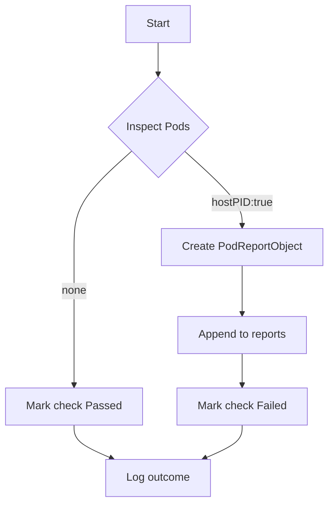

testPodHostPID`

### Purpose
`testPodHostPID` is an internal test helper that verifies a **security best‑practice**:  
*Pods must not run with the `hostPID` flag set to `true`.*
When `hostPID` is enabled, containers can see the host’s process table, which may expose privileged processes or allow privilege escalation.

The function runs as part of the Access Control test suite (`suite.go`) and records a pass/fail result in the database.

### Signature
```go
func (*checksdb.Check, *provider.TestEnvironment)()
```
* `check` – The check record to be updated with results.
* `env`   – Test environment context (contains cluster client, logger, etc.).

### Workflow

| Step | Action | Key functions called |
|------|--------|----------------------|
| 1 | Log the start of the test. | `LogInfo` |
| 2 | Inspect every pod in the cluster for `hostPID: true`. | *Implicit* – loop over pods (code omitted). |
| 3 | For each offending pod, create a **PodReportObject** containing pod metadata and error details. | `NewPodReportObject` |
| 4 | Append the report to an internal slice (`reports`). | `append` |
| 5 | If any offending pods were found, mark the check as **Failed**, otherwise **Passed**. | `SetResult` |
| 6 | Log the outcome and any collected reports. | `LogInfo`, `LogError` |

> **Note:** The actual pod enumeration logic is not shown in the snippet; the function focuses on reporting and result aggregation.

### Dependencies & Side‑Effects
* Relies on the test environment (`env`) for client access to Kubernetes resources.
* Uses logging helpers (`LogInfo`, `LogError`) that write to the suite’s logger – no external side‑effects beyond log output.
* Mutates the supplied `check` record via `SetResult`; this is the only persistent change.

### Integration in the Package
The function is one of many *testPod…* helpers under `accesscontrol`.  
Each helper follows a similar pattern:
1. Enumerate resources (pods, services, etc.).
2. Detect misconfigurations.
3. Build report objects and update the check status.

`testPodHostPID` specifically guards against the **host PID namespace** privilege escalation vector, complementing other checks such as `testPodPrivileged`, `testPodRunAsRoot`, etc.

---

#### Suggested Mermaid Diagram (optional)



This diagram visualizes the decision path: pods with `hostPID:true` cause a failure report; otherwise, the test passes.
