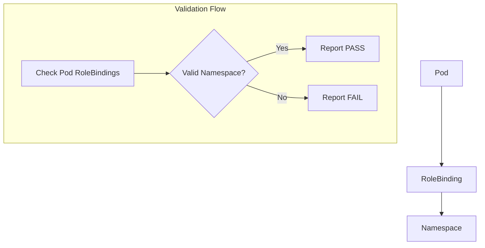

testPodRoleBindings`

**File:** `suite.go` – line 581  
**Package:** `accesscontrol` (internal test helper)  

---

### Purpose
`testPodRoleBindings` verifies that a running pod is attached to a *valid* Kubernetes RoleBinding and that the binding does **not** reference a namespace outside of the CNF‑specific set.  
The check is executed as part of CertSuite’s access‑control tests.

### Signature
```go
func testPodRoleBindings(check *checksdb.Check, env *provider.TestEnvironment)
```
| Parameter | Type | Description |
|-----------|------|-------------|
| `check`   | `*checksdb.Check` | Holds the current check context (results, logs, etc.). |
| `env`     | `*provider.TestEnvironment` | Provides access to the Kubernetes API and test‑environment metadata. |

### Inputs
- **Kubernetes cluster state** – the function queries the pod’s RoleBinding via the client in `env`.
- **Test environment configuration** – contains namespaces, CNF namespace list, etc.

### Outputs / Side‑effects
| Action | Effect |
|--------|--------|
| Calls to `check.LogInfo` / `LogError` | Emits diagnostic messages that are captured by CertSuite’s reporting system. |
| Creation of `NewPodReportObject` instances | Builds structured report entries for each namespace examined. |
| Setting fields (`SetType`, `AddField`) on report objects | Populates the report with details such as namespace, binding name, and validation status. |
| Calls to `check.SetResult` | Marks the overall check as PASS or FAIL in the database. |

The function does **not** modify any cluster resources; it is read‑only.

### Key Dependencies
- **`checksdb.Check`** – repository for test results.
- **`provider.TestEnvironment`** – provides a Kubernetes client and environment context.
- **Report helpers** (`NewPodReportObject`, `SetType`, `AddField`) – build JSON‑serializable reports.
- **Logging helpers** (`LogInfo`, `LogError`) – standard CertSuite logging.

### How it fits the package
Within the `accesscontrol` test suite, this function is registered as a sub‑test for each pod that must be evaluated. It complements other checks such as:
- `testPodServiceAccount` (verifying service account usage)
- `testContainerImagePullSecrets` (ensuring image pull secrets are correct)

Together they enforce CNF‑specific RBAC rules across the cluster.

---

#### Suggested Mermaid diagram



This diagram visualises the key data flow: a pod → role binding → namespace, with the check evaluating whether the namespace is allowed.
