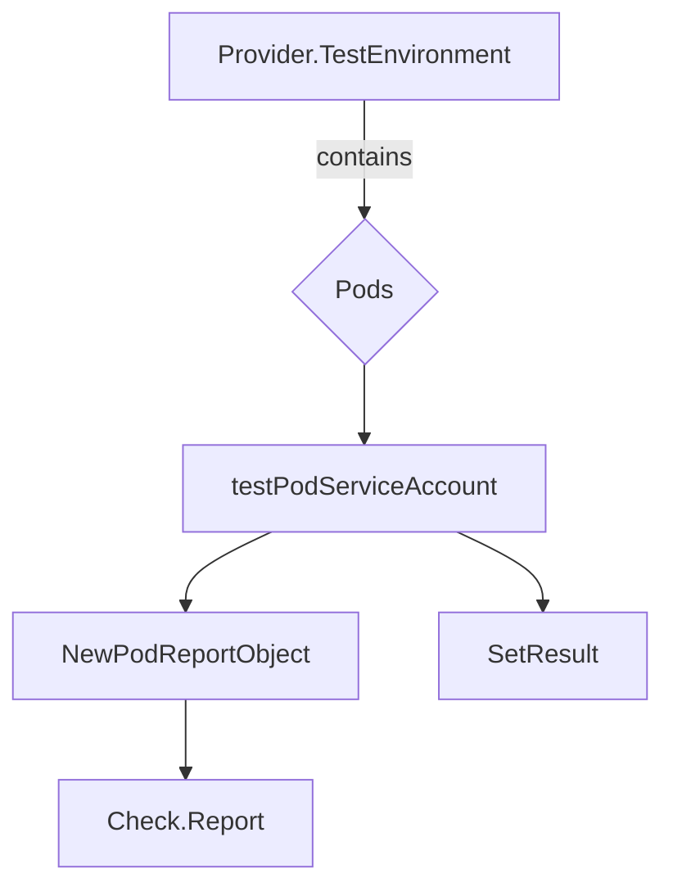

testPodServiceAccount`

```go
func (*checksdb.Check, *provider.TestEnvironment)()
```

| Aspect | Details |
|--------|---------|
| **Purpose** | Validates that each pod in the test environment is running with a service account that exists and is allowed to perform its intended actions. It checks the `serviceAccountName` field of every container spec against the list of known good service accounts. |
| **Inputs** | * A `*checksdb.Check` – the check definition (metadata, result placeholder). <br>* A `*provider.TestEnvironment` – contains all pods to be examined (`env.Pods`). |
| **Outputs / Side‑effects** | The function updates the passed `Check` object with a report of each pod’s service account status. It sets the overall test result via `SetResult`. Logging is performed through `LogInfo` and `LogError`. No values are returned directly; all results are stored in the `Check` argument. |
| **Key dependencies** | * `NewPodReportObject` – creates a report entry for a pod.<br>* `SetResult` – records pass/fail state.<br>* Logging helpers (`LogInfo`, `LogError`).<br>* The global slice of “known” service accounts (not shown in the snippet but referenced elsewhere). |
| **Side‑effects** | • Appends `PodReportObject`s to the check’s report list. <br>• May log informational or error messages. <br>• Calls `SetResult` which may mark the entire test as failed if any pod uses an invalid service account. |
| **Package context** | Part of the *accesscontrol* test suite for certsuite. It is executed during a test run that verifies Kubernetes cluster configuration against Red‑Hat best practices. This function specifically ensures that pods are not running with arbitrary or missing service accounts, which would be a security risk. |

### How it fits into the package

```
tests/
 └─ accesscontrol/
     ├─ suite.go          // orchestrates all tests
     ├─ pidshelper.go      // helpers for PID checks
     └─ (other test files)
```

`testPodServiceAccount` is called from `suite.go` during the *access‑control* phase. It relies on the environment populated by `provider.TestEnvironment`, which contains live pod data collected earlier in the test pipeline. The results it produces feed into the overall compliance report that certsuite generates.

### Suggested Mermaid diagram



*The diagram illustrates the data flow from the test environment, through pod evaluation, to the final check report.*
