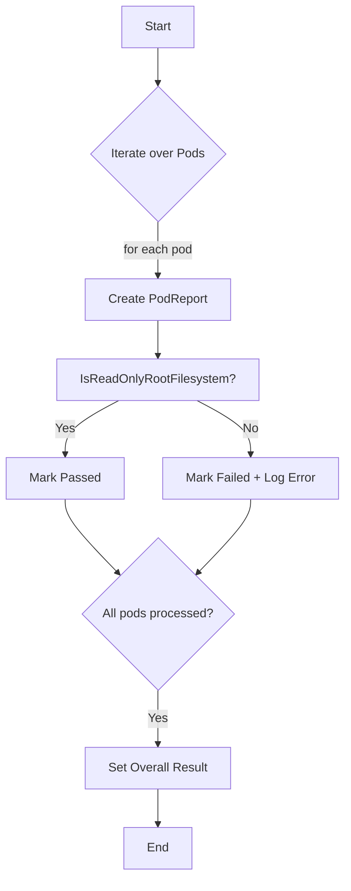

testSecConReadOnlyFilesystem`

| Item | Detail |
|------|--------|
| **Package** | `accesscontrol` (github.com/redhat-best-practices-for-k8s/certsuite/tests/accesscontrol) |
| **Visibility** | Unexported (`private`) – used only within the test suite. |
| **Signature** | `func(*checksdb.Check, *provider.TestEnvironment)` |
| **Purpose** | Verify that every pod in a Kubernetes cluster is running with a read‑only root filesystem (`ReadOnlyRootFilesystem`). If any container violates this policy, the check is marked as failed and an error report is generated. |

---

### Parameters

| Parameter | Type | Role |
|-----------|------|------|
| `check` | `*checksdb.Check` | Holds the current test definition (e.g., ID, name). The function may mutate its result state via `SetResult`. |
| `env` | `*provider.TestEnvironment` | Provides access to the Kubernetes client (`Client`) and logger. This object is injected by the test harness. |

---

### Core Logic Flow

1. **Initial Logging**  
   ```go
   GetLogger().LogInfo("Start read‑only filesystem check")
   ```
   Marks the start of the check for debugging purposes.

2. **Pod Enumeration**  
   The function iterates over all pods returned by `env.Client.Pods()`. For each pod:
   * A `PodReportObject` is created to accumulate per‑pod results.
   * `IsReadOnlyRootFilesystem(pod)` is called to determine if the pod's containers enforce read‑only root.

3. **Result Handling**  
   * If any container fails the check, the pod report’s result is set to **Failed**, and an error message is appended.
   * Otherwise, the pod report’s result is marked **Passed**.

4. **Aggregate Reporting**  
   After all pods are processed:
   * The overall `check` result is set to **Passed** if no failures were recorded; otherwise it remains **Failed** (or is explicitly set).
   * Detailed pod reports are attached to the check for downstream consumption.

5. **Final Logging**  
   ```go
   GetLogger().LogInfo("Finished read‑only filesystem check")
   ```

---

### Key Dependencies

| Dependency | Role |
|------------|------|
| `GetLogger()` | Provides a logger instance used throughout the test (via `LogInfo`/`LogError`). |
| `IsReadOnlyRootFilesystem(*v1.Pod) bool` | Core helper that inspects pod spec containers for the `readOnlyRootFilesystem` flag. |
| `NewPodReportObject(*v1.Pod)` | Constructs a container for per‑pod results and messages. |
| `SetResult(result checksdb.Result)` | Updates the overall test outcome (`Passed`, `Failed`, etc.). |

---

### Side Effects

* Mutates the supplied `check` object's result state.
* Emits log entries at the start and end of the check, as well as for each pod processed.
* Generates detailed error messages that are attached to the check report.

---

### How It Fits the Package

The `accesscontrol` package implements a suite of security checks for Kubernetes workloads.  
`testSecConReadOnlyFilesystem` is one such check focused on filesystem permissions.  
It works in concert with other tests (e.g., privilege escalation, host network usage) to provide a comprehensive security posture assessment.

---

#### Suggested Mermaid Diagram



This diagram visualizes the decision path for each pod and the final aggregation step.
