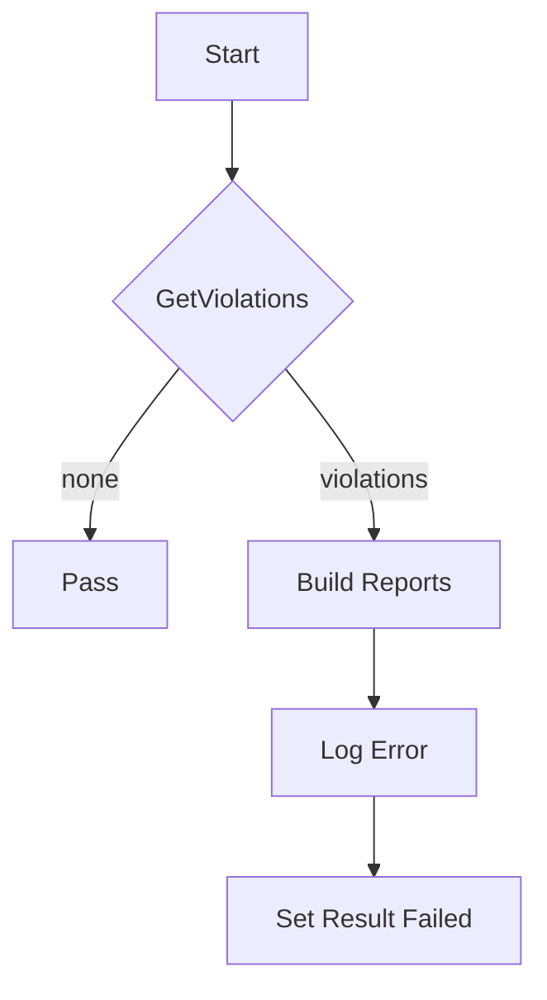

testSecConRunAsNonRoot`

| Aspect | Details |
|--------|---------|
| **Package** | `accesscontrol` (tests for certsuite) |
| **File / Line** | `suite.go:349` |
| **Signature** | `func(*checksdb.Check, *provider.TestEnvironment)()` |
| **Exported?** | No – helper used only inside the test suite |

---

### Purpose
`testSecConRunAsNonRoot` is a unit‑level check that verifies **every container in the cluster does not run as root** (i.e., `runAsNonRoot: true` or an equivalent effective UID).  
It is invoked by the certsuite framework when running the “security context” tests for Kubernetes workloads.

---

### Inputs

| Parameter | Type | Role |
|-----------|------|------|
| `check` | `*checksdb.Check` | Holds metadata about the current check (ID, name, etc.). It is not mutated in this function. |
| `env` | `*provider.TestEnvironment` | Encapsulates the test environment: the Kubernetes client, the list of all pods/containers, and helper methods for reporting. |

---

### Workflow

1. **Log start** – `LogInfo("RunAsNonRoot check")`.
2. **Identify violations**  
   * Calls `GetRunAsNonRootFalseContainers(env)` which returns a slice of containers that either lack the `runAsNonRoot` flag or explicitly set it to `false`. The result is stored in `containers`.
3. **Handle no‑violations case** – If `len(containers) == 0`, the check passes immediately and the function returns.
4. **Build report objects**  
   * For each violating container, a `PodReportObject` (representing its owning pod) is created via `NewPodReportObject`.
   * Inside that pod object, a `ContainerReportObject` (for the offending container) is appended using `NewContainerReportObject`.  
   * The container’s name and the reason (`"runAsNonRoot: false"`) are recorded.
5. **Log failure** – If any violations exist, `LogError(fmt.Sprintf("Found %d containers that run as root", len(containers)))` is called.
6. **Mark check result** – `SetResult(check, checksdb.StatusFailed)` signals to the test harness that this particular security‑context rule failed.

---

### Key Dependencies

| Dependency | Role |
|------------|------|
| `GetRunAsNonRootFalseContainers` | Scans all pods/containers for non‑root violations. |
| `NewPodReportObject`, `NewContainerReportObject` | Construct the hierarchical report structure used by certsuite’s UI/reporting layer. |
| `SetResult` | Updates the check status in the test database (`checksdb`). |
| `LogInfo`, `LogError` | Emit diagnostic logs for human operators and automated tooling. |

---

### Side Effects

* **Reporting** – The function creates and stores report objects for each offending container, which later feed into audit reports.
* **State mutation** – It only mutates the check status via `SetResult`; all other state is read‑only.

---

### Context in Package

`testSecConRunAsNonRoot` sits among a suite of security‑context checks (e.g., `testSecConAllowPrivilegeEscalation`, `testSecConReadOnlyRootFilesystem`).  
Each follows the same pattern: query the environment, build reports, and set pass/fail status.  
These functions are registered in the test harness during package initialization, ensuring they run automatically when certsuite executes its access‑control tests.

---

### Suggested Mermaid Diagram

This visual captures the decision flow: zero violations → pass; otherwise, construct detailed reports and mark the check as failed.
