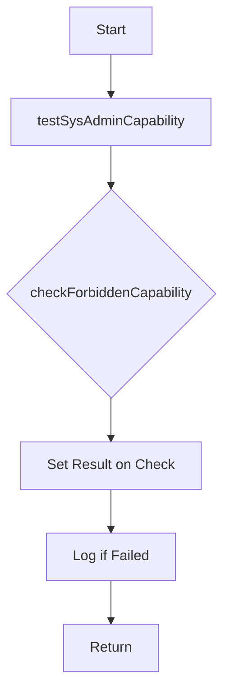

testSysAdminCapability`

| Aspect | Details |
|--------|---------|
| **File** | `tests/accesscontrol/suite.go` (line 323) |
| **Package** | `accesscontrol` |
| **Visibility** | Unexported – used only within the test suite. |

### Purpose
The function verifies that a *system‑administrator* user (the one that runs CertSuite tests) is **not** granted any privileged capabilities that are forbidden in a normal Kubernetes runtime.  
It checks that the `Check` record for the “sys‑admin capability” has been marked as *failed* and logs a helpful message when the test fails.

### Signature
```go
func testSysAdminCapability(c *checksdb.Check, env *provider.TestEnvironment)
```
| Parameter | Type | Meaning |
|-----------|------|---------|
| `c` | `*checksdb.Check` | The check instance that represents the “sys‑admin capability” rule. It contains fields such as `Result`, `Description`, etc., which are updated by this function. |
| `env` | `*provider.TestEnvironment` | The test environment struct (holds config, logger, and helper functions). The function only uses it to obtain a logger via `GetLogger()`; no other side‑effects occur on `env`. |

The function returns **nothing** – its job is to mutate the passed `Check` object.

### Key Dependencies
| Dependency | Role |
|------------|------|
| `checkForbiddenCapability(c)` | Helper that performs the actual capability check and sets the result status on the `Check`. It is called first. |
| `GetLogger()` | Retrieves a structured logger from `env` (via `provider.TestEnvironment`). Used to emit diagnostic messages. |
| `SetResult(c, <status>)` | Convenience wrapper that assigns the final result (`Success`, `Failed`, etc.) on the check after evaluation. |

### Side‑Effects & Mutations
* Calls `checkForbiddenCapability` which may perform system calls or inspect container processes; these are read‑only in terms of the test environment.
* Sets fields on the `Check` instance:
  * `Result` – typically set to `Failed` if forbidden capabilities are found.
  * `Description` and/or `Notes` – may be updated by the helper functions.
* Logs a message through the provided logger if the check fails.

### How it Fits into the Package
The `accesscontrol` package contains a suite of tests that validate Kubernetes security best‑practice checks.  
Each test function follows this pattern:

1. **Setup**: `beforeEachFn` prepares the environment, creating a `Check` and a `TestEnvironment`.
2. **Execution**: A specific test routine (e.g., `testSysAdminCapability`) runs, performing the check logic.
3. **Result**: The check status is stored in the database via `SetResult`.

`testSysAdminCapability` is one of many such routines; it focuses on system‑administrator privileges and ensures that a user with root access cannot unintentionally elevate privileges within containers.

### Suggested Mermaid Diagram


This diagram visualizes the linear flow: invoke helper → set result → log → finish.
