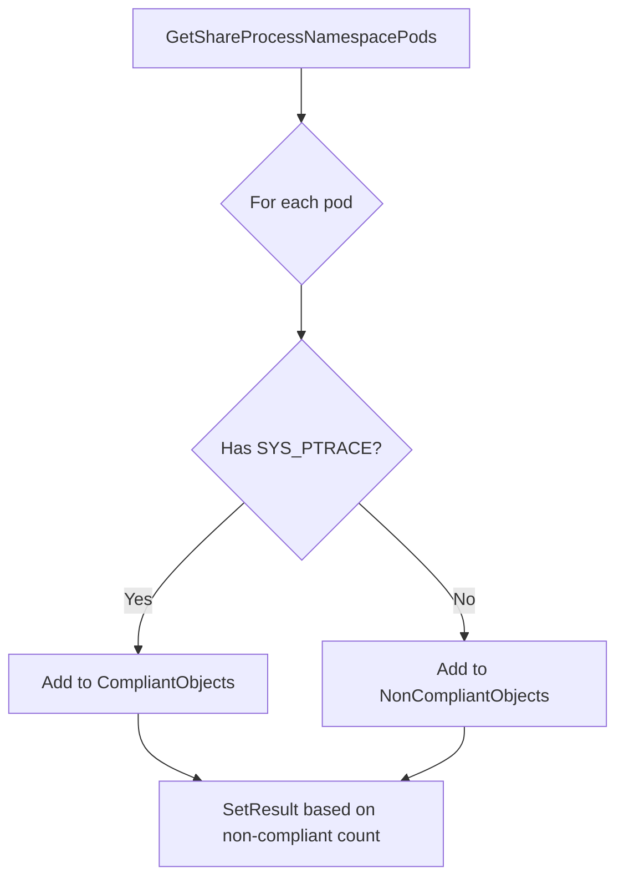

testSysPtraceCapability`

| Attribute | Detail |
|-----------|--------|
| **Package** | `accesscontrol` (`github.com/redhat-best-practices-for-k8s/certsuite/tests/accesscontrol`) |
| **Visibility** | unexported (internal test helper) |
| **Signature** | `func(*checksdb.Check, *provider.TestEnvironment)` |
| **Purpose** | Verify that every pod in the cluster either:  • has the process‑namespace sharing feature enabled (`shareProcessNamespace:true`), **or**  • contains at least one container that explicitly grants the `SYS_PTRACE` capability. |
| **Inputs** | * `check`: a mutable reference to a compliance check record (from `checksdb`). * `env`: the test environment context providing cluster state and utilities. |
| **Outputs / Side‑effects** | 1. Populates two report slices attached to the `check`:    - `CompliantObjects`: pods that satisfy the condition.    - `NonCompliantObjects`: pods that do not. 2. Calls `SetResult` on the check with a pass/fail status based on whether any non‑compliant pods were found. 3. Emits informational and error logs through the test environment’s logger. |
| **Key Dependencies** | - `GetShareProcessNamespacePods(env)`: retrieves all pods that enable process namespace sharing. - `StringInSlice(name, slice)` : helper to detect if a capability name appears in a container’s capability list. - `NewPodReportObject(pod, env)`: constructs a lightweight representation of a pod for reporting. - `SetResult(check, status, message)`: records the final check outcome. |
| **Control Flow** | 1. Call `GetShareProcessNamespacePods` to gather candidates. 2. For each pod:    * If it has no containers with `SYS_PTRACE`, it is flagged as non‑compliant and appended to `NonCompliantObjects`.    * Otherwise, the pod is marked compliant and appended to `CompliantObjects`. 3. After iterating all pods, call `SetResult` passing success if there were no non‑compliant objects, otherwise failure. |
| **Side‑effects** | - Logs progress at several points (starting analysis, number of pods processed, failures). - No mutation of the cluster state – it only reads pod specifications. |

### How It Fits the Package

`testSysPtraceCapability` is a helper invoked by higher‑level test cases that assess **security best practices** for Kubernetes workloads.  
In the `accesscontrol` suite, each check corresponds to one of the Red Hat “Best Practices” rules (e.g., *“Pods should not have access to SYS_PTRACE unless explicitly required.”*).  
This function implements rule evaluation logic and feeds the results back into the test harness so that a final compliance report can be generated.

### Suggested Mermaid Diagram

---
