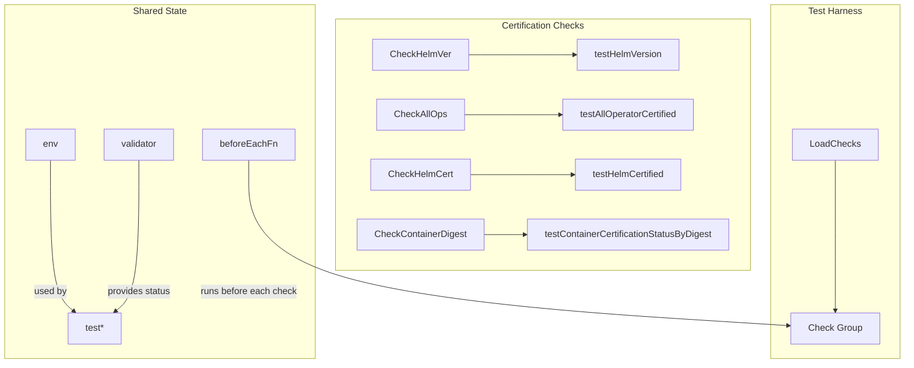
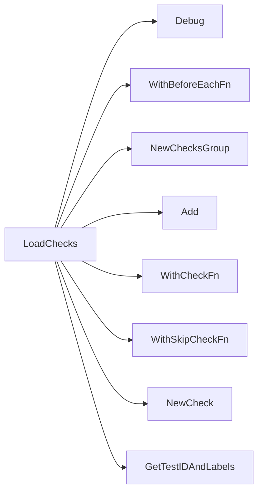

## Package certification (github.com/redhat-best-practices-for-k8s/certsuite/tests/certification)

# certsuite – `certification` test package

The *certification* package implements a set of integration tests that verify whether the Kubernetes objects discovered in a cluster are **certified** by Red‑Hat.  
All logic lives in a single file (`suite.go`) and uses helper types from the surrounding CertSuite codebase.

---

## 1. Global state

| Variable | Type | Purpose |
|----------|------|---------|
| `env` | `provider.TestEnvironment` | Holds runtime information (e.g., cluster type, Helm releases) that is shared across all checks. |
| `validator` | `certdb.CertificationStatusValidator` | Provides the API to query certification status for operators, charts and containers. |
| `beforeEachFn` | untyped | A closure executed before every check; it performs per‑check setup (e.g., logging). |
| `skipIfNoOperatorsFn`, `skipIfNoHelmChartReleasesFn` | untyped | Skip functions that prevent a test from running when the required resource type is absent. |

The two exported constants simply provide human‑readable strings for reporting:

```go
const (
    CertifiedOperator = "Certified Operator"
    Online            = "Online"
)
```

---

## 2. Core entry point – `LoadChecks()`

`LoadChecks` is called by the test harness once during initialization and registers all checks with the framework.  
It uses a fluent API that builds a **check group** for certification tests:

1. A *before‑each* hook (`WithBeforeEachFn`) attaches the global `beforeEachFn`.  
2. For each of the following scenarios it creates a `NewCheck`:
   - Helm chart version check (`testHelmVersion`)
   - All operator certification status (`testAllOperatorCertified`)
   - Helm chart certification (`testHelmCertified`)
   - Container certification by digest (`testContainerCertificationStatusByDigest`)

Each check is enriched with labels and a unique test ID via `GetTestIDAndLabels`.  
If the cluster has no operators or Helm releases, the corresponding checks are skipped using the skip functions defined above.

---

## 3. Supporting helpers

### `getContainersToQuery(env *provider.TestEnvironment) map[provider.ContainerImageIdentifier]bool`

Collects all container images that appear in the test environment and returns a map keyed by image identifiers.  
The boolean value is unused; the map simply acts as a set.

### `testAllOperatorCertified(check, env, validator)`
Iterates over every operator reported in the environment:

1. Skips non‑OCP clusters (`IsOCPCluster`).  
2. Splits each operator name into *group* and *name* for reporting.  
3. Calls `validator.IsOperatorCertified` to decide if the operator is certified.  
4. Builds a report object per operator, populating fields such as:
   - Operator group / name
   - Certification status (`CertifiedOperator` or empty)
   - Result (`pass`/`fail`) based on validation outcome

All report objects are aggregated into a single `NewOperatorReportObject`.

### `testContainerCertification(id, validator) bool`

Simply forwards to `validator.IsContainerCertified`.  
Used by the container‑by‑digest test.

### `testContainerCertificationStatusByDigest(check, env, validator)`
For each image identified in `getContainersToQuery`:

1. Calls `testContainerCertification`.
2. Creates a report object with fields:
   - Image name
   - Digest
   - Certification status (`CertifiedOperator` or empty)
3. Adds the result to the check’s output.

### `testHelmCertified(check, env, validator)`
Checks each Helm chart release reported by the environment:

1. Calls `validator.IsHelmChartCertified`.
2. Builds a report object containing:
   - Release name
   - Chart version
   - Certification status (`CertifiedOperator` or empty)
3. Updates the check result accordingly.

### `testHelmVersion(check)`
Collects all pods in the cluster (via the Kubernetes client), counts them, and reports the total number of Helm releases found.  
This is a lightweight sanity check to ensure that Helm has been used on the cluster.

---

## 4. Interaction diagram



---

## 5. Summary

* **Purpose** – Verify that operators, Helm charts and container images present in a cluster are certified.
* **Data flow** – `LoadChecks` registers checks → each check pulls data from the shared environment (`env`) and validator (`validator`) → builds report objects → test framework consumes them.
* **Key functions** – `testAllOperatorCertified`, `testHelmCertified`, `testContainerCertificationStatusByDigest`, `testHelmVersion`.
* **Globals** – Provide context, validation logic, and skip conditions for the tests.

The package is intentionally read‑only: it only registers checks; all stateful work happens in the check functions themselves.

### Functions

- **LoadChecks** — func()()

### Globals


### Call graph (exported symbols, partial)



### Symbol docs

- [function LoadChecks](symbols/function_LoadChecks.md)
