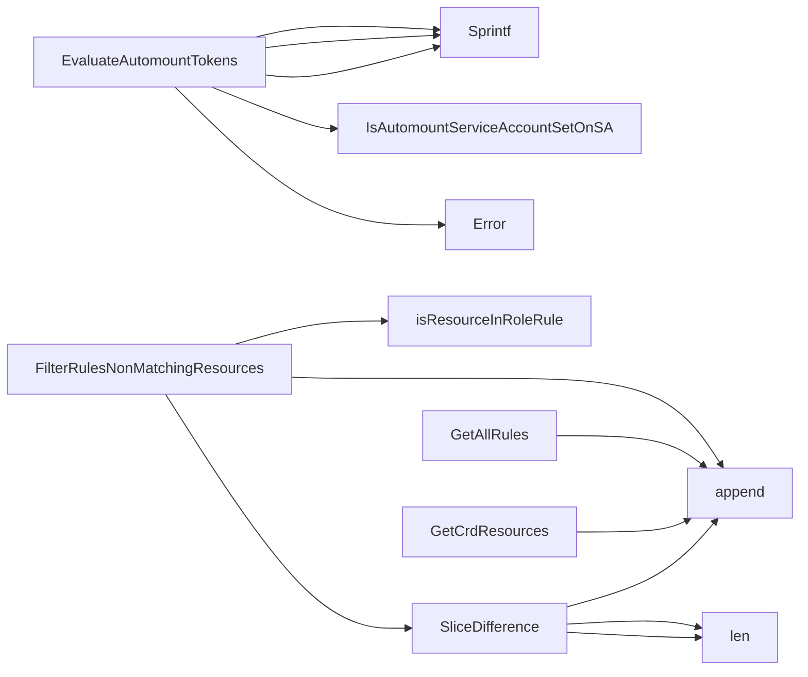

## Package rbac (github.com/redhat-best-practices-for-k8s/certsuite/tests/common/rbac)

### Structs

- **CrdResource** (exported) — 4 fields, 0 methods
- **RoleResource** (exported) — 2 fields, 0 methods
- **RoleRule** (exported) — 2 fields, 0 methods

### Functions

- **EvaluateAutomountTokens** — func(corev1typed.CoreV1Interface, *provider.Pod)(bool, string)
- **FilterRulesNonMatchingResources** — func([]RoleRule, []CrdResource)([]RoleRule)
- **GetAllRules** — func(*rbacv1.Role)([]RoleRule)
- **GetCrdResources** — func([]*apiextv1.CustomResourceDefinition)([]CrdResource)
- **SliceDifference** — func([]RoleRule, []RoleRule)([]RoleRule)

### Call graph (exported symbols, partial)

### Symbol docs

- [struct CrdResource](symbols/struct_CrdResource.md)
- [struct RoleResource](symbols/struct_RoleResource.md)
- [struct RoleRule](symbols/struct_RoleRule.md)
- [function EvaluateAutomountTokens](symbols/function_EvaluateAutomountTokens.md)
- [function FilterRulesNonMatchingResources](symbols/function_FilterRulesNonMatchingResources.md)
- [function GetAllRules](symbols/function_GetAllRules.md)
- [function GetCrdResources](symbols/function_GetCrdResources.md)
- [function SliceDifference](symbols/function_SliceDifference.md)
