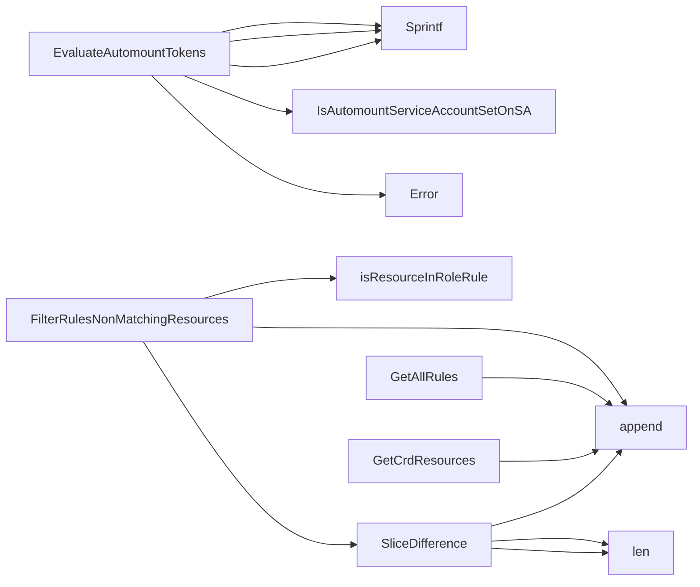

## Package rbac (github.com/redhat-best-practices-for-k8s/certsuite/tests/common/rbac)

## Package Overview – `github.com/redhat-best-practices-for-k8s/certsuite/tests/common/rbac`

| Section | Summary |
|---------|---------|
| **Purpose** | Provides helper types and functions for inspecting Kubernetes RBAC objects (Roles, ServiceAccounts) during test runs. It focuses on two concerns: <br>1️⃣  Determining if a Pod has the correct *automountServiceAccountToken* setting.<br>2️⃣  Comparing Role rules with Custom Resource Definitions (CRDs). |
| **Key Imports** | `fmt`, Kubernetes API packages (`rbac/v1`, `apiextensions/v1`), provider types, client-go core interface. |

---

## Data Structures

### `RoleRule`
```go
type RoleRule struct {
    Resource RoleResource // e.g., {"group":"apps","name":"deployments"}
    Verb     string       // e.g., "get", "create"
}
```
*Represents a single RBAC rule in a simplified form.*

---

### `RoleResource`
```go
type RoleResource struct {
    Group string // API group (empty for core)
    Name  string // resource name, usually plural
}
```

---

### `CrdResource`
```go
type CrdResource struct {
    Group       string   // CRD's API group
    PluralName  string   // e.g., "myresources"
    SingularName string  // optional
    ShortNames  []string // optional
}
```
*Encapsulates the essential parts of a Custom Resource Definition that are relevant for RBAC matching.*

---

## Core Functions

### 1. `GetCrdResources`

```go
func GetCrdResources(crds []*apiextv1.CustomResourceDefinition) []CrdResource
```
*Iterates over CRDs, extracts group and plural name, builds a slice of `CrdResource`.*

---

### 2. `GetAllRules`

```go
func GetAllRules(r *rbacv1.Role) []RoleRule
```
*Flattens all rules in a Role into the simplified `RoleRule` representation.*

---

### 3. `isResourceInRoleRule` (private)

```go
func isResourceInRoleRule(crd CrdResource, rule RoleRule) bool
```
*Checks if the CRD’s group and plural name match those defined in a `RoleRule`. Uses `strings.Split` to handle potential group prefixes.*

---

### 4. `FilterRulesNonMatchingResources`

```go
func FilterRulesNonMatchingResources(rules []RoleRule, crds []CrdResource) []RoleRule
```
*Keeps only the rules that do **not** match any CRD in the provided list.*  
The implementation:
1. Builds a slice of matching rules by iterating over `rules` and checking each against all `crds`.
2. Uses `SliceDifference` to compute the non‑matching set (`rules - matched`).

---

### 5. `SliceDifference`

```go
func SliceDifference(s1, s2 []RoleRule) []RoleRule
```
*Returns elements present in `s1` but not in `s2`. Simple O(n²) comparison.*

---

## Automount Token Evaluation

### `EvaluateAutomountTokens`

```go
func EvaluateAutomountTokens(corev1typed.CoreV1Interface, *provider.Pod) (bool, string)
```
*Checks whether the Pod has an explicit `automountServiceAccountToken` setting or inherits a correct value from its ServiceAccount.*

**Logic flow**

| Step | Action |
|------|--------|
| 1 | Retrieve the pod’s namespace & name. |
| 2 | Call `IsAutomountServiceAccountSetOnSA` to see if SA explicitly sets the field. |
| 3 | If not set, evaluate the pod’s own value (`pod.Spec.AutomountServiceAccountToken`). |
| 4 | Return `(true, "")` when either condition is satisfied; otherwise return `(false, <error message>)`. |

*The function uses `fmt.Sprintf` for constructing error messages and relies on the helper `Error()` to format them.*

---

## How Everything Connects

```mermaid
graph TD
    Pod[Pod] -->|needs SA config| SA[ServiceAccount]
    SA -->|automountServiceAccountToken| EvaluateAutomountTokens(Pod)
    
    Role[Role] --> GetAllRules --> Rules[[]RoleRule]
    CRDs --> GetCrdResources --> CrdRes[[]CrdResource]
    Rules & CrdRes --> FilterRulesNonMatchingResources
```

1. **Automount checks** – `EvaluateAutomountTokens` is called during pod validation tests to ensure service account tokens are not unintentionally auto‑mounted.
2. **RBAC rule checks** – Tests that examine whether a Role grants permissions on all CRDs in the cluster use:
   * `GetAllRules` → `FilterRulesNonMatchingResources`.
3. The helper `SliceDifference` is used internally to derive non‑matching rules for reporting or further validation.

---

## Summary

- **Data types** (`RoleRule`, `RoleResource`, `CrdResource`) provide a lightweight view of RBAC and CRD objects.
- **Utility functions** convert raw Kubernetes objects into these types, filter them, and compute differences.
- **Automount evaluation** ensures Pods respect the intended token mounting policy via ServiceAccount settings.

These components are used by CertSuite’s test harness to assert correct RBAC configuration in a cluster.

### Structs

- **CrdResource** (exported) — 4 fields, 0 methods
- **RoleResource** (exported) — 2 fields, 0 methods
- **RoleRule** (exported) — 2 fields, 0 methods

### Functions

- **EvaluateAutomountTokens** — func(corev1typed.CoreV1Interface, *provider.Pod)(bool, string)
- **FilterRulesNonMatchingResources** — func([]RoleRule, []CrdResource)([]RoleRule)
- **GetAllRules** — func(*rbacv1.Role)([]RoleRule)
- **GetCrdResources** — func([]*apiextv1.CustomResourceDefinition)([]CrdResource)
- **SliceDifference** — func([]RoleRule, []RoleRule)([]RoleRule)

### Call graph (exported symbols, partial)



### Symbol docs

- [struct CrdResource](symbols/struct_CrdResource.md)
- [struct RoleResource](symbols/struct_RoleResource.md)
- [struct RoleRule](symbols/struct_RoleRule.md)
- [function EvaluateAutomountTokens](symbols/function_EvaluateAutomountTokens.md)
- [function FilterRulesNonMatchingResources](symbols/function_FilterRulesNonMatchingResources.md)
- [function GetAllRules](symbols/function_GetAllRules.md)
- [function GetCrdResources](symbols/function_GetCrdResources.md)
- [function SliceDifference](symbols/function_SliceDifference.md)
