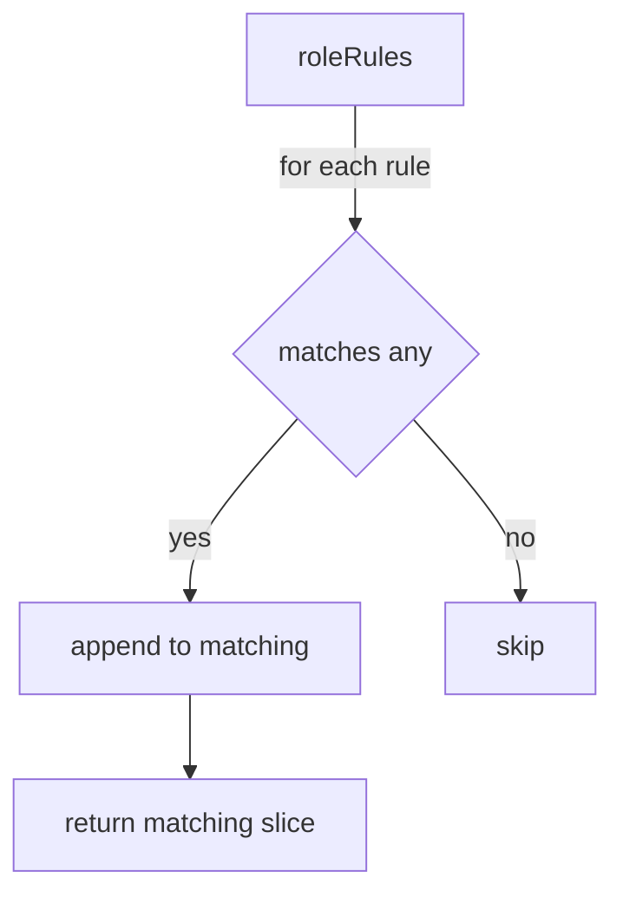

FilterRulesNonMatchingResources`

**Package**: `rbac`  
**File**: `roles.go` (line 88)  

### Purpose
`FilterRulesNonMatchingResources` separates a list of `RoleRule`s into two groups:

| Group | Meaning |
|-------|---------|
| **Matching** | Rules that can be satisfied by at least one CRD resource in the supplied `resourceList`. |
| **Non‑matching** | Rules that cannot be satisfied by any CRD resource in the list. |

The function is typically used when evaluating whether a set of Role rules actually cover the resources defined by Custom Resource Definitions (CRDs).  
It returns only the *Matching* slice; callers may derive the *Non‑matching* slice with `SliceDifference` if needed.

### Signature
```go
func FilterRulesNonMatchingResources(roleRules []RoleRule, resourceList []CrdResource) []RoleRule
```

- **roleRules** – A slice of `RoleRule`.  
  Each rule describes a set of verbs, resources, and optionally other fields such as `apiGroups`, `resourceNames`, or `nonResourceURLs`.

- **resourceList** – A slice of `CrdResource`.  
  Each element represents an API resource defined by a CRD (e.g., kind, plural name, group, scope).

### Dependencies
| Dependency | Role |
|------------|------|
| `isResourceInRoleRule` | Checks whether a single `CrdResource` matches the criteria of a given `RoleRule`. Returns `true` if at least one verb/resource combination is covered. |
| `append` | Standard Go slice operation used to build result slices. |
| `SliceDifference` (not called directly in this function but listed) | Utility that could be employed by callers to obtain the non‑matching rules from the full list and the returned matching slice. |

### Algorithm Overview
1. **Iterate over each rule** in `roleRules`.
2. For each rule, **check every CRD resource** using `isResourceInRoleRule`.  
   - If *any* resource matches, the rule is appended to a temporary `matching` slice.
3. After processing all rules, **return the `matching` slice**.

The function deliberately ignores non‑matching rules; callers can compute them if needed (e.g., by calling `SliceDifference(roleRules, matching)`).

### Side Effects
- None beyond slice allocations: the input slices are not modified.
- No external state is read or written.

### How it fits the package
In the `rbac` test suite this helper is used to validate that Role definitions actually reference resources exposed by CRDs.  
By filtering only those rules that have a corresponding CRD resource, tests can assert coverage and identify orphaned or mis‑configured permissions.  

The function is exported so other packages (e.g., higher‑level test helpers) may reuse the matching logic without duplicating code.

--- 

**Mermaid diagram suggestion**



This visual clarifies the single‑pass, decision‑based flow of `FilterRulesNonMatchingResources`.
