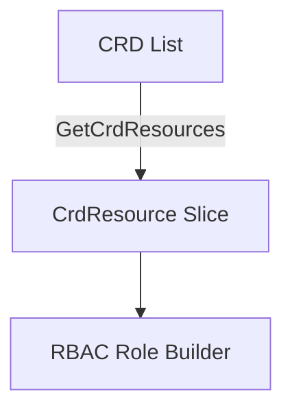

GetCrdResources`

| Aspect | Detail |
|--------|--------|
| **Package** | `rbac` (github.com/redhat-best-practices-for-k8s/certsuite/tests/common/rbac) |
| **Exported?** | Yes – it is part of the public API of this package. |
| **Signature** | `func GetCrdResources(crds []*apiextv1.CustomResourceDefinition) []CrdResource` |

### Purpose
`GetCrdResources` transforms a slice of Kubernetes Custom Resource Definition (CRD) objects into a flat list of the package’s own `CrdResource` type.  
In the test suite this helper is used to convert the CRDs that are read from the cluster into a form suitable for RBAC role/role‑binding generation and verification.

### Parameters
| Name | Type | Description |
|------|------|-------------|
| `crds` | `[]*apiextv1.CustomResourceDefinition` | A slice of pointers to the official Kubernetes CRD structs (from `k8s.io/apiextensions-apiserver/pkg/apis/apiextensions/v1`). Each element represents a single CRD that has been discovered in the test environment. |

### Return value
| Type | Description |
|------|-------------|
| `[]CrdResource` | A **flat** slice of `CrdResource` objects.  The function iterates over each input CRD and appends one or more `CrdResource` instances to the result.  The exact mapping logic is not shown in the snippet but typically includes extracting fields such as group, version, kind, scope, and names. |

### Key Dependencies
* **`apiextv1.CustomResourceDefinition`** – the function accepts this type; it relies on the CRD struct definition from the Kubernetes API extensions package.
* **`append`** – Go’s built‑in slice helper is used to grow the result slice.

No external packages are imported beyond `k8s.io/apiextensions-apiserver/pkg/apis/apiextensions/v1`, so the function has no additional runtime dependencies.

### Side Effects
The function is pure:
* It does **not** modify any of the input CRDs.
* It returns a newly allocated slice; callers can safely mutate the returned value without affecting the original data.

### Placement in the Package
`rbac` contains utilities for generating and validating RBAC rules against Kubernetes resources.  
`GetCrdResources` is a helper that feeds into higher‑level logic (e.g., building `Role` objects or testing permissions).  By isolating CRD conversion here, the rest of the package can work with its own lightweight `CrdResource` abstraction instead of the full Kubernetes struct.

### Example Usage

```go
// Assume crds is obtained from a client call to list CRDs.
crdResources := rbac.GetCrdResources(crds)

// crdResources now contains a slice that can be fed into role creation logic.
```

### Suggested Mermaid Diagram (optional)



This diagram shows the data flow from raw CRDs to the package’s RBAC tooling.
