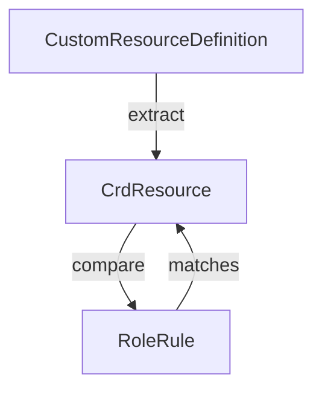

CrdResource` – Kubernetes Custom‑Resource Descriptor

| Attribute | Type | Purpose |
|-----------|------|---------|
| **Group** | `string` | API group of the CRD (e.g., `"example.com"`). Used to match against a `RoleRule.Group`. |
| **PluralName** | `string` | The plural form of the resource name, as defined in the CRD (`Spec.Names.Plural`). This is compared with `RoleRule.Resource` when determining rule coverage. |
| **SingularName** | `string` | Singular form of the resource (from `Spec.Names.Singular`). Not used directly by the current helper functions but retained for completeness and potential future extensions. |
| **ShortNames** | `[]string` | Optional short names defined in the CRD (`Spec.Names.ShortNames`). They are *not* currently consulted when matching a rule, but are part of the public representation so tests or callers can introspect them. |

### Context & Usage

- The `rbac` package contains helper functions that work with RBAC `RoleRule`s and custom resources.
- `GetCrdResources` takes a slice of `*apiextv1.CustomResourceDefinition` objects (from the Kubernetes API) and extracts the relevant fields into a flat slice of `CrdResource`.
- `FilterRulesNonMatchingResources` uses `isResourceInRoleRule` to decide whether a given `CrdResource` is covered by a particular `RoleRule`.  
  The function returns only those rules that *do* match, while the caller can use `SliceDifference` to obtain the non‑matching ones.
- `isResourceInRoleRule` compares the `Group` and `PluralName` of a `CrdResource` against the corresponding fields in a `RoleRule`. If both match, the rule is considered to cover that resource.

### Diagram

### Key Points

- **Immutable** – `CrdResource` is a simple data holder; its fields are not modified by the package functions.
- **Public Fields** – All fields are exported, allowing external packages (or tests) to construct or inspect CRD descriptors directly.
- **No Methods** – The struct only serves as a container for metadata; all logic resides in helper functions that operate on slices of `CrdResource`.
- **Dependency** – Requires the standard library (`strings`) for splitting the `PluralName` during matching, but no external packages beyond the Kubernetes API types.

In short, `CrdResource` is a lightweight representation of a CRD’s identity used by RBAC utilities to determine whether a set of role rules adequately covers all custom resources in a cluster.
