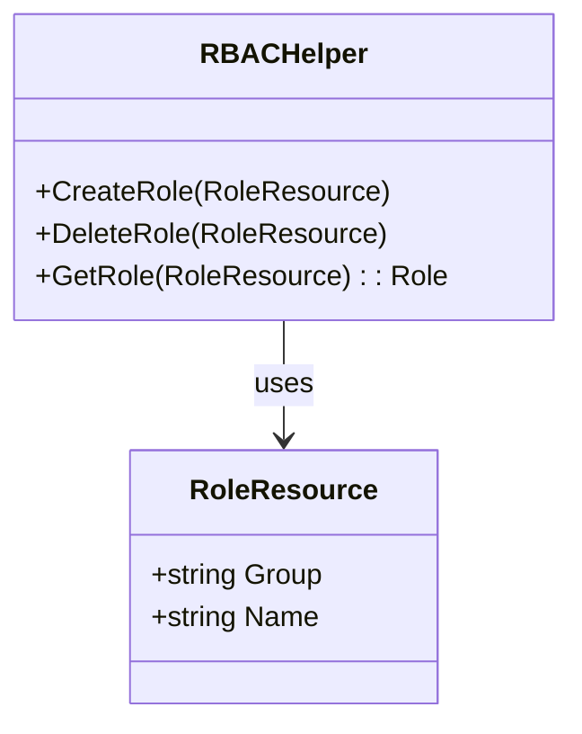

RoleResource` – A lightweight representation of an RBAC resource

| Item | Details |
|------|---------|
| **Package** | `rbac` (`github.com/redhat-best-practices-for-k8s/certsuite/tests/common/rbac`) |
| **File** | `roles.go`, line 30 |
| **Purpose** | Encapsulates the two most common attributes that identify a Role or ClusterRole in Kubernetes: its *group* (API group) and *name*. It is used throughout the test suite to refer to roles without pulling in the full RBAC API structs, keeping the code lightweight. |

### Fields

| Field | Type   | Description |
|-------|--------|-------------|
| `Group` | `string` | The API group where the role lives (`rbac.authorization.k8s.io`). For ClusterRoles this is typically an empty string because they are cluster‑wide. |
| `Name`  | `string` | The unique name of the Role/ClusterRole. |

> **Note**: Because RBAC resources can belong to different API groups, the `Group` field allows the same struct to represent both namespaced Roles (`rbac.authorization.k8s.io`) and other group‑specific roles if needed.

### How it is used

* **Test setup** – When creating or deleting roles for a test case, the suite constructs a `RoleResource{Group: "rbac.authorization.k8s.io", Name: "view"}` and passes it to helper functions that interact with the Kubernetes client.
* **Assertions** – After performing actions (e.g., granting permissions), tests compare expected `RoleResource` values against what is returned from API queries, simplifying equality checks.

### Dependencies & Side Effects

| Dependency | Interaction |
|------------|-------------|
| `k8s.io/client-go/kubernetes` | The struct itself has no direct dependency, but helper functions that accept a `RoleResource` will use the Kubernetes client to fetch or modify RBAC objects. |
| None (pure data) | No side effects; purely a value holder. |

### Integration with the rest of the package

```
rbac
├── roles.go          // RoleResource definition + role helpers
├── test_roles_test.go
└── helpers.go        // Functions that accept RoleResource
```

`RoleResource` acts as the *canonical key* for RBAC objects in the `rbac` test utilities. It keeps the code DRY: instead of repeatedly passing group and name strings, tests pass a single struct.

### Suggested Mermaid diagram



This diagram shows that `RBACHelper` (the test utilities) operate on `RoleResource` instances.
