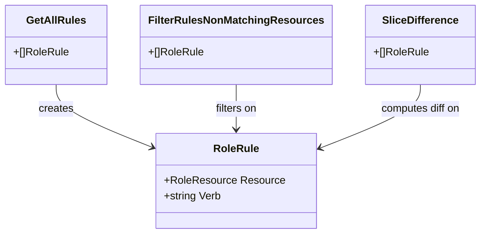

RoleRule` – Lightweight representation of an RBAC rule

| Field | Type | Purpose |
|-------|------|---------|
| `Resource` | `RoleResource` | Encapsulates the API group and resource name that the rule applies to (e.g., `"apps/v1", "deployments"`). |
| `Verb` | `string` | The single verb allowed by this rule (`"get"`, `"create"`, `"update"`, etc.). |

## What is a `RoleRule`?

In this test‑suite the Kubernetes RBAC *role* object (from `rbacv1.Role`) is converted into a flat list of `RoleRule`s so that unit tests can reason about individual permissions without dealing with the nested structure of `policy.Rule`.  
A `RoleRule` therefore represents **one** permission granted by a role: “the verb *Verb* on the resource *Resource*”.

## Where it’s used

| Function | How it is used |
|----------|----------------|
| `GetAllRules(*rbacv1.Role)` | Extracts every rule from a `Role` and appends each `PolicyRule.Verb` together with its `ResourceNames` to produce a slice of `RoleRule`. |
| `FilterRulesNonMatchingResources([]RoleRule, []CrdResource)` | Filters the list of `RoleRule`s by checking whether any of the supplied `CrdResource`s match the rule’s `Resource`. |
| `SliceDifference([]RoleRule, []RoleRule)` | Computes the difference between two sets of `RoleRule`s (used for determining missing or unexpected permissions). |

The helper function **`isResourceInRoleRule(CrdResource, RoleRule) bool`** is the core matching logic: it splits the CRD’s full name into group and plural components and compares them to the rule’s `Resource`.  

## Key characteristics

* **Immutability** – The struct contains only value types (`string`) so once a `RoleRule` is created its fields cannot be changed through aliasing.
* **Equality semantics** – Two `RoleRule`s are considered equal if both their `Resource` and `Verb` match. This implicit equality is relied upon by the slice‑difference algorithm, which performs linear scans comparing each field.
* **No methods** – The struct is a plain data container; all logic that consumes it lives in separate helper functions.

## Diagram (suggested)

## Summary

`RoleRule` is a thin abstraction that lets the test suite treat RBAC permissions as first‑class objects. It feeds into filtering and comparison utilities to validate that roles contain (or omit) expected capabilities against known CRD resources.
