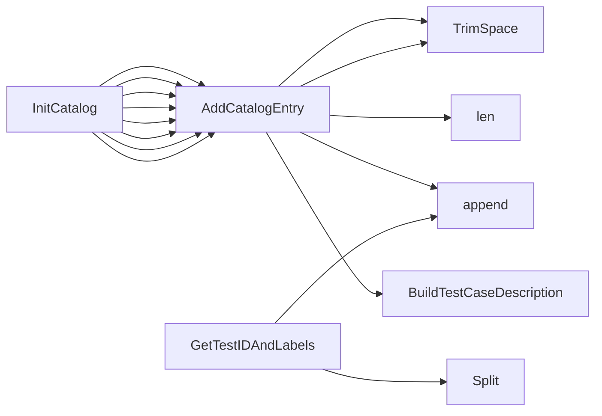

## Package identifiers (github.com/redhat-best-practices-for-k8s/certsuite/tests/identifiers)

# Overview – `github.com/redhat-best-practices-for-k8s/certsuite/tests/identifiers`

The **identifiers** package is the central registry that ties together every test case in CertSuite with:

* a unique *claim.Identifier* (the key used by the engine to refer to a test)
* a human‑readable description (`claim.TestCaseDescription`)
* metadata such as labels, impact, remediation and documentation links.

The package is **read‑only** – all state is initialized once at import time and never mutated again.  
This guarantees that tests can safely read the catalog in parallel without races.

---

## Core data structures

| Type | Purpose |
|------|---------|
| `claim.Identifier` | A string alias that uniquely identifies a test case (e.g. `"TestPodHostIPC"`).  It is used as a map key throughout CertSuite. |
| `claim.TestCaseDescription` | Holds the test’s description, severity, tags and optional links/impact. The struct is defined in the *certsuite-claim* package but only instantiated here. |

---

## Global catalog

```go
// Catalog is the JUnit testcase catalog of tests.
var Catalog map[claim.Identifier]claim.TestCaseDescription

// Classification maps test IDs to their impact statements
var ImpactMap map[string]string
```

`Catalog` is populated in `init()` by calling `InitCatalog()`.  
`ImpactMap` is defined in *impact.go* and used by the catalog to annotate each test with its impact string.

---

## Key functions

| Function | Signature | Role |
|----------|-----------|------|
| **AddCatalogEntry** | `func(string, string, string, string, string, string, bool, map[string]string, ...string) claim.Identifier` | Builds a `claim.TestCaseDescription`, registers it in the global catalog and returns the identifier.  Parameters are: `<id>, <name>, <description>, <severity>, <labels...>`. The function also attaches optional *impact* data from the `ImpactMap`. |
| **InitCatalog** | `func() map[claim.Identifier]claim.TestCaseDescription` | Calls `AddCatalogEntry` dozens of times – one per test case – to fill the catalog.  It is invoked once during package init. |
| **GetTestIDAndLabels** | `func(claim.Identifier) (string, []string)` | Transforms an identifier into a test ID suitable for skipping tests and returns the list of labels that belong to it.  The function splits the identifier on “.” and appends any remaining parts as labels. |
| **init** | `func()` | Package‑level init that simply calls `InitCatalog()`.  It guarantees that `Catalog` is ready before any test runs. |

---

## Flow of a single test case

1. **Definition** – A file such as `identifiers.go` declares a variable, e.g.:

   ```go
   var TestPodHostIPC claim.Identifier = AddCatalogEntry(
       "TestPodHostIPC",
       "Host IPC is disallowed for pods",
       "...description...",
       "High",
       "K8s", "Pod", "Security",
       true,
       map[string]string{"impact": PreflightHasNoProhibitedPackagesImpact},
   )
   ```

2. **AddCatalogEntry**  
   * Trims whitespace from `id` and `name`.  
   * Builds a slice of labels (e.g. `"K8s"`, `"Pod"`, `"Security"`).  
   * Calls `BuildTestCaseDescription()` to create the `claim.TestCaseDescription` value, attaching severity, description, labels, impact, remediation, doc links, etc.  
   * Stores the description in `Catalog[id]`.  
   * Returns `id`.

3. **Catalog ready** – After all declarations, `init()` has executed `InitCatalog()`, leaving `Catalog` fully populated.

4. **Runtime use** – When a test function runs, it can call:

   ```go
   id := TestPodHostIPC
   desc := Catalog[id]
   ```

   or skip tests via:

   ```go
   _, labels := GetTestIDAndLabels(id)
   // decide whether to run based on labels
   ```

---

## Relationships between globals, constants and helper data

* **Tag constants** (`TagCommon`, `TagExtended`, etc.) are used as label values in the catalog entries.  
* **Remediation constants** (e.g. `ContainerHostPortRemediation`) are referenced inside each catalog entry to point to a remediation function or description.  
* **Impact constants** (e.g. `PreflightHasNoProhibitedPackagesImpact`) come from *impact.go* and describe the business impact of failing a test.  
* **Doc link constants** (e.g. `TestPodHostIPCDocLink`) provide URLs for documentation; they are passed to `AddCatalogEntry` as part of the description.

The package is intentionally flat: every exported variable is a single identifier, and the only mutable state is the catalog itself, which is built once and never changed again.

---

## Suggested Mermaid diagram

```mermaid
graph TD
    A[Package init] --> B[InitCatalog]
    B --> C{AddCatalogEntry}
    C --> D1[(TestPodHostIPC)]
    C --> D2[(TestContainerPortNameFormat)]
    ...
    D1 --> E[Catalog[TestPodHostIPC]]
    D2 --> E[Catalog[TestContainerPortNameFormat]]
    subgraph Catalog
        E
    end
```

The diagram shows the one‑time initialization flow and how each `AddCatalogEntry` call populates the global `Catalog`.

---

### Bottom line

* **Identifiers** are *claim.Identifier* constants created via `AddCatalogEntry`.  
* Each identifier is registered in a global catalog with a full description, severity, tags, impact, remediation, and documentation links.  
* The package provides helper functions to retrieve test IDs and labels, enabling the test engine to skip or run tests based on metadata.  
* All data is read‑only after initialization, ensuring thread safety during parallel test execution.

### Functions

- **AddCatalogEntry** — func(string, string, string, string, string, string, bool, map[string]string, ...string)(claim.Identifier)
- **GetTestIDAndLabels** — func(claim.Identifier)(string, []string)
- **InitCatalog** — func()(map[claim.Identifier]claim.TestCaseDescription)

### Globals

- **Catalog**: 
- **Classification**: 
- **ImpactMap**: 
- **Test1337UIDIdentifier**: claim.Identifier
- **TestAPICompatibilityWithNextOCPReleaseIdentifier**: claim.Identifier
- **TestAffinityRequiredPods**: claim.Identifier
- **TestBpfIdentifier**: claim.Identifier
- **TestCPUIsolationIdentifier**: claim.Identifier
- **TestClusterOperatorHealth**: claim.Identifier
- **TestContainerHostPort**: claim.Identifier
- **TestContainerIsCertifiedDigestIdentifier**: claim.Identifier
- **TestContainerPortNameFormat**: claim.Identifier
- **TestContainerPostStartIdentifier**: claim.Identifier
- **TestContainerPrestopIdentifier**: claim.Identifier
- **TestContainersImageTag**: claim.Identifier
- **TestCrdRoleIdentifier**: claim.Identifier
- **TestCrdScalingIdentifier**: claim.Identifier
- **TestCrdsStatusSubresourceIdentifier**: claim.Identifier
- **TestDeploymentScalingIdentifier**: claim.Identifier
- **TestDpdkCPUPinningExecProbe**: claim.Identifier
- **TestExclusiveCPUPoolIdentifier**: claim.Identifier
- **TestExclusiveCPUPoolSchedulingPolicy**: claim.Identifier
- **TestHelmIsCertifiedIdentifier**: claim.Identifier
- **TestHelmVersionIdentifier**: claim.Identifier
- **TestHugepagesNotManuallyManipulated**: claim.Identifier
- **TestHyperThreadEnable**: claim.Identifier
- **TestICMPv4ConnectivityIdentifier**: claim.Identifier
- **TestICMPv4ConnectivityMultusIdentifier**: claim.Identifier
- **TestICMPv6ConnectivityIdentifier**: claim.Identifier
- **TestICMPv6ConnectivityMultusIdentifier**: claim.Identifier
- **TestIDToClaimID**: 
- **TestImagePullPolicyIdentifier**: claim.Identifier
- **TestIpcLockIdentifier**: claim.Identifier
- **TestIsRedHatReleaseIdentifier**: claim.Identifier
- **TestIsSELinuxEnforcingIdentifier**: claim.Identifier
- **TestIsolatedCPUPoolSchedulingPolicy**: claim.Identifier
- **TestLimitedUseOfExecProbesIdentifier**: claim.Identifier
- **TestLivenessProbeIdentifier**: claim.Identifier
- **TestLoggingIdentifier**: claim.Identifier
- **TestMultipleSameOperatorsIdentifier**: claim.Identifier
- **TestNamespaceBestPracticesIdentifier**: claim.Identifier
- **TestNamespaceResourceQuotaIdentifier**: claim.Identifier
- **TestNetAdminIdentifier**: claim.Identifier
- **TestNetRawIdentifier**: claim.Identifier
- **TestNetworkAttachmentDefinitionSRIOVUsingMTU**: claim.Identifier
- **TestNetworkPolicyDenyAllIdentifier**: claim.Identifier
- **TestNoSSHDaemonsAllowedIdentifier**: claim.Identifier
- **TestNodeOperatingSystemIdentifier**: claim.Identifier
- **TestNonTaintedNodeKernelsIdentifier**: claim.Identifier
- **TestOCPLifecycleIdentifier**: claim.Identifier
- **TestOCPReservedPortsUsage**: claim.Identifier
- **TestOneProcessPerContainerIdentifier**: claim.Identifier
- **TestOperatorAutomountTokens**: claim.Identifier
- **TestOperatorCatalogSourceBundleCountIdentifier**: claim.Identifier
- **TestOperatorCrdSchemaIdentifier**: claim.Identifier
- **TestOperatorCrdVersioningIdentifier**: claim.Identifier
- **TestOperatorHasSemanticVersioningIdentifier**: claim.Identifier
- **TestOperatorInstallStatusSucceededIdentifier**: claim.Identifier
- **TestOperatorIsCertifiedIdentifier**: claim.Identifier
- **TestOperatorIsInstalledViaOLMIdentifier**: claim.Identifier
- **TestOperatorNoSCCAccess**: claim.Identifier
- **TestOperatorOlmSkipRange**: claim.Identifier
- **TestOperatorPodsNoHugepages**: claim.Identifier
- **TestOperatorRunAsNonRoot**: claim.Identifier
- **TestOperatorSingleCrdOwnerIdentifier**: claim.Identifier
- **TestPersistentVolumeReclaimPolicyIdentifier**: claim.Identifier
- **TestPodAutomountServiceAccountIdentifier**: claim.Identifier
- **TestPodClusterRoleBindingsBestPracticesIdentifier**: claim.Identifier
- **TestPodDeploymentBestPracticesIdentifier**: claim.Identifier
- **TestPodDisruptionBudgetIdentifier**: claim.Identifier
- **TestPodHighAvailabilityBestPractices**: claim.Identifier
- **TestPodHostIPC**: claim.Identifier
- **TestPodHostNetwork**: claim.Identifier
- **TestPodHostPID**: claim.Identifier
- **TestPodHostPath**: claim.Identifier
- **TestPodHugePages1G**: claim.Identifier
- **TestPodHugePages2M**: claim.Identifier
- **TestPodNodeSelectorAndAffinityBestPractices**: claim.Identifier
- **TestPodRecreationIdentifier**: claim.Identifier
- **TestPodRequestsIdentifier**: claim.Identifier
- **TestPodRoleBindingsBestPracticesIdentifier**: claim.Identifier
- **TestPodServiceAccountBestPracticesIdentifier**: claim.Identifier
- **TestPodTolerationBypassIdentifier**: claim.Identifier
- **TestReadinessProbeIdentifier**: claim.Identifier
- **TestReservedExtendedPartnerPorts**: claim.Identifier
- **TestRestartOnRebootLabelOnPodsUsingSRIOV**: claim.Identifier
- **TestRtAppNoExecProbes**: claim.Identifier
- **TestSYSNiceRealtimeCapabilityIdentifier**: claim.Identifier
- **TestSecConNonRootUserIDIdentifier**: claim.Identifier
- **TestSecConPrivilegeEscalation**: claim.Identifier
- **TestSecConReadOnlyFilesystem**: claim.Identifier
- **TestSecContextIdentifier**: claim.Identifier
- **TestServiceDualStackIdentifier**: claim.Identifier
- **TestServiceMeshIdentifier**: claim.Identifier
- **TestServicesDoNotUseNodeportsIdentifier**: claim.Identifier
- **TestSharedCPUPoolSchedulingPolicy**: claim.Identifier
- **TestSingleOrMultiNamespacedOperatorInstallationInTenantNamespace**: claim.Identifier
- **TestStartupProbeIdentifier**: claim.Identifier
- **TestStatefulSetScalingIdentifier**: claim.Identifier
- **TestStorageProvisioner**: claim.Identifier
- **TestSysAdminIdentifier**: claim.Identifier
- **TestSysPtraceCapabilityIdentifier**: claim.Identifier
- **TestSysctlConfigsIdentifier**: claim.Identifier
- **TestTerminationMessagePolicyIdentifier**: claim.Identifier
- **TestUnalteredBaseImageIdentifier**: claim.Identifier
- **TestUnalteredStartupBootParamsIdentifier**: claim.Identifier
- **TestUndeclaredContainerPortsUsage**: claim.Identifier

### Call graph (exported symbols, partial)



### Symbol docs

- [function AddCatalogEntry](symbols/function_AddCatalogEntry.md)
- [function GetTestIDAndLabels](symbols/function_GetTestIDAndLabels.md)
- [function InitCatalog](symbols/function_InitCatalog.md)
