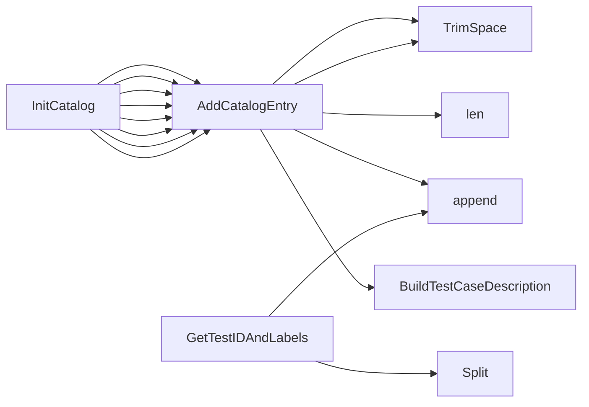

## Package identifiers (github.com/redhat-best-practices-for-k8s/certsuite/tests/identifiers)

### Functions

- **AddCatalogEntry** — func(string, string, string, string, string, string, bool, map[string]string, ...string)(claim.Identifier)
- **GetTestIDAndLabels** — func(claim.Identifier)(string, []string)
- **InitCatalog** — func()(map[claim.Identifier]claim.TestCaseDescription)

### Globals

- **Catalog**: 
- **Classification**: 
- **ImpactMap**: 
- **Test1337UIDIdentifier**: claim.Identifier
- **TestAPICompatibilityWithNextOCPReleaseIdentifier**: claim.Identifier
- **TestAffinityRequiredPods**: claim.Identifier
- **TestBpfIdentifier**: claim.Identifier
- **TestCPUIsolationIdentifier**: claim.Identifier
- **TestClusterOperatorHealth**: claim.Identifier
- **TestContainerHostPort**: claim.Identifier
- **TestContainerIsCertifiedDigestIdentifier**: claim.Identifier
- **TestContainerPortNameFormat**: claim.Identifier
- **TestContainerPostStartIdentifier**: claim.Identifier
- **TestContainerPrestopIdentifier**: claim.Identifier
- **TestContainersImageTag**: claim.Identifier
- **TestCrdRoleIdentifier**: claim.Identifier
- **TestCrdScalingIdentifier**: claim.Identifier
- **TestCrdsStatusSubresourceIdentifier**: claim.Identifier
- **TestDeploymentScalingIdentifier**: claim.Identifier
- **TestDpdkCPUPinningExecProbe**: claim.Identifier
- **TestExclusiveCPUPoolIdentifier**: claim.Identifier
- **TestExclusiveCPUPoolSchedulingPolicy**: claim.Identifier
- **TestHelmIsCertifiedIdentifier**: claim.Identifier
- **TestHelmVersionIdentifier**: claim.Identifier
- **TestHugepagesNotManuallyManipulated**: claim.Identifier
- **TestHyperThreadEnable**: claim.Identifier
- **TestICMPv4ConnectivityIdentifier**: claim.Identifier
- **TestICMPv4ConnectivityMultusIdentifier**: claim.Identifier
- **TestICMPv6ConnectivityIdentifier**: claim.Identifier
- **TestICMPv6ConnectivityMultusIdentifier**: claim.Identifier
- **TestIDToClaimID**: 
- **TestImagePullPolicyIdentifier**: claim.Identifier
- **TestIpcLockIdentifier**: claim.Identifier
- **TestIsRedHatReleaseIdentifier**: claim.Identifier
- **TestIsSELinuxEnforcingIdentifier**: claim.Identifier
- **TestIsolatedCPUPoolSchedulingPolicy**: claim.Identifier
- **TestLimitedUseOfExecProbesIdentifier**: claim.Identifier
- **TestLivenessProbeIdentifier**: claim.Identifier
- **TestLoggingIdentifier**: claim.Identifier
- **TestMultipleSameOperatorsIdentifier**: claim.Identifier
- **TestNamespaceBestPracticesIdentifier**: claim.Identifier
- **TestNamespaceResourceQuotaIdentifier**: claim.Identifier
- **TestNetAdminIdentifier**: claim.Identifier
- **TestNetRawIdentifier**: claim.Identifier
- **TestNetworkAttachmentDefinitionSRIOVUsingMTU**: claim.Identifier
- **TestNetworkPolicyDenyAllIdentifier**: claim.Identifier
- **TestNoSSHDaemonsAllowedIdentifier**: claim.Identifier
- **TestNodeOperatingSystemIdentifier**: claim.Identifier
- **TestNonTaintedNodeKernelsIdentifier**: claim.Identifier
- **TestOCPLifecycleIdentifier**: claim.Identifier
- **TestOCPReservedPortsUsage**: claim.Identifier
- **TestOneProcessPerContainerIdentifier**: claim.Identifier
- **TestOperatorAutomountTokens**: claim.Identifier
- **TestOperatorCatalogSourceBundleCountIdentifier**: claim.Identifier
- **TestOperatorCrdSchemaIdentifier**: claim.Identifier
- **TestOperatorCrdVersioningIdentifier**: claim.Identifier
- **TestOperatorHasSemanticVersioningIdentifier**: claim.Identifier
- **TestOperatorInstallStatusSucceededIdentifier**: claim.Identifier
- **TestOperatorIsCertifiedIdentifier**: claim.Identifier
- **TestOperatorIsInstalledViaOLMIdentifier**: claim.Identifier
- **TestOperatorNoSCCAccess**: claim.Identifier
- **TestOperatorOlmSkipRange**: claim.Identifier
- **TestOperatorPodsNoHugepages**: claim.Identifier
- **TestOperatorRunAsNonRoot**: claim.Identifier
- **TestOperatorSingleCrdOwnerIdentifier**: claim.Identifier
- **TestPersistentVolumeReclaimPolicyIdentifier**: claim.Identifier
- **TestPodAutomountServiceAccountIdentifier**: claim.Identifier
- **TestPodClusterRoleBindingsBestPracticesIdentifier**: claim.Identifier
- **TestPodDeploymentBestPracticesIdentifier**: claim.Identifier
- **TestPodDisruptionBudgetIdentifier**: claim.Identifier
- **TestPodHighAvailabilityBestPractices**: claim.Identifier
- **TestPodHostIPC**: claim.Identifier
- **TestPodHostNetwork**: claim.Identifier
- **TestPodHostPID**: claim.Identifier
- **TestPodHostPath**: claim.Identifier
- **TestPodHugePages1G**: claim.Identifier
- **TestPodHugePages2M**: claim.Identifier
- **TestPodNodeSelectorAndAffinityBestPractices**: claim.Identifier
- **TestPodRecreationIdentifier**: claim.Identifier
- **TestPodRequestsIdentifier**: claim.Identifier
- **TestPodRoleBindingsBestPracticesIdentifier**: claim.Identifier
- **TestPodServiceAccountBestPracticesIdentifier**: claim.Identifier
- **TestPodTolerationBypassIdentifier**: claim.Identifier
- **TestReadinessProbeIdentifier**: claim.Identifier
- **TestReservedExtendedPartnerPorts**: claim.Identifier
- **TestRestartOnRebootLabelOnPodsUsingSRIOV**: claim.Identifier
- **TestRtAppNoExecProbes**: claim.Identifier
- **TestSYSNiceRealtimeCapabilityIdentifier**: claim.Identifier
- **TestSecConNonRootUserIDIdentifier**: claim.Identifier
- **TestSecConPrivilegeEscalation**: claim.Identifier
- **TestSecConReadOnlyFilesystem**: claim.Identifier
- **TestSecContextIdentifier**: claim.Identifier
- **TestServiceDualStackIdentifier**: claim.Identifier
- **TestServiceMeshIdentifier**: claim.Identifier
- **TestServicesDoNotUseNodeportsIdentifier**: claim.Identifier
- **TestSharedCPUPoolSchedulingPolicy**: claim.Identifier
- **TestSingleOrMultiNamespacedOperatorInstallationInTenantNamespace**: claim.Identifier
- **TestStartupProbeIdentifier**: claim.Identifier
- **TestStatefulSetScalingIdentifier**: claim.Identifier
- **TestStorageProvisioner**: claim.Identifier
- **TestSysAdminIdentifier**: claim.Identifier
- **TestSysPtraceCapabilityIdentifier**: claim.Identifier
- **TestSysctlConfigsIdentifier**: claim.Identifier
- **TestTerminationMessagePolicyIdentifier**: claim.Identifier
- **TestUnalteredBaseImageIdentifier**: claim.Identifier
- **TestUnalteredStartupBootParamsIdentifier**: claim.Identifier
- **TestUndeclaredContainerPortsUsage**: claim.Identifier

### Call graph (exported symbols, partial)

### Symbol docs

- [function AddCatalogEntry](symbols/function_AddCatalogEntry.md)
- [function GetTestIDAndLabels](symbols/function_GetTestIDAndLabels.md)
- [function InitCatalog](symbols/function_InitCatalog.md)
