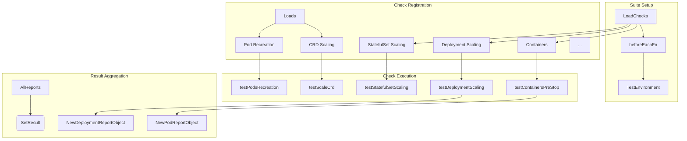
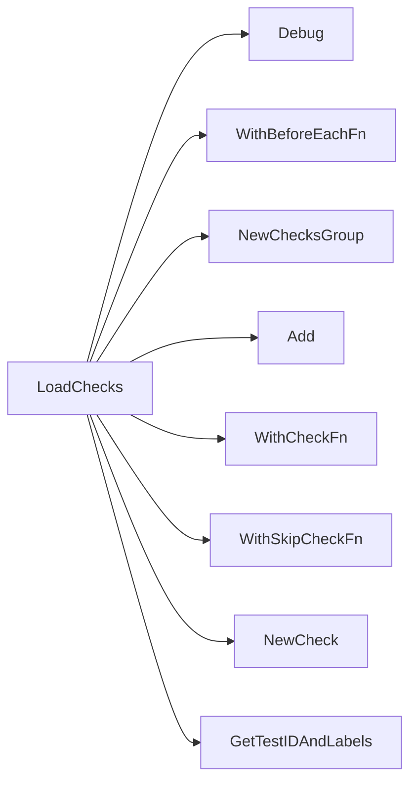

## Package lifecycle (github.com/redhat-best-practices-for-k8s/certsuite/tests/lifecycle)

# Lifecycle Test Package – High‑Level Overview

The **`lifecycle`** package implements a suite of integration tests that validate the behaviour of Kubernetes workloads (Deployments, StatefulSets, Pods, CRDs, etc.) during scaling, recreation, and runtime configuration changes.  
All logic is driven by *check* objects (`checksdb.Check`) which are registered in `LoadChecks`. Each check contains a name, description, tags, and a callback that receives the current test environment.

> **Key design principle** – every test is split into small helper functions (e.g. `testContainersPreStop`, `testDeploymentScaling`).  
> The helpers log progress, build report objects (`NewPodReportObject`, `NewDeploymentReportObject` …) and set a final result on the check.

Below we describe how the package pieces fit together.

---

## Global constants

| Name | Meaning |
|------|---------|
| `timeout` | Overall timeout for a test run. |
| `minWorkerNodesForLifecycle` | Minimum number of worker nodes required before running lifecycle tests. |
| `statefulSet`, `localStorage` | Labels/identifiers used to filter resources. |
| `timeoutPodRecreationPerPod`, `timeoutPodSetReady` | Timeouts for pod recreation and readiness checks. |
| `intrusiveTcSkippedReason` | Reason string used when an intrusive test is skipped. |

---

## Global variables

| Variable | Type | Purpose |
|----------|------|---------|
| `env` | `provider.TestEnvironment` | Holds the current test environment (cluster, kubeconfig, etc.). It is initialized in `beforeEachFn`. |
| `beforeEachFn` | function | Registered with Ginkgo’s `BeforeSuite`; it sets up `env` and other per‑suite state. |
| `skipIfNoPodSetsetsUnderTest` | bool | Flag that indicates whether the suite should skip tests when no Pods/ReplicaSets are present. |

---

## Core data structures

The package does not declare its own structs; it relies on types from:

* **`checksdb.Check`** – represents a single test check.  
  *Has fields*: `Name`, `Description`, `Tags`, `CheckFn`, `SkipFn`, `Result`.
* **Report objects** (`NewPodReportObject`, `NewDeploymentReportObject`, …) – lightweight structs that capture the result of a sub‑check (status, messages, metadata).

These report objects are collected into slices and attached to the check’s final `Result`.

---

## Loading checks – `LoadChecks`

```go
func LoadChecks() func()
```

* **Purpose** – register all lifecycle checks with the global checks database.
* **Process**  
  1. A debug log is emitted.  
  2. A `beforeEachFn` is added via `WithBeforeEachFn`.  
  3. For each test category (containers, deployments, scaling, etc.) a `NewChecksGroup` is created.  
  4. Within the group, individual checks are added using `Add(NewCheck(...))`.  
     * Each check receives:  
       - A unique ID (`GetTestIDAndLabels`).  
       - Optional skip logic (`GetNoContainersUnderTestSkipFn`, `GetNotIntrusiveSkipFn`, …).  
       - The actual test function (e.g. `testContainersPreStop`).  

* **Outcome** – after the suite runs, all checks are executed in order of registration.

---

## Helper functions

| Function | Signature | Role |
|----------|-----------|------|
| `nameInDeploymentSkipList` / `nameInStatefulSetSkipList` | `(string,string,[]config.SkipX) bool` | Checks if a deployment/statefulset should be skipped based on configuration. |
| `testAffinityRequiredPods` | `(*checksdb.Check,*provider.TestEnvironment)` | Validates pod affinity/anti‑affinity rules against the cluster’s scheduler policies. |
| `testCPUIsolation` | `(*checksdb.Check,*provider.TestEnvironment)` | Checks that pods with guaranteed QoS request exclusive CPUs are properly isolated. |
| `testContainersImagePolicy`, `testContainersLivenessProbe`, … | `(*checksdb.Check,*provider.TestEnvironment)` | Inspect container specs for image pull policies, probes, lifecycle hooks, etc. |
| `testPodsOwnerReference` | `(*checksdb.Check,*provider.TestEnvironment)` | Verifies that pods have correct owner references (e.g., Deployment). |
| `testPodsRecreation` | `(*checksdb.Check,*provider.TestEnvironment)` | Simulates node failure by cordoning nodes, then waits for pod recreation and readiness. |
| `testDeploymentScaling`, `testStatefulSetScaling`, `testScaleCrd` | `(*provider.TestEnvironment,time.Duration,*checksdb.Check)` | Test scaling logic: apply HPA, verify that the desired replica count is achieved within timeouts. |
| `testHighAvailability` | `(*checksdb.Check,*provider.TestEnvironment)` | Checks HA of deployments/statefulsets by inspecting pod distribution across nodes. |
| `testPodNodeSelectorAndAffinityBestPractices` | `([]*provider.Pod,*checksdb.Check)` | Ensures pods have node selectors or affinity configured for best‑practice placement. |
| `testPodPersistentVolumeReclaimPolicy` | `(*checksdb.Check,*provider.TestEnvironment)` | Validates that PVCs use the delete reclaim policy on dynamic volumes. |
| `testPodTolerationBypass`, `testStorageProvisioner` | `(*checksdb.Check,*provider.TestEnvironment)` | Verify tolerations, node taints handling and storage class provisioning rules. |

Each helper:

1. Logs its start (`LogInfo`).  
2. Retrieves relevant Kubernetes objects via the provider (`Get…` helpers).  
3. Builds a report object for each subject (pod, deployment, etc.).  
4. Appends reports to the check’s result slice.  
5. Calls `SetResult` at the end with an overall status.

---

## How checks interact with the environment

* **Provider abstraction** – All Kubernetes interactions are routed through `provider.TestEnvironment`.  
  * Example: `GetResourceHPA`, `GetAllNodesForAllPodSets`, `CordonCleanup`.  
* **Logging** – Uses a custom logger (`log.Debug`, `log.Info`) that is tied to the check’s context.  
* **Skipping logic** – Skip functions are evaluated before the main test function runs; if true, the check is marked as skipped with an explanatory message.

---

## Suggested Mermaid diagram



This diagram captures the flow from loading checks, through environment setup, to individual test execution and result aggregation.

---

## Summary

* **Lifecycle tests** are modular checks registered in `LoadChecks`.  
* Each check is a self‑contained function that logs, queries the cluster via the provider, builds report objects, and records a final status.  
* Skipping logic is applied per check using configuration‑driven helper functions.  
* Global constants configure timeouts and environment constraints; global variables hold the test environment and flags.  

The package is heavily tied to the Certsuite infrastructure (checksdb, provider, postmortem) but can be understood as a collection of well‑structured, reusable test routines that validate Kubernetes lifecycle behaviour.

### Functions

- **LoadChecks** — func()()

### Globals


### Call graph (exported symbols, partial)



### Symbol docs

- [function LoadChecks](symbols/function_LoadChecks.md)
