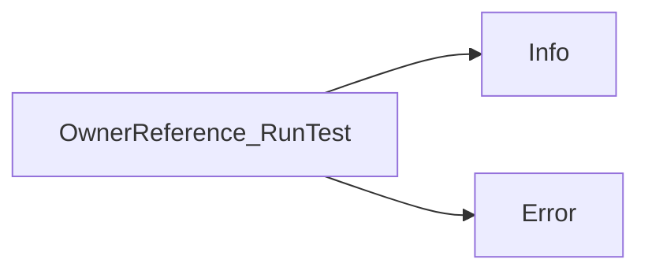

## Package ownerreference (github.com/redhat-best-practices-for-k8s/certsuite/tests/lifecycle/ownerreference)

# `ownerreference` Test Package Overview  
*(located in `tests/lifecycle/ownerreference`) *

---

## Purpose
The package implements a lightweight test that verifies whether a **Pod** correctly records its owner references (e.g., ReplicaSet or StatefulSet). It is part of Certsuite’s lifecycle tests.

---

## Core Data Structure

| Field | Type | Description |
|-------|------|-------------|
| `put`  | `*corev1.Pod` | The pod under test. |
| `result` | `int` | Test outcome: `0` for success, any other value indicates failure. |

```go
type OwnerReference struct {
    put     *corev1.Pod
    result  int
}
```

### Key Methods

| Method | Signature | Responsibility |
|--------|-----------|----------------|
| `RunTest(*log.Logger)` | `func (o *OwnerReference) RunTest(l *log.Logger)` | Executes the test, logs progress/errors via Certsuite’s logger, and stores the result in `o.result`. |
| `GetResults()` | `func (o OwnerReference) GetResults() int` | Returns the stored `result` value. |

> **Note**: `RunTest` internally uses the logger’s `Info` and `Error` functions to report status.

---

## Global Constants

| Name | Value | Usage |
|------|-------|-------|
| `replicaSet` | `"ReplicaSet"` | Owner kind expected for replica‑controlled pods. |
| `statefulSet` | `"StatefulSet"` | Owner kind expected for stateful‑set controlled pods. |

These constants are used in the test logic to compare against the owner reference kinds found on the pod.

---

## Factory Function

```go
func NewOwnerReference(pod *corev1.Pod) *OwnerReference
```

Creates a new `OwnerReference` instance, initializing its `put` field with the supplied pod. The `result` is left at the zero value (`0`) until `RunTest` is invoked.

---

## How It Works

1. **Setup**  
   ```go
   pod := ... // obtained from test harness
   test := NewOwnerReference(pod)
   ```

2. **Execution**  
   ```go
   logger := log.New(...)          // Certsuite logger
   test.RunTest(logger)             // logs steps, sets test.result
   ```

3. **Result Retrieval**  
   ```go
   outcome := test.GetResults()    // 0 → success; >0 → failure
   ```

---

## Suggested Mermaid Flow

```mermaid
flowchart TD
    A[Create Pod] --> B[NewOwnerReference(pod)]
    B --> C{RunTest}
    C -->|Success| D[Set result = 0]
    C -->|Failure| E[Log Error & set result ≠ 0]
    D --> F[GetResults() → 0]
    E --> G[GetResults() → non‑zero]
```

---

## Summary

- **`OwnerReference`** bundles a pod and its test result.  
- **`RunTest`** validates that the pod’s owner references match expected kinds (`ReplicaSet` or `StatefulSet`).  
- **`GetResults`** exposes the outcome for further aggregation by Certsuite.  

This minimal design keeps the test self‑contained while leveraging the shared logging infrastructure.

### Structs

- **OwnerReference** (exported) — 2 fields, 2 methods

### Functions

- **NewOwnerReference** — func(*corev1.Pod)(*OwnerReference)
- **OwnerReference.GetResults** — func()(int)
- **OwnerReference.RunTest** — func(*log.Logger)()

### Call graph (exported symbols, partial)



### Symbol docs

- [struct OwnerReference](symbols/struct_OwnerReference.md)
- [function NewOwnerReference](symbols/function_NewOwnerReference.md)
- [function OwnerReference.GetResults](symbols/function_OwnerReference_GetResults.md)
- [function OwnerReference.RunTest](symbols/function_OwnerReference_RunTest.md)
