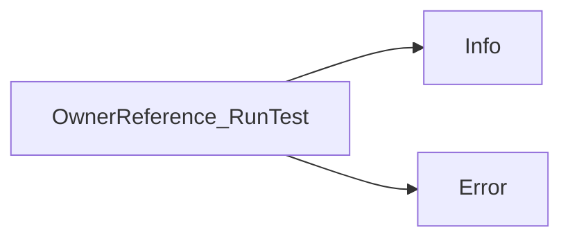

## Package ownerreference (github.com/redhat-best-practices-for-k8s/certsuite/tests/lifecycle/ownerreference)

### Structs

- **OwnerReference** (exported) — 2 fields, 2 methods

### Functions

- **NewOwnerReference** — func(*corev1.Pod)(*OwnerReference)
- **OwnerReference.GetResults** — func()(int)
- **OwnerReference.RunTest** — func(*log.Logger)()

### Call graph (exported symbols, partial)

### Symbol docs

- [struct OwnerReference](symbols/struct_OwnerReference.md)
- [function NewOwnerReference](symbols/function_NewOwnerReference.md)
- [function OwnerReference.GetResults](symbols/function_OwnerReference_GetResults.md)
- [function OwnerReference.RunTest](symbols/function_OwnerReference_RunTest.md)
