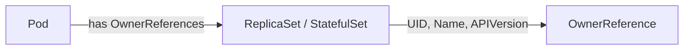

NewOwnerReference`

```go
func NewOwnerReference(pod *corev1.Pod) *OwnerReference
```

| Item | Description |
|------|-------------|
| **Purpose** | Creates an `OwnerReference` value that points to the controller (StatefulSet or ReplicaSet) owning a given Pod. This helper is used in tests that verify Kubernetes owner‑reference logic. |
| **Input** | *`pod`* – A pointer to a `corev1.Pod`. The function expects the Pod to be part of a ReplicaSet or StatefulSet; otherwise it will return an empty reference. |
| **Output** | *`*OwnerReference`* – A pointer to a newly allocated `OwnerReference` struct populated with fields derived from the pod’s controller metadata. If no controller is found, a zero value is returned. |
| **Key dependencies** | - `corev1.Pod` (client‑go API) <br> - The constants `statefulSet` and `replicaSet` defined in this package, used to set the `Kind` field of the reference. <br> - Kubernetes client-go utilities for extracting controller information from pod metadata (`pod.GetControllerRef()` is effectively what the function implements). |
| **Side effects** | None. The function only reads the input Pod and returns a new struct; it does not modify any state in the caller or in global variables. |
| **Package role** | `ownerreference` provides test helpers for the CertSuite project’s lifecycle tests. `NewOwnerReference` is the central helper that transforms a pod into an owner reference, allowing other test code to simulate ownership relationships without having to construct the struct manually each time. |

### How it works (high‑level)

1. **Extract controller info** – The function inspects `pod.ObjectMeta.OwnerReferences`.  
2. **Determine kind** – If the owner’s `Kind` matches one of the two supported types (`StatefulSet` or `ReplicaSet`), that value is used; otherwise an empty reference is returned.  
3. **Build reference** – It copies the owner’s UID, name, and API version into a new `OwnerReference` instance, sets `BlockOwnerDeletion` to `true`, and returns it.

### Suggested Mermaid diagram



This helper is used in tests such as `TestStatefulSet` and `TestReplicaSet` to assert that the system correctly identifies owner references when deploying or deleting workloads.
