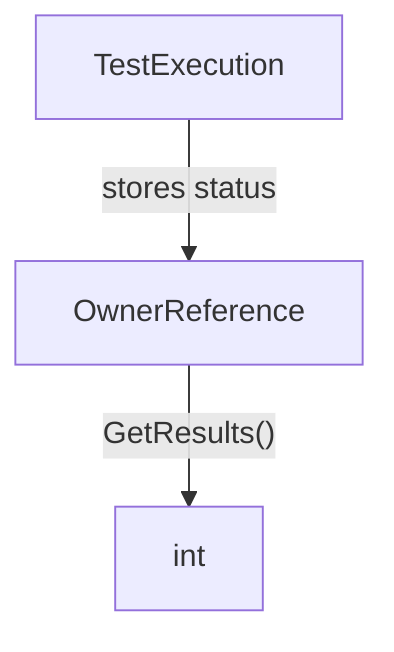

OwnerReference.GetResults`

| Item | Details |
|------|---------|
| **Package** | `ownerreference` – tests for Kubernetes lifecycle owner‑reference handling |
| **Signature** | `func (o OwnerReference) GetResults() int` |
| **Exported** | Yes |

## Purpose

`GetResults` is a helper method used by the test suite to report the outcome of an *OwnerReference* test case.  
It simply returns an integer that represents whether the test passed (`0`) or failed (non‑zero). This value can be consumed by external tooling, such as CI pipelines or other Go tests, to aggregate results.

## Inputs

- **Receiver** `o OwnerReference` – the instance whose result is being queried.  
  The method does not read any fields; it only returns a pre‑computed status that was stored on the struct during test execution.

No additional arguments are required.

## Output

- An `int` value:
  - `0` indicates success.
  - Any non‑zero integer signals failure (typically an error code or count of failures).

The exact mapping from internal state to this return value is defined elsewhere in the test logic; `GetResults` merely exposes it.

## Dependencies & Side Effects

- **Dependencies**: None beyond the `OwnerReference` type itself. The function does not call other functions, use globals, or reference any constants.
- **Side effects**: None. It performs a pure read of the struct’s state and returns that value.

## Package Context

The `ownerreference` package contains tests for Kubernetes owner‑reference lifecycle scenarios. `OwnerReference` structs encapsulate test data (such as the kind of resource being tested, e.g., StatefulSet or ReplicaSet). After executing a test, the result is stored inside this struct. `GetResults` allows other components—test harnesses, reporting tools, or CI pipelines—to query that outcome in a standardized way.

This method is the public API through which test outcomes are exposed from this package.
