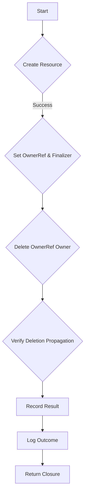

OwnerReference.RunTest` – Owner‑Reference Lifecycle Test Runner  

### Purpose
`RunTest` executes the suite of tests that verify Kubernetes owner reference behaviour for a given resource.  
The function is the entry point called by the test harness; it drives all sub‑tests, logs progress, and records results in the `OwnerReference.result` field.

### Signature
```go
func (o *OwnerReference) RunTest(logger *log.Logger) func()
```

* **Receiver** – `o *OwnerReference`  
  Holds configuration for the test (resource type, namespace, etc.) and a mutable `result` map that will be populated after execution.  
* **Parameter** – `logger *log.Logger`  
  Logger used to emit informational and error messages during the run.
* **Return value** – an anonymous function (`func()`) that performs no work by itself; it is returned so callers can defer its execution if desired.

### Key Dependencies
| Dependency | Role |
|------------|------|
| `log.Logger` | Provides structured logging. Calls to `logger.Info()` and `logger.Error()` appear in the test output. |
| `OwnerReference.result` (field) | Map that stores per‑test outcome (`"PASS"`/`"FAIL"`, error details). The function writes into this map. |
| Internal test helpers | Although not explicitly listed, `RunTest` relies on other methods of `OwnerReference` (e.g., to create the resource, delete it, and verify finalizers) that perform the actual Kubernetes API interactions. |

### Side‑Effects
1. **Logging** – Emits start/finish messages for each sub‑test via the supplied logger.
2. **Result mutation** – Updates the `OwnerReference.result` map; callers inspect this after execution to determine overall pass/fail status.
3. **Kubernetes state changes** – The test creates and deletes resources in a target namespace, potentially adding finalizers or owner references. These are cleaned up by the test itself.

### Package Context
The function lives in `github.com/redhat-best-practices-for-k8s/certsuite/tests/lifecycle/ownerreference`.  
That package implements a suite of tests that validate whether resources correctly propagate deletion through Kubernetes owner references and finalizers. `RunTest` orchestrates these checks for a single resource type, making it the central execution point for this test group.

### Suggested Mermaid Flow


This diagram illustrates the high‑level steps performed by `RunTest` when validating owner reference semantics.
