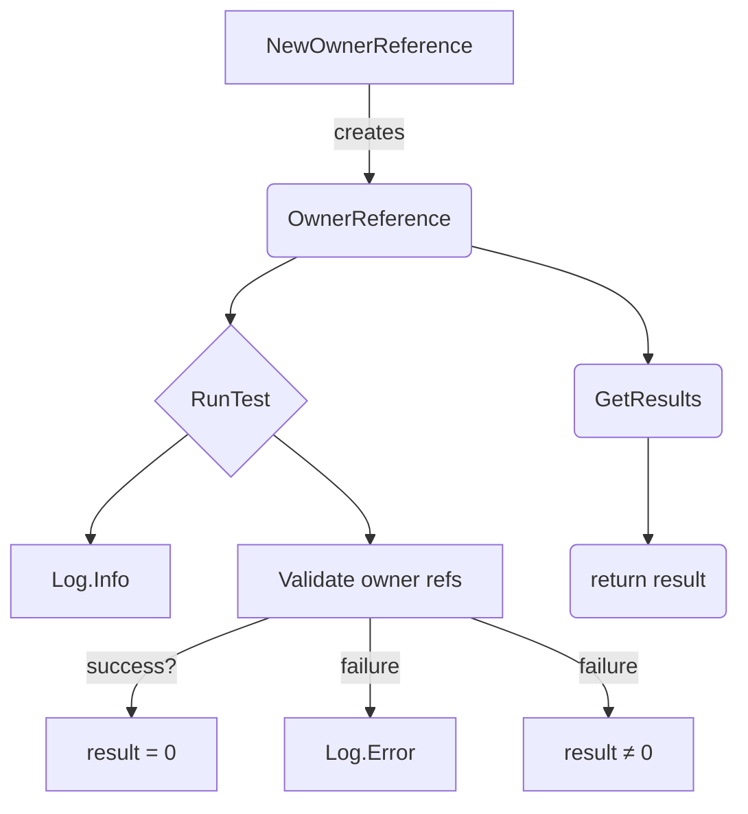

OwnerReference` – Test harness for Kubernetes owner‑reference validation

| Element | Details |
|---------|---------|
| **Package** | `github.com/redhat-best-practices-for-k8s/certsuite/tests/lifecycle/ownerreference` |
| **File** | `ownerreference.go` (line 32) |

### Purpose
`OwnerReference` is a lightweight test helper that verifies the correctness of owner‑references on Kubernetes resources.  
It is used in CertSuite’s lifecycle tests to:

1. Hold a reference to the *resource under test* (`put`, a `corev1.Pod`).
2. Run the validation logic via `RunTest`.
3. Store the numeric result (e.g., 0 for success, non‑zero for failure) in `result`.

The struct is intentionally simple because it only needs to orchestrate the test flow and expose the outcome.

### Fields

| Field | Type | Role |
|-------|------|------|
| `put` | `*corev1.Pod` | The Pod whose owner references are being validated. |
| `result` | `int` | Stores the final test result; 0 indicates success, any other value signals an error condition. |

### Methods

#### `RunTest(logger *log.Logger)`

```go
func (o *OwnerReference) RunTest(logger *log.Logger)
```

* **Input** – A logger to record progress and errors.
* **Behavior**
  1. Logs the start of the test (`logger.Info`).
  2. Executes the owner‑reference validation logic (details omitted in this snippet; likely involves checking `o.put.OwnerReferences` against expected values).
  3. On success, sets `o.result = 0`; on failure, assigns a non‑zero value and logs an error via `logger.Error`.
* **Side effects**
  * Modifies the struct’s own `result` field.
  * Emits log entries – no external state changes beyond the logger.

#### `GetResults() int`

```go
func (o OwnerReference) GetResults() int
```

* **Return** – The integer stored in `result`.
* **Usage** – Called by test harnesses to decide pass/fail status after `RunTest` completes.

### Dependency Graph



### How it fits the package

* **Package role** – The `ownerreference` package contains all logic required to test Kubernetes owner‑references as part of CertSuite’s lifecycle validation suite.
* **Interaction** – Tests instantiate an `OwnerReference` via `NewOwnerReference`, run the test, and then inspect the outcome with `GetResults`.
* **Extensibility** – Adding new validation checks would involve extending the logic inside `RunTest`; the struct itself remains unchanged.

---

> **Note**: The actual validation algorithm is not shown in this snippet; `RunTest` focuses on orchestration and logging, delegating the core checks to other helpers or inline code.
