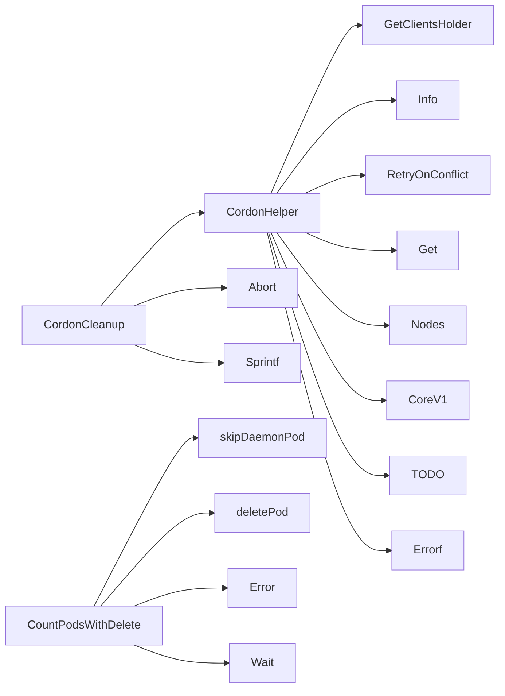

## Package podrecreation (github.com/redhat-best-practices-for-k8s/certsuite/tests/lifecycle/podrecreation)

# podrecreation – Lifecycle Test Package

The **`podrecreation`** package implements a test that verifies Kubernetes controllers correctly recreate Pods when a node is cordoned or uncordoned.  
It operates on the cluster via the shared client holder, watches for Pod deletion events, and optionally deletes Pods in different propagation modes.

> **Key concepts**
| Symbol | Meaning |
|--------|---------|
| `Cordon` / `Uncordon` | Actions performed on a node (`spec.unschedulable`). |
| `DeleteBackground`, `DeleteForeground`, `NoDelete` | Pod deletion propagation policies used by the test. |
| `ReplicaSetString`, `DeploymentString`, etc. | Constants for Kubernetes resource kinds – used only in logs and diagnostics. |

---

## Core Data Structures

The package does **not** define any custom structs; it relies on the Kubernetes API types (`corev1.Pod`) and a small helper type from the provider package.

```go
type Pod struct { /* defined in provider */ }
```

Only constants are exported as global variables.

---

## Main Workflow

Below is a high‑level flow of how the test runs:

```mermaid
flowchart TD
    A[Start Test] --> B{Get Node}
    B -->|exists| C[CordonHelper(node, "cordon")]
    C --> D[CountPodsWithDelete(pods, nodeName, deleteMode)]
    D --> E[Wait for Pods to be recreated]
    E --> F[Cleanup – Uncordon or Delete cleanup]
```

1. **Cordon / Uncordon**  
   `CordonHelper` sets the `unschedulable` flag on a node via an optimistic retry loop (`RetryOnConflict`). It logs progress and errors.

2. **Delete Pods (optional)**  
   `CountPodsWithDelete` iterates over all pods belonging to the node, optionally deleting each one with `deletePod`.  
   *DaemonSet‑owned pods are skipped (`skipDaemonPod`).*  
   A `sync.WaitGroup` ensures all delete operations finish before proceeding.

3. **Watch for Deletion**  
   Inside `deletePod`, a watch is started on the pod’s namespace, waiting until the Pod terminates (or times out).  
   The helper `waitPodDeleted` consumes events from that watch and stops it once the Pod disappears.

4. **Cleanup**  
   `CordonCleanup` is returned by the test entry point; when invoked it uncordons the node or performs any needed final clean‑up.

---

## Key Functions

| Function | Purpose | Notable Calls |
|----------|---------|---------------|
| **`CordonHelper(node, action)`** | Sets or clears `unschedulable` on a node. Uses `RetryOnConflict` for safe updates. | `GetClientsHolder`, `CoreV1().Nodes()`, `Update`, `Errorf` |
| **`CountPodsWithDelete(pods []*provider.Pod, nodeName string, deleteMode string)`** | Deletes eligible pods and counts them. | `skipDaemonPod`, `deletePod`, `Wait`, `Error` |
| **`deletePod(pod *corev1.Pod, nodeName string, wg *sync.WaitGroup)`** | Deletes a single pod with the chosen propagation policy and watches until it is removed. | `GetClientsHolder`, `Pods().Delete()`, `Watch()`, `waitPodDeleted` |
| **`skipDaemonPod(pod *corev1.Pod)`** | Returns true if the pod belongs to a DaemonSet (do not delete). | – |
| **`waitPodDeleted(namespace, name string, grace int64, w watch.Interface)`** | Consumes events from a watch until the Pod is gone or timeout occurs. | `Debug`, `Stop`, `ResultChan`, `After` |
| **`CordonCleanup(nodeName string, check *checksdb.Check)()`** | Returned cleanup closure that uncordons the node and aborts the test if needed. | `CordonHelper`, `Abort`, `Sprintf` |

---

## Global Constants

```go
const (
    ReplicaSetString      = "ReplicaSet"
    DeploymentString      = "Deployment"
    StatefulsetString     = "StatefulSet"
    DaemonSetString       = "DaemonSet"

    Cordon   = "cordon"
    Uncordon = "uncordon"

    DefaultGracePeriodInSeconds int64 = 30

    DeleteBackground = "background"
    DeleteForeground = "foreground"
    NoDelete         = ""
)
```

These are used only for logging and determining which propagation policy to apply when deleting Pods.

---

## Interaction with External Packages

* **`clientsholder`** – Provides the shared Kubernetes client set (`GetClientsHolder()`).
* **`log`** – Wraps standard log functions; used throughout.
* **`checksdb` & `provider`** – Represent test metadata and a lightweight pod wrapper.

---

## Summary

The package orchestrates a lifecycle test by:

1. Cordon/uncordon a node,
2. Optionally deleting Pods on that node with different propagation policies,
3. Watching for Pod deletion events to confirm controllers react appropriately,
4. Cleaning up by uncordoning the node.

No custom data structures are introduced; the logic relies heavily on Kubernetes client-go primitives and simple helper functions to manage watches, retries, and concurrency via `sync.WaitGroup`.

### Functions

- **CordonCleanup** — func(string, *checksdb.Check)()
- **CordonHelper** — func(string, string)(error)
- **CountPodsWithDelete** — func([]*provider.Pod, string, string)(int, error)

### Call graph (exported symbols, partial)



### Symbol docs

- [function CordonCleanup](symbols/function_CordonCleanup.md)
- [function CordonHelper](symbols/function_CordonHelper.md)
- [function CountPodsWithDelete](symbols/function_CountPodsWithDelete.md)
