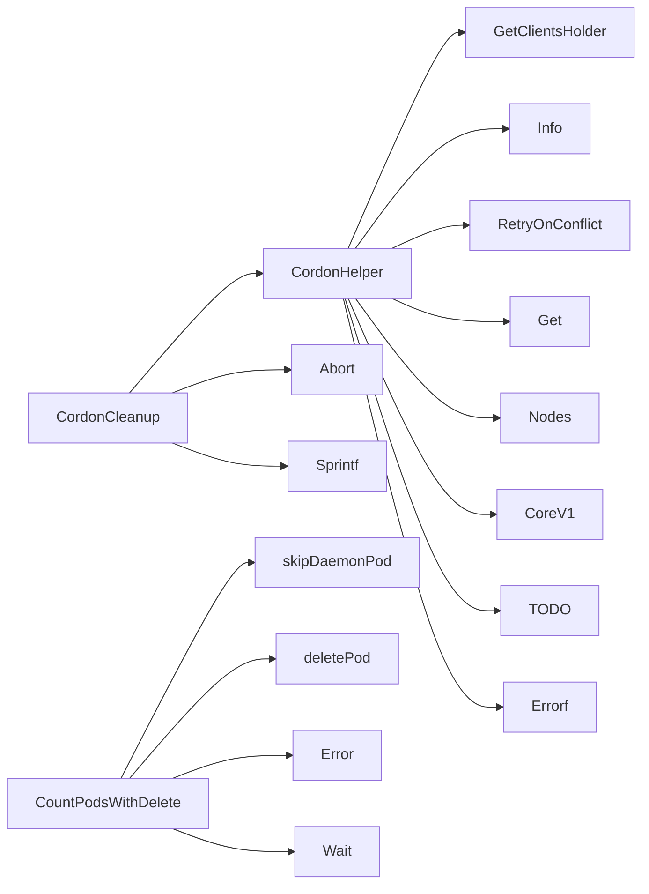

## Package podrecreation (github.com/redhat-best-practices-for-k8s/certsuite/tests/lifecycle/podrecreation)

### Functions

- **CordonCleanup** — func(string, *checksdb.Check)()
- **CordonHelper** — func(string, string)(error)
- **CountPodsWithDelete** — func([]*provider.Pod, string, string)(int, error)

### Call graph (exported symbols, partial)

### Symbol docs

- [function CordonCleanup](symbols/function_CordonCleanup.md)
- [function CordonHelper](symbols/function_CordonHelper.md)
- [function CountPodsWithDelete](symbols/function_CountPodsWithDelete.md)
