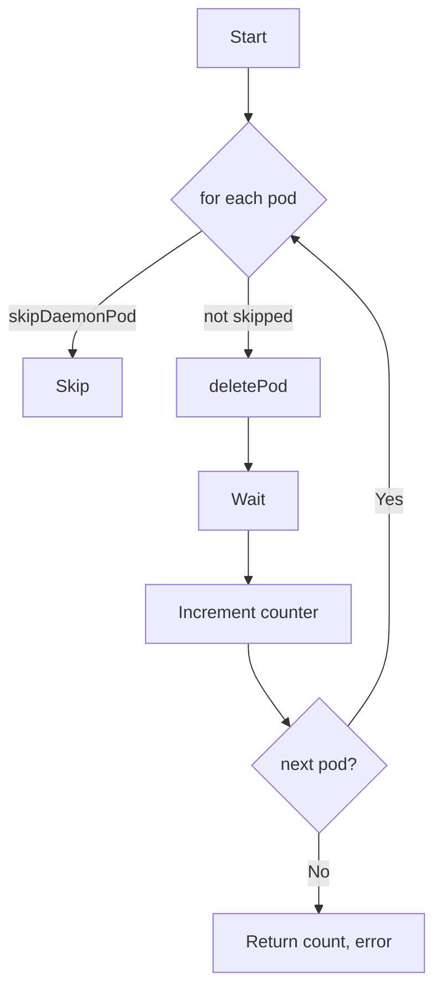

CountPodsWithDelete` – pod‑deletion counter

**File**  
`/Users/deliedit/dev/certsuite/tests/lifecycle/podrecreation/podrecreation.go:76`

---

## Purpose
`CountPodsWithDelete` traverses a list of Kubernetes pods and counts how many of them are actually removed by the test harness.  
The function is used in the *pod recreation* lifecycle tests to assert that pod deletions happen as expected.

It:
1. Skips DaemonSet‑owned pods (they’re not meant to be deleted).
2. Attempts to delete each remaining pod.
3. Waits for the deletion to finish.
4. Returns the total number of successful deletions, or an error if any step fails.

---

## Signature

```go
func CountPodsWithDelete(pods []*provider.Pod, namespace string, podNamePrefix string) (int, error)
```

| Parameter | Type            | Description |
|-----------|-----------------|-------------|
| `pods`    | `[]*provider.Pod` | Slice of pods to evaluate. |
| `namespace` | `string`        | Namespace in which the pods reside; used for deletion and waiting calls. |
| `podNamePrefix` | `string`     | Prefix that identifies the pod set under test (used by `deletePod`). |

**Returns**

- `int` – number of pods that were successfully deleted.
- `error` – non‑nil if any pod could not be processed.

---

## Dependencies & Side‑Effects

| Called function | Role |
|-----------------|------|
| `skipDaemonPod(pod)` | Determines whether the pod belongs to a DaemonSet and should be ignored. |
| `deletePod(pod, namespace, prefix)` | Issues a delete request for the pod. |
| `Wait(namespace, podName)` | Blocks until the pod is fully removed from the API server. |
| `Error(err)` | Wraps an error with additional context (likely returns a custom error type). |

**Side‑effects**

- Calls to `deletePod` and `Wait` modify the cluster state by deleting pods.
- The function itself does not mutate its input slice; it only reads from it.

---

## How It Fits the Package

The `podrecreation` package implements lifecycle tests for pod recreation scenarios (e.g., after a node failure or during rolling updates).  
`CountPodsWithDelete` is a helper that:

1. **Normalises** the set of pods to be considered by excluding DaemonSet pods.
2. **Triggers** deletion actions required by the test logic.
3. **Quantifies** the outcome so that higher‑level tests can assert the expected number of deletions.

Because it encapsulates common delete–wait logic, other test functions can reuse it without duplicating code.

---

## Suggested Mermaid Diagram



---
