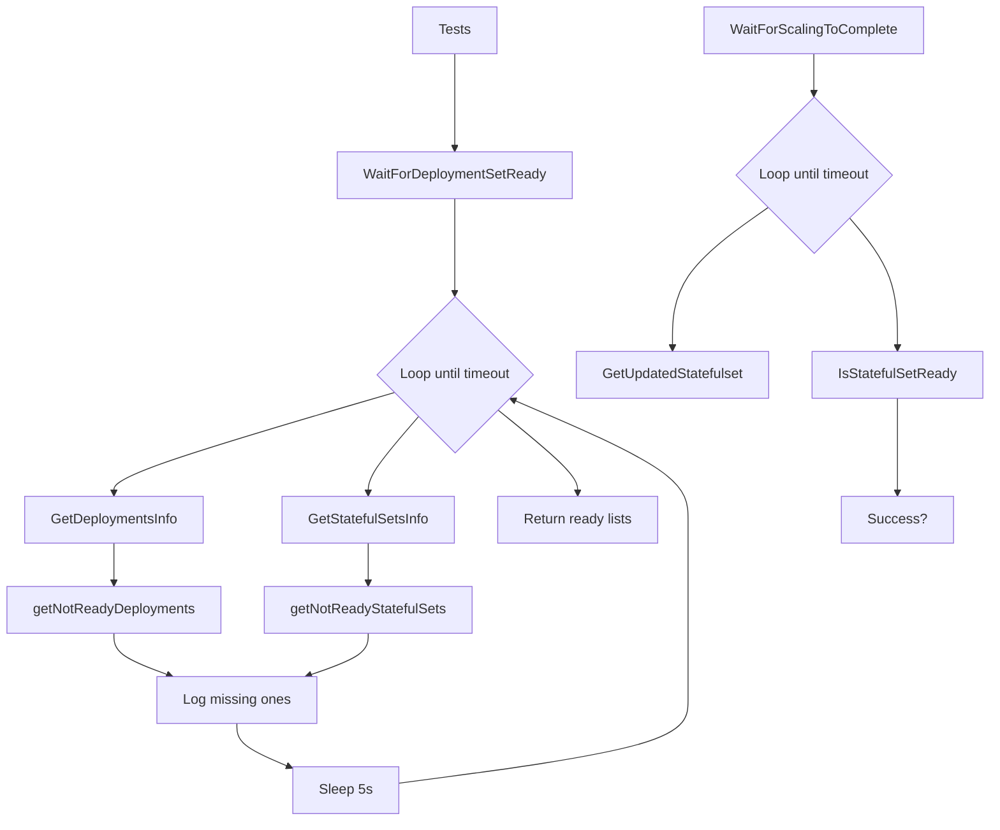
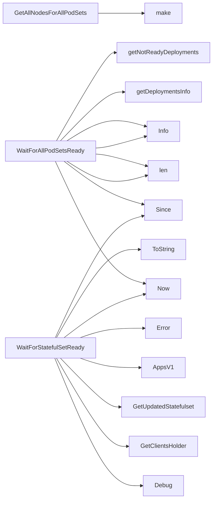

## Package podsets (github.com/redhat-best-practices-for-k8s/certsuite/tests/lifecycle/podsets)

# Overview – `github.com/redhat-best-practices-for-k8s/certsuite/tests/lifecycle/podsets`

The *podsets* test package provides helper utilities for waiting on and inspecting the readiness of **Deployments** and **StatefulSets** in a Kubernetes cluster.  
It is intentionally read‑only: the code only queries the API, logs progress, and returns status information.

> **Key idea** – Each “wait” routine repeatedly polls the target resource until it reaches the desired state or a timeout occurs.  The helpers that extract *namespace:name* strings are used for logging and diagnostics.

---

## Global function variables

| Name | Purpose |
|------|---------|
| `WaitForDeploymentSetReady` | Function variable that points to `WaitForAllPodSetsReady`.  It is exported so tests can call it via the package name without importing the concrete implementation. |
| `WaitForScalingToComplete` | Function variable that points to `WaitForStatefulSetReady`.  Used when a test needs to wait for a StatefulSet’s replicas to reach the desired count. |

These variables are defined as:

```go
var (
    WaitForDeploymentSetReady = WaitForAllPodSetsReady
    WaitForScalingToComplete  = WaitForStatefulSetReady
)
```

---

## Constants

| Constant | Value | Usage |
|----------|-------|-------|
| `ReplicaSetString` | `"replicaset"` | Used in log messages to indicate a Deployment’s underlying ReplicaSet. |
| `StatefulsetString` | `"statefulset"` | Used in log messages for StatefulSets. |

---

## Core helpers

### 1. `WaitForAllPodSetsReady`

```go
func WaitForAllPodSetsReady(
    env *provider.TestEnvironment,
    timeout time.Duration,
    logger *log.Logger,
) ([]*provider.Deployment, []*provider.StatefulSet)
```

| Step | What happens |
|------|--------------|
| Log start | `logger.Info("waiting for all podsets to be ready")` |
| Loop until timeout or both lists empty | 1. **Get current deployments** via `getDeploymentsInfo`. <br>2. **Identify not‑ready deployments** with `getNotReadyDeployments`. <br>3. Log any missing ones. <br>4. Repeat the same for StatefulSets (`getStatefulSetsInfo`, `getNotReadyStatefulSets`). |
| Sleep | 5 seconds between iterations. |
| Return | Two slices: the *ready* Deployments and the *ready* StatefulSets at the end of the wait. |

It uses helper functions to extract string identifiers, check readiness (`isDeploymentReady`, `isStatefulSetReady`), and log progress.

### 2. `WaitForStatefulSetReady`

```go
func WaitForStatefulSetReady(
    namespace, name string,
    timeout time.Duration,
    logger *log.Logger,
) bool
```

| Step | What happens |
|------|--------------|
| Log start | `logger.Debug(...)` |
| Poll loop until timeout | 1. Fetch the current StatefulSet via `GetUpdatedStatefulset`. <br>2. Check readiness with `IsStatefulSetReady`. <br>3. If not ready, log error and sleep for a second. |
| Return | `true` if ready before timeout; otherwise `false`. |

---

## Helper functions

| Function | Signature | Responsibility |
|----------|-----------|----------------|
| `isDeploymentReady` | `func(namespace, name string) (bool, error)` | Calls the API to get an updated Deployment and uses `IsDeploymentReady` from `provider` to determine readiness. |
| `isStatefulSetReady` | `func(namespace, name string) (bool, error)` | Similar but for StatefulSets. |
| `getDeploymentsInfo` | `func([]*provider.Deployment) []string` | Builds a slice of `"namespace:name"` strings for logging. |
| `getNotReadyDeployments` | `func([]*provider.Deployment) []*provider.Deployment` | Filters out deployments that are not ready, logging each failure. |
| `getStatefulSetsInfo` | `func([]*provider.StatefulSet) []string` | Same as `getDeploymentsInfo`, but for StatefulSets. |
| `getNotReadyStatefulSets` | `func([]*provider.StatefulSet) []*provider.StatefulSet` | Filters out not‑ready StatefulSets, logging failures. |

---

## Interaction diagram (simplified)



---

## Usage pattern

```go
readyDeploys, readySTS := podsets.WaitForDeploymentSetReady(env, 10*time.Minute, logger)
if len(readyDeploys) == 0 || len(readySTS) == 0 {
    // handle failure
}
```

or

```go
ok := podsets.WaitForScalingToComplete("my-namespace", "my-sts", 5*time.Minute, logger)
if !ok { /* timeout */ }
```

---

### Summary

* The package contains **no custom data structures** – it works with the types supplied by `provider`.
* Two exported function variables (`WaitForDeploymentSetReady`, `WaitForScalingToComplete`) expose the waiting logic to tests.
* Helper functions isolate polling logic, readiness checks, and string formatting for concise log output.  
* The code is straightforward, side‑effect‑free (except for logging), and designed for use in integration test suites that validate Kubernetes workloads.

### Functions

- **GetAllNodesForAllPodSets** — func([]*provider.Pod)(map[string]bool)
- **WaitForAllPodSetsReady** — func(*provider.TestEnvironment, time.Duration, *log.Logger)([]*provider.Deployment, []*provider.StatefulSet)
- **WaitForStatefulSetReady** — func(string, string, time.Duration, *log.Logger)(bool)

### Globals

- **WaitForDeploymentSetReady**: 
- **WaitForScalingToComplete**: 

### Call graph (exported symbols, partial)



### Symbol docs

- [function GetAllNodesForAllPodSets](symbols/function_GetAllNodesForAllPodSets.md)
- [function WaitForAllPodSetsReady](symbols/function_WaitForAllPodSetsReady.md)
- [function WaitForStatefulSetReady](symbols/function_WaitForStatefulSetReady.md)
