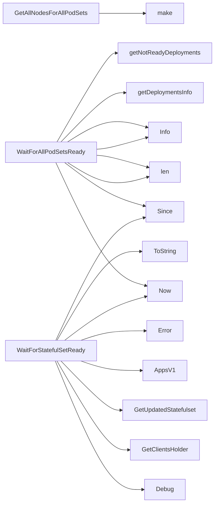

## Package podsets (github.com/redhat-best-practices-for-k8s/certsuite/tests/lifecycle/podsets)

### Functions

- **GetAllNodesForAllPodSets** — func([]*provider.Pod)(map[string]bool)
- **WaitForAllPodSetsReady** — func(*provider.TestEnvironment, time.Duration, *log.Logger)([]*provider.Deployment, []*provider.StatefulSet)
- **WaitForStatefulSetReady** — func(string, string, time.Duration, *log.Logger)(bool)

### Globals

- **WaitForDeploymentSetReady**: 
- **WaitForScalingToComplete**: 

### Call graph (exported symbols, partial)

### Symbol docs

- [function GetAllNodesForAllPodSets](symbols/function_GetAllNodesForAllPodSets.md)
- [function WaitForAllPodSetsReady](symbols/function_WaitForAllPodSetsReady.md)
- [function WaitForStatefulSetReady](symbols/function_WaitForStatefulSetReady.md)
