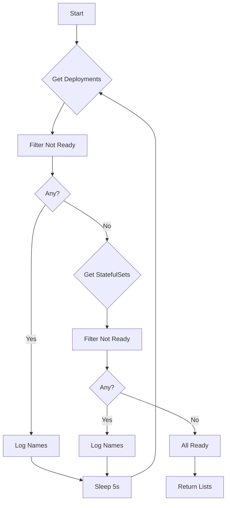

WaitForAllPodSetsReady`

```go
func WaitForAllPodSetsReady(
    env *provider.TestEnvironment,
    timeout time.Duration,
    log *log.Logger,
) ([]*provider.Deployment, []*provider.StatefulSet)
```

---

## Purpose

`WaitForAllPodSetsReady` is a helper used in the CertSuite test suite to pause execution until **every** Deployment and StatefulSet created by the current test environment has reached its ready state.  
The function repeatedly polls the Kubernetes API via the supplied `TestEnvironment`, checks each resource’s status, and returns once all are ready or when the given timeout expires.

---

## Parameters

| Name   | Type                     | Description |
|--------|--------------------------|-------------|
| `env`  | `*provider.TestEnvironment` | The test environment that owns the deployments/statefulsets. It exposes methods to list resources (`GetDeployments`, `GetStatefulSets`) and inspect their status. |
| `timeout` | `time.Duration` | Maximum duration to wait for readiness before giving up. |
| `log`  | `*log.Logger` | Logger used for progress and error messages. |

---

## Return Values

1. **Deployments** – slice of pointers to all deployments that were ready at the end of the wait (or nil if none).  
2. **StatefulSets** – slice of pointers to all statefulsets that were ready at the end of the wait (or nil if none).

Both slices are empty if the function timed out or encountered an error before any resource became ready.

---

## Key Dependencies & Calls

| Dependency | Role |
|------------|------|
| `getDeploymentsInfo(env)` | Retrieves all deployments in the environment and logs their names. |
| `getNotReadyDeployments(deploys, log)` | Filters deployments that are not yet ready. |
| `getStatefulSetsInfo(env)` | Retrieves all statefulsets in the environment and logs their names. |
| `getNotReadyStatefulSets(sts, log)` | Filters statefulsets that are not yet ready. |
| `WaitForDeploymentSetReady` (global) | A helper that waits for a **single** Deployment to become ready; used internally by `getNotReadyDeployments`. |
| `WaitForScalingToComplete` (global) | Ensures scaling operations finish before checking readiness. |

The function also uses standard library helpers:
- `time.Now`, `time.Since` – to enforce the timeout.
- `time.Sleep` – short pauses between polls.

---

## Algorithm Overview

1. **Initial Logging**  
   Log the total number of deployments and statefulsets discovered.

2. **Loop Until Timeout**  
   Repeatedly (every 5 s) perform:
   * Get all deployments → log count.
   * Filter not‑ready deployments using `getNotReadyDeployments`.
   * If any remain, log their names and sleep; otherwise break the loop.
   * Repeat similar steps for statefulsets.

3. **Timeout Handling**  
   If the elapsed time exceeds `timeout`, log an error and return the current lists (which may be incomplete).

4. **Success Path**  
   Once both sets are empty, return slices of ready deployments and statefulsets.

---

## Side Effects

- The function writes to the supplied logger but does not modify any resources.
- It relies on helper functions that may internally call `WaitForDeploymentSetReady` or `WaitForScalingToComplete`, which perform their own blocking waits; those helpers are considered side‑effect free for this context.

---

## Package Context

The **podsets** package is part of the CertSuite test harness, focused on managing and verifying Kubernetes PodSets (Deployments & StatefulSets).  
`WaitForAllPodSetsReady` sits at a high level in that hierarchy: it orchestrates readiness checks across all pod‑set types created during a test run. The function is used by higher‑level lifecycle tests to guarantee that the system under test has fully rolled out before proceeding with further assertions.

---

## Suggested Mermaid Diagram



This diagram visualizes the polling loop that alternates between Deployments and StatefulSets until both are ready or a timeout occurs.
