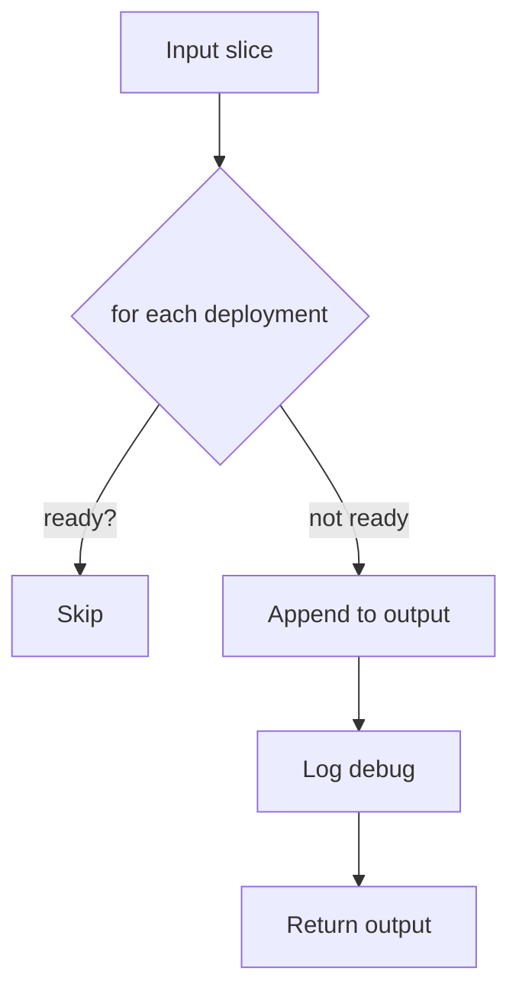

getNotReadyDeployments`

| Aspect | Details |
|--------|---------|
| **Signature** | `func getNotReadyDeployments(deployments []*provider.Deployment) []*provider.Deployment` |
| **Visibility** | Unexported (used only inside the `podsets` test package). |

### Purpose
Filters a slice of deployments, returning only those that are *not* in a ready state.  
The function is used by the tests to identify failures during the deployment‑rollout phase.

### Parameters
| Name | Type | Description |
|------|------|-------------|
| `deployments` | `[]*provider.Deployment` | A list of deployments retrieved from the cluster (via `client.Client`). |

### Return Value
| Type | Meaning |
|------|---------|
| `[]*provider.Deployment` | Slice containing only the deployments that are not ready. The order is preserved from the input slice. |

### Implementation Flow
1. **Iterate** over each deployment in the supplied slice.
2. For each deployment, call the helper `isDeploymentReady(deployment)` to determine its status.
3. If a deployment is *not* ready:
   - Append it to an output slice (`notReady`).
   - Log a debug message using the test logger (via `Debug(...)`).  
     The log includes the deployment name and namespace, converted to string with `ToString`.
4. Return the accumulated `notReady` slice.

### Key Dependencies
| Dependency | Role |
|------------|------|
| `isDeploymentReady` | Checks whether a single deployment has reached its desired replica count. |
| `Debug`, `Error` (from the test logger) | Produce diagnostic output; no state changes. |
| `ToString` | Serialises objects for logging. |

### Side‑Effects
- **Logging only** – the function does not modify any deployments or cluster state.
- It may log an error if `isDeploymentReady` fails, but this is captured in the debug output.

### Package Context
The `podsets` package contains tests that exercise Kubernetes pod set types (ReplicaSets, StatefulSets, Deployments).  
`getNotReadyDeployments` is a helper used by higher‑level test functions such as *waitForDeploymentSetReady* or *WaitForScalingToComplete* to report which deployments failed to reach readiness during the test run.

### Suggested Mermaid Diagram

--- 

**Note:** The function itself is straightforward; its main value lies in isolating the readiness check logic and providing clear diagnostic logs for test failures.
