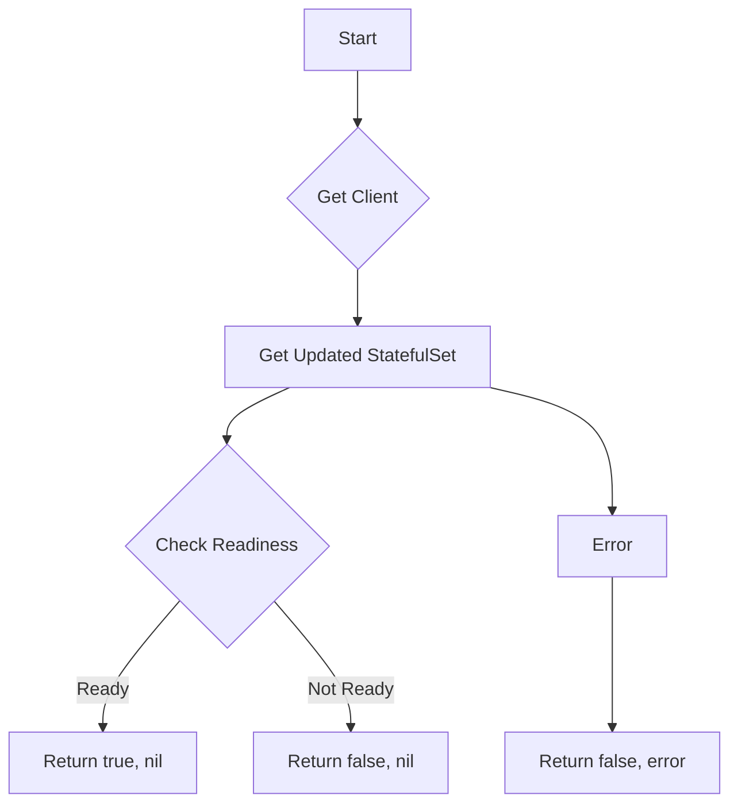

isStatefulSetReady`

| Feature | Details |
|---------|---------|
| **Visibility** | Unexported (used only inside the *podsets* test package) |
| **Signature** | `func(isStatefulSetReady(setName, ns string) (bool, error)` |
| **Purpose** | Determine whether a StatefulSet with name `setName` in namespace `ns` has reached its desired state. It performs a single check rather than waiting; callers can loop or use the returned boolean to trigger further actions. |

### Inputs
- **`setName` (string)** – The Kubernetes object name of the StatefulSet.
- **`ns` (string)** – Namespace in which the StatefulSet resides.

### Outputs
- **`bool`** – `true` if the StatefulSet is ready, otherwise `false`.
- **`error`** – Any error encountered while querying or interpreting the StatefulSet state. A non‑nil error indicates that readiness could not be determined.

### Key Dependencies & Calls

| Called Function | What it provides |
|-----------------|------------------|
| `AppsV1()` | Returns a typed client interface to interact with Apps v1 resources (e.g., StatefulSets). |
| `GetClientsHolder()` | Supplies the current Kubernetes client set used by the test harness. |
| `GetUpdatedStatefulset(setName, ns)` | Retrieves the most recent API object for the specified StatefulSet. |
| `IsStatefulSetReady(statefulSet)` | Evaluates the StatefulSet’s status conditions and pod counts to decide readiness. |

### Flow Overview

1. Acquire the AppsV1 client via `GetClientsHolder()`.
2. Pull the latest StatefulSet object with `GetUpdatedStatefulset`.
3. Pass that object to `IsStatefulSetReady` which inspects:
   - `.Status.ReadyReplicas`
   - `.Spec.Replicas`
   - Relevant condition types (`Available`, `Progressing`).
4. Return the boolean result and any error from the fetch or readiness check.

### Side‑Effects & Constraints
- **No mutation** – The function only reads state; it does not modify Kubernetes objects.
- **Network I/O** – Requires connectivity to the cluster API server; timeouts may propagate as errors.
- **Test‑only context** – Intended for use in integration tests under `github.com/redhat-best-practices-for-k8s/certsuite/tests/lifecycle/podsets`.

### Package Context
The *podsets* package contains utilities for verifying that Kubernetes workloads (Deployments, StatefulSets, etc.) reach a ready state during certsuite’s lifecycle tests.  
`isStatefulSetReady` is one of several helpers (`WaitForDeploymentSetReady`, `WaitForScalingToComplete`) that provide fine‑grained checks used by higher‑level test orchestration functions.
