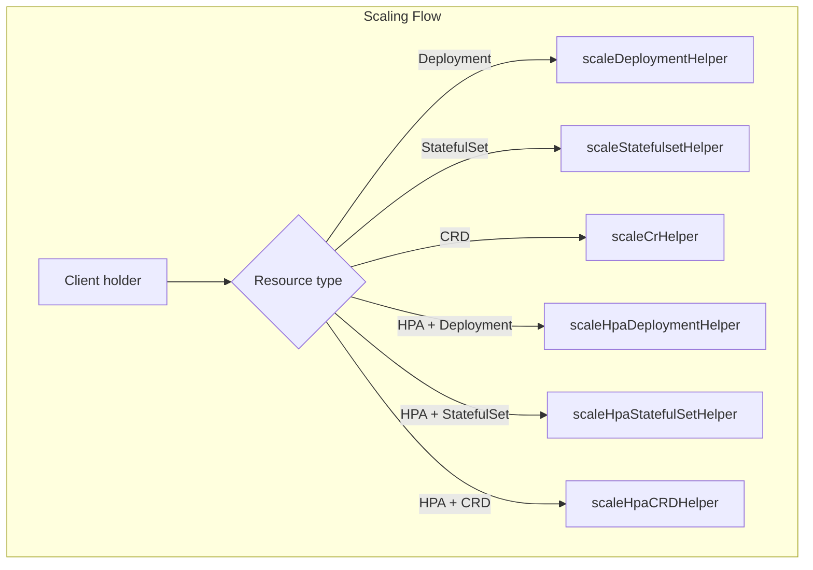
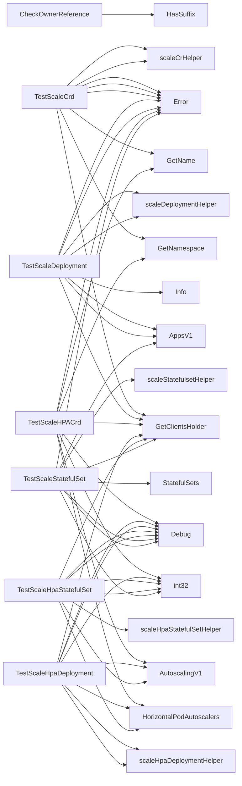

## Package scaling (github.com/redhat-best-practices-for-k8s/certsuite/tests/lifecycle/scaling)

# Scaling Test Package – `github.com/redhat-best-practices-for-k8s/certsuite/tests/lifecycle/scaling`

The **scaling** package implements a collection of unit‑test helpers that verify the ability of the system to scale various Kubernetes resources (Deployments, StatefulSets, CRDs and HPAs).  
All helpers are *pure functions* – they do not modify any global state.  They use the existing `clientsholder.ClientsHolder` infrastructure for talking to a K8s cluster.

> **Key idea**:  
> Each test helper performs a *scale‑up* followed by a *scale‑down* (or vice‑versa) and waits until the target resource reports the desired state.  The helpers expose a single boolean return value that indicates success (`true`) or failure (`false`).  

Below is a high‑level view of the data flow, followed by a description of the most important building blocks.

---

## 1. High‑Level Flow

```mermaid
flowchart TD
    A[Start] --> B{Is resource managed?}
    B -- Yes --> C[Get current replica count]
    B -- No --> D[Skip test]
    C --> E[Scale up/down (int32 target)]
    E --> F[Update via API]
    F --> G[Wait for readiness / scaling to finish]
    G --> H{Success?}
    H -->|yes| I[Return true]
    H -->|no | J[Log error, return false]
```

* `IsManaged` – used by tests that run only on known “managed” workloads.  
* `GetResourceHPA` – helper to find the HPA that owns a resource.  

The helpers are split into three categories:

| Category | Typical resources | Primary helper |
|----------|-------------------|----------------|
| **CRD scaling** | Custom resources (CRDs) + their HPAs | `TestScaleCrd`, `TestScaleHPACrd` |
| **Deployment scaling** | Deployments, HPAs for Deployments | `TestScaleDeployment`, `TestScaleHpaDeployment` |
| **StatefulSet scaling** | StatefulSets, HPAs for StatefulSets | `TestScaleStatefulSet`, `TestScaleHpaStatefulSet` |

---

## 2. Core Functions & Their Roles

### 2.1 Helper Selection / Filtering

| Function | Purpose | Notes |
|----------|---------|-------|
| **`IsManaged(name string, m []configuration.ManagedDeploymentsStatefulsets) bool`** | Checks if a deployment/statefulset is in the user‑supplied whitelist. | Called by tests that only run on known workloads. |
| **`GetResourceHPA(hpas []*scalingv1.HorizontalPodAutoscaler, name, ns, owner string) *scalingv1.HorizontalPodAutoscaler`** | Finds an HPA whose `OwnerReferences` match the given resource. | Used when a test needs to scale via the owning HPA. |
| **`CheckOwnerReference(ors []apiv1.OwnerReference, filters []configuration.CrdFilter, crds []*apiextv1.CustomResourceDefinition) bool`** | Determines whether a CRD is referenced by an owner reference that matches any filter. | Helps decide if a CRD should be scaled in tests. |

### 2.2 Scaling Logic

| Function | What it does | Where it lives |
|----------|--------------|----------------|
| **`scaleCrHelper(sc scale.ScalesGetter, gr schema.GroupResource, cr *provider.CrScale, target int32, dryRun bool, timeout time.Duration, log *log.Logger) bool`** | Generic scaling routine for any CR.  It reads the current replica count via `sc.Get()`, applies a new value with `Update()`, and waits until `WaitForScalingToComplete`. | In `crd_scaling.go` |
| **`scaleDeploymentHelper(apps typedappsv1.AppsV1Interface, dep *appsv1.Deployment, target int32, timeout time.Duration, dryRun bool, log *log.Logger) bool`** | Same as above but uses the Deployment client.  It also calls `WaitForDeploymentSetReady`. | In `deployment_scaling.go` |
| **`scaleStatefulsetHelper(cs *clientsholder.ClientsHolder, ss v1.StatefulSetInterface, set *appsv1.StatefulSet, target int32, timeout time.Duration, log *log.Logger) bool`** | Handles scaling for StatefulSets.  Uses `WaitForStatefulSetReady`. | In `statefulset_scaling.go` |
| **`scaleHpaCRDHelper(hps HorizontalPodAutoscalerInterface, name, ns, owner string, target int32, scaleTarget int32, timeout time.Duration, gr schema.GroupResource, log *log.Logger) bool`** | Scales a CRD via its HPA.  Calls `Update()` on the HPA spec and then waits for scaling to finish. | In `crd_scaling.go` |
| **`scaleHpaDeploymentHelper(hps HorizontalPodAutoscalerInterface, name, ns, owner string, target int32, scaleTarget int32, timeout time.Duration, log *log.Logger) bool`** | Same as above but targeted at Deployments and uses `WaitForDeploymentSetReady`. | In `deployment_scaling.go` |
| **`scaleHpaStatefulSetHelper(hps HorizontalPodAutoscalerInterface, name, ns, owner string, target int32, scaleTarget int32, timeout time.Duration, log *log.Logger) bool`** | Same as above but for StatefulSets and uses `WaitForStatefulSetReady`. | In `statefulset_scaling.go` |

### 2.3 Public Test Functions

| Function | Signature | Role |
|----------|-----------|------|
| **`TestScaleCrd(cr *provider.CrScale, gr schema.GroupResource, timeout time.Duration, log *log.Logger) bool`** | Scales a CRD directly (no HPA).  Calls `scaleCrHelper`. | Test entry point for CRDs. |
| **`TestScaleDeployment(dep *appsv1.Deployment, timeout time.Duration, log *log.Logger) bool`** | Scales a Deployment via its spec.  Calls `scaleDeploymentHelper`. | Test entry point for Deployments. |
| **`TestScaleStatefulSet(set *appsv1.StatefulSet, timeout time.Duration, log *log.Logger) bool`** | Scales a StatefulSet via its spec.  Calls `scaleStatefulsetHelper`. | Test entry point for StatefulSets. |
| **`TestScaleHPACrd(cr *provider.CrScale, hpa *scalingv1.HorizontalPodAutoscaler, gr schema.GroupResource, timeout time.Duration, log *log.Logger) bool`** | Scales a CRD through its HPA.  Calls `scaleHpaCRDHelper`. | Test entry point for CRDs with HPAs. |
| **`TestScaleHpaDeployment(dep *provider.Deployment, hpa *v1autoscaling.HorizontalPodAutoscaler, timeout time.Duration, log *log.Logger) bool`** | Scales a Deployment via its HPA.  Calls `scaleHpaDeploymentHelper`. | Test entry point for Deployments with HPAs. |
| **`TestScaleHpaStatefulSet(set *appsv1.StatefulSet, hpa *v1autoscaling.HorizontalPodAutoscaler, timeout time.Duration, log *log.Logger) bool`** | Scales a StatefulSet via its HPA.  Calls `scaleHpaStatefulSetHelper`. | Test entry point for StatefulSets with HPAs. |

All public functions follow the same pattern:

1. Retrieve the Kubernetes client(s) (`clientsholder.GetClientsHolder()`).
2. Log initial state (replicas, target replicas).
3. Call the corresponding private helper to perform the scale operation.
4. Return `true` if the helper reported success, otherwise log an error and return `false`.

---

## 3. Interaction with External Packages

| Package | What it provides |
|---------|------------------|
| **`clientsholder`** | Centralised access to typed clients (`AppsV1`, `AutoscalingV1`, etc.). |
| **`log`** | Structured logger used by all helpers (debug, info, error). |
| **`provider`** | Contains lightweight wrappers (`CrScale`, `Deployment`) that expose minimal fields needed for tests. |
| **`configuration`** | Holds user‑defined lists of managed workloads and CRD filters. |
| **`podsets`** | Utility functions (e.g., `WaitForDeploymentSetReady`). |

---

## 4. Error Handling & Retry

All helpers rely on Kubernetes client-go’s `retry.RetryOnConflict` to cope with optimistic concurrency conflicts when updating a resource.  
After an update, they invoke one of the *wait* helpers (`WaitForScalingToComplete`, `WaitForDeploymentSetReady`, etc.) that poll the API until the desired replica count is observed or a timeout expires.

If any step fails, the helper logs the error and returns `false`.  The public test functions then surface this result to the caller (e.g., a test harness).

---

## 5. Suggested Mermaid Diagram



This diagram shows how each public test function delegates to a specialized helper based on the resource being scaled.

---

### Bottom Line

The **scaling** package is a focused set of pure helpers that:

* Verify scaling behavior for Deployments, StatefulSets and CRDs.
* Support both direct spec updates and HPA‑driven scaling.
* Use retry logic and wait utilities to ensure eventual consistency.
* Expose a simple boolean API suitable for integration into larger test suites.

All logic is self‑contained; there are no global variables or mutable state beyond the Kubernetes clients themselves.

### Functions

- **CheckOwnerReference** — func([]apiv1.OwnerReference, []configuration.CrdFilter, []*apiextv1.CustomResourceDefinition)(bool)
- **GetResourceHPA** — func([]*scalingv1.HorizontalPodAutoscaler, string, string, string)(*scalingv1.HorizontalPodAutoscaler)
- **IsManaged** — func(string, []configuration.ManagedDeploymentsStatefulsets)(bool)
- **TestScaleCrd** — func(*provider.CrScale, schema.GroupResource, time.Duration, *log.Logger)(bool)
- **TestScaleDeployment** — func(*appsv1.Deployment, time.Duration, *log.Logger)(bool)
- **TestScaleHPACrd** — func(*provider.CrScale, *scalingv1.HorizontalPodAutoscaler, schema.GroupResource, time.Duration, *log.Logger)(bool)
- **TestScaleHpaDeployment** — func(*provider.Deployment, *v1autoscaling.HorizontalPodAutoscaler, time.Duration, *log.Logger)(bool)
- **TestScaleHpaStatefulSet** — func(*appsv1.StatefulSet, *v1autoscaling.HorizontalPodAutoscaler, time.Duration, *log.Logger)(bool)
- **TestScaleStatefulSet** — func(*appsv1.StatefulSet, time.Duration, *log.Logger)(bool)

### Call graph (exported symbols, partial)



### Symbol docs

- [function CheckOwnerReference](symbols/function_CheckOwnerReference.md)
- [function GetResourceHPA](symbols/function_GetResourceHPA.md)
- [function IsManaged](symbols/function_IsManaged.md)
- [function TestScaleCrd](symbols/function_TestScaleCrd.md)
- [function TestScaleDeployment](symbols/function_TestScaleDeployment.md)
- [function TestScaleHPACrd](symbols/function_TestScaleHPACrd.md)
- [function TestScaleHpaDeployment](symbols/function_TestScaleHpaDeployment.md)
- [function TestScaleHpaStatefulSet](symbols/function_TestScaleHpaStatefulSet.md)
- [function TestScaleStatefulSet](symbols/function_TestScaleStatefulSet.md)
