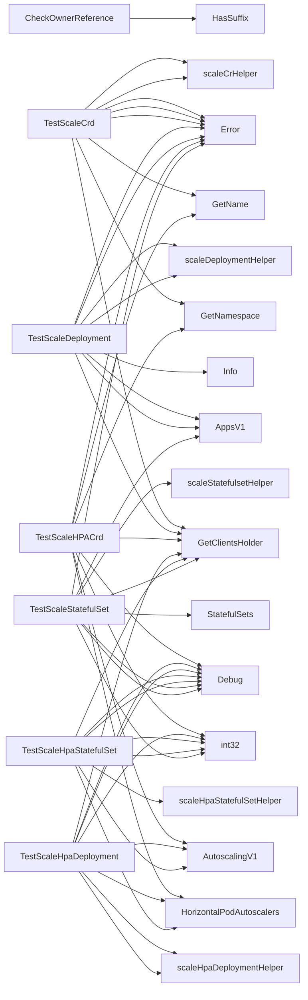

## Package scaling (github.com/redhat-best-practices-for-k8s/certsuite/tests/lifecycle/scaling)

### Functions

- **CheckOwnerReference** — func([]apiv1.OwnerReference, []configuration.CrdFilter, []*apiextv1.CustomResourceDefinition)(bool)
- **GetResourceHPA** — func([]*scalingv1.HorizontalPodAutoscaler, string, string, string)(*scalingv1.HorizontalPodAutoscaler)
- **IsManaged** — func(string, []configuration.ManagedDeploymentsStatefulsets)(bool)
- **TestScaleCrd** — func(*provider.CrScale, schema.GroupResource, time.Duration, *log.Logger)(bool)
- **TestScaleDeployment** — func(*appsv1.Deployment, time.Duration, *log.Logger)(bool)
- **TestScaleHPACrd** — func(*provider.CrScale, *scalingv1.HorizontalPodAutoscaler, schema.GroupResource, time.Duration, *log.Logger)(bool)
- **TestScaleHpaDeployment** — func(*provider.Deployment, *v1autoscaling.HorizontalPodAutoscaler, time.Duration, *log.Logger)(bool)
- **TestScaleHpaStatefulSet** — func(*appsv1.StatefulSet, *v1autoscaling.HorizontalPodAutoscaler, time.Duration, *log.Logger)(bool)
- **TestScaleStatefulSet** — func(*appsv1.StatefulSet, time.Duration, *log.Logger)(bool)

### Call graph (exported symbols, partial)

### Symbol docs

- [function CheckOwnerReference](symbols/function_CheckOwnerReference.md)
- [function GetResourceHPA](symbols/function_GetResourceHPA.md)
- [function IsManaged](symbols/function_IsManaged.md)
- [function TestScaleCrd](symbols/function_TestScaleCrd.md)
- [function TestScaleDeployment](symbols/function_TestScaleDeployment.md)
- [function TestScaleHPACrd](symbols/function_TestScaleHPACrd.md)
- [function TestScaleHpaDeployment](symbols/function_TestScaleHpaDeployment.md)
- [function TestScaleHpaStatefulSet](symbols/function_TestScaleHpaStatefulSet.md)
- [function TestScaleStatefulSet](symbols/function_TestScaleStatefulSet.md)
