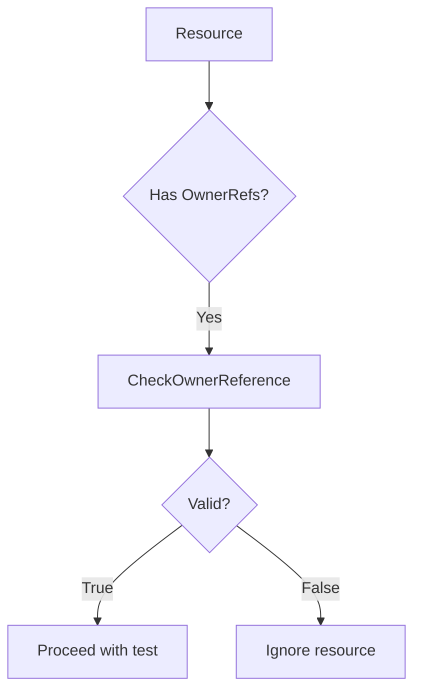

CheckOwnerReference`

### Purpose
`CheckOwnerReference` validates that the owner references attached to a Kubernetes object are **allowed** by the current test configuration.

In the scaling tests this function is called for every resource that may be owned (e.g., Pods, Deployments). It ensures that:

1. The reference’s `Kind` matches one of the CRD kinds that are being filtered in the test.
2. The reference’s `APIVersion` ends with a suffix that belongs to an allowed API group.

If both conditions are satisfied, the resource is considered valid for further scaling operations; otherwise it is ignored.

### Signature
```go
func CheckOwnerReference(
    ownerRefs []apiv1.OwnerReference,
    filters   []configuration.CrdFilter,
    crds      []*apiextv1.CustomResourceDefinition,
) bool
```

| Parameter | Type | Description |
|-----------|------|-------------|
| `ownerRefs` | `[]apiv1.OwnerReference` | List of owner references from a Kubernetes object. |
| `filters`   | `[]configuration.CrdFilter` | Configuration that lists which CRDs should be considered. Each filter contains a `CRDName` and a list of allowed `Kinds`. |
| `crds`      | `[]*apiextv1.CustomResourceDefinition` | The full set of CRDs present in the cluster, used to resolve group information. |

**Return value**

- `true` – at least one owner reference satisfies both the kind and API‑group checks.
- `false` – no valid owner references were found.

### Key Dependencies

| Dependency | Role |
|------------|------|
| `HasSuffix` (from Go's standard library) | Used to verify that a reference’s `APIVersion` ends with one of the allowed suffixes derived from CRD groups. |
| `apiv1.OwnerReference` | Standard Kubernetes type representing an owner link. |
| `configuration.CrdFilter` | Test‑specific struct that enumerates acceptable CRDs and their kinds. |
| `apiextv1.CustomResourceDefinition` | Provides group information needed to construct the suffixes for `HasSuffix`. |

### Algorithm (high‑level)

1. **Build allowed suffix list**  
   For each CRD in `crds`, extract its `Spec.Group` and add it as a suffix (`group/`) that will be accepted by `HasSuffix`.

2. **Iterate owner references**  
   For every reference in `ownerRefs`:
   - Check if the reference’s `Kind` appears in any filter’s `Kinds`.
   - Use `HasSuffix` to confirm that the reference’s `APIVersion` ends with one of the allowed suffixes.

3. **Return true on first match** – short‑circuit when a valid owner is found; otherwise return false after exhausting all references.

### Side Effects

- None. The function performs read‑only checks and returns a boolean flag.
- No external state or global variables are mutated.

### Package Context

The `scaling` package contains helpers for lifecycle tests that exercise the scaling behavior of custom resources.  
`CheckOwnerReference` is part of the *scaling helper* module (`scaling_helper.go`) and is invoked during test setup to filter out objects whose owners are not relevant to the current scaling scenario.



This concise function ensures that scaling tests only operate on resources whose ownership is explicitly permitted by the test configuration.
