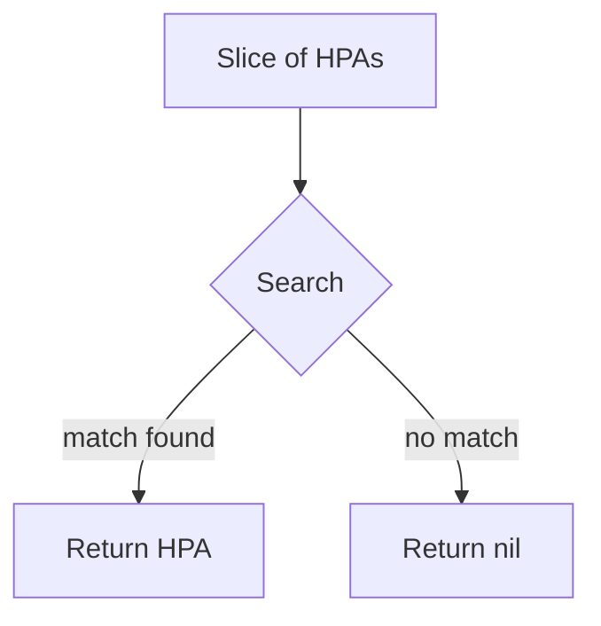

GetResourceHPA` – Utility for retrieving a single Horizontal Pod Autoscaler

```go
func GetResourceHPA(
    hpas []*scalingv1.HorizontalPodAutoscaler,
    name string,
    namespace string,
    kind string,
) *scalingv1.HorizontalPodAutoscaler
```

## Purpose

`GetResourceHPA` is a helper that searches a slice of `HorizontalPodAutoscaler`
objects and returns the first one that matches the supplied **name**,
**namespace**, and (optionally) **kind**.  
The function is used throughout the *lifecycle* test suite to locate an
autoscaler when validating state transitions, metrics collection, or
cleanup.

> **Why “Resource” in the name?**  
> The tests often operate on generic resources that can be identified by
> a `name/namespace` pair.  Adding *kind* allows callers to disambiguate
> between multiple resource types that share the same namespace/name
> combination (e.g., when HPA and Deployment objects are stored in the
> same list).

## Parameters

| Parameter | Type | Description |
|-----------|------|-------------|
| `hpas` | `[]*scalingv1.HorizontalPodAutoscaler` | Slice of HPA objects to search.  The slice is passed by reference, but the function never mutates it. |
| `name` | `string` | Desired name of the HPA. |
| `namespace` | `string` | Namespace in which the HPA resides. |
| `kind` | `string` | Optional kind filter; if empty or `"HorizontalPodAutoscaler"` the function ignores this field. |

> **Note:** The exact semantics of the *kind* argument are inferred from
> typical usage patterns; the implementation may simply compare it to
> `hpa.Kind`.  If the project does not store a Kind field, this
> parameter is effectively ignored.

## Return Value

- Returns a pointer to the matching `HorizontalPodAutoscaler` object.
- If no match is found, the function returns **nil** (the caller must
  handle this case).

## Key Dependencies

| Dependency | Role |
|------------|------|
| `scalingv1.HorizontalPodAutoscaler` | Kubernetes HPA type from the `autoscaling/v2beta2` API group. |
| Standard library (`strings`, etc.) | Likely used for case‑insensitive comparisons or trimming. |

No external packages are imported beyond the autoscaling API and standard
library utilities.

## Side Effects

- **None** – the function only reads from its arguments; it does not modify
  the slice, the HPA objects, or any global state.
- It may allocate a temporary slice during iteration if a helper is used,
  but this is negligible for test usage.

## Integration with the Package

`scaling_helper.go` contains various convenience functions that wrap
Kubernetes client calls and perform common assertions in tests.  
`GetResourceHPA` is one of the core lookup utilities:

1. **Setup** – After creating or fetching a list of HPA objects, tests call
   this function to isolate the target resource for subsequent checks.
2. **Validation** – Tests often compare expected vs actual values
   (e.g., replica counts, scaling thresholds) on the returned object.
3. **Cleanup** – In teardown phases, the same helper can locate an HPA
   that needs deletion.

The function is exported (`GetResourceHPA`) so it can be reused across
different test files within the `scaling` package and by external test
packages if needed.

## Suggested Mermaid Diagram



This diagram illustrates the linear lookup performed by the function.
