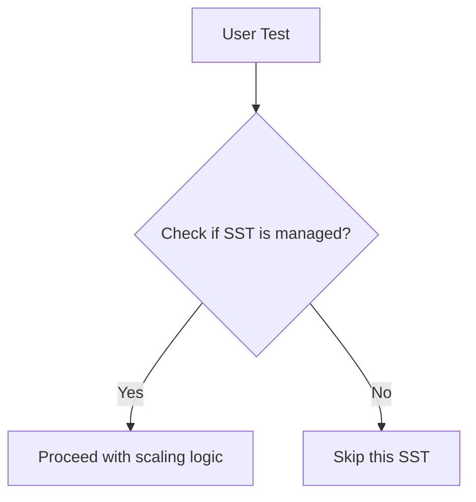

IsManaged` – Test Helper

```go
func IsManaged(name string, deployments []configuration.ManagedDeploymentsStatefulsets) bool
```

#### Purpose  
Used in the *lifecycle/scaling* test suite to determine whether a given StatefulSet name is part of the set of deployments that are expected to be managed by Cert‑Suite.  
It simply performs a lookup over a slice of `ManagedDeploymentsStatefulsets` objects and returns `true` if the supplied `name` matches any entry.

#### Parameters  

| Name | Type | Description |
|------|------|-------------|
| `name` | `string` | The name of the StatefulSet to check. |
| `deployments` | `[]configuration.ManagedDeploymentsStatefulsets` | Slice containing all deployments that Cert‑Suite should manage during scaling tests. |

> **Note:**  
> *The type `configuration.ManagedDeploymentsStatefulsets` is defined in the test configuration package and typically holds a field such as `Name string`. The function relies only on this field.*

#### Return Value  

| Type | Description |
|------|-------------|
| `bool` | `true` if `name` appears in any element of `deployments`; otherwise `false`. |

#### Dependencies & Side‑Effects  
- **Dependencies:** None beyond the standard library; it just iterates over a slice.  
- **Side‑Effects:** None – purely functional.

#### How It Fits the Package  

The `scaling` package implements end‑to‑end tests that scale Kubernetes resources up and down. During those tests, the framework needs to know whether a particular StatefulSet should be considered part of the test’s managed set.  
`IsManaged` is called by other helper functions (e.g., when waiting for pods to reach a desired state) to filter out unrelated resources.

#### Suggested Usage

```go
if !scaling.IsManaged(sts.Name, config.ManagedDeploymentsStatefulsets) {
    // Skip this StatefulSet – it’s not part of the test.
}
```

#### Mermaid Diagram (Optional)



This concise helper keeps the test code clean and avoids repeated lookup logic across the scaling suite.
