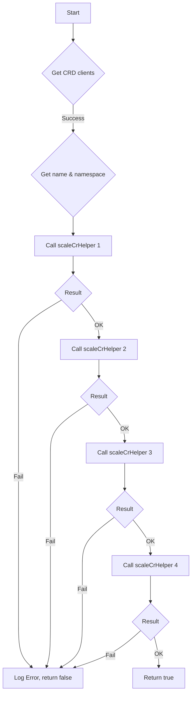

TestScaleCrd`

| Feature | Description |
|---------|-------------|
| **Package** | `github.com/redhat-best-practices-for-k8s/certsuite/tests/lifecycle/scaling` |
| **Signature** | `func (*provider.CrScale, schema.GroupResource, time.Duration, *log.Logger) bool` |
| **Exported?** | ✅ |

### Purpose
`TestScaleCrd` is a test helper that verifies whether a custom‑resource‑definition (CRD) can be scaled within a given timeout.  
It attempts to scale the CRD in four distinct ways (likely `scale`, `autoscale`, etc.) and checks for success or failure. The function returns `true` if **all** scaling attempts succeed; otherwise it logs errors and returns `false`.

### Parameters
| Name | Type | Role |
|------|------|------|
| `crScale` | `*provider.CrScale` | Holds the current CRD object, its namespace and name, plus client helpers. |
| `groupResource` | `schema.GroupResource` | The group‑resource pair that identifies which CRD to target. |
| `timeout` | `time.Duration` | Maximum time allowed for each scaling operation. |
| `logger` | `*log.Logger` | Used to log progress and errors; passed through to helper functions. |

### Return Value
- `bool`:  
  *`true`* – every scale attempt succeeded within the timeout.  
  *`false`* – at least one attempt failed or timed out.

### Key Dependencies & Flow

1. **Client acquisition** – `GetClientsHolder(crScale)` fetches a Kubernetes client set capable of performing scaling operations on the CRD.
2. **Identification** – `crScale.GetName()` and `crScale.GetNamespace()` supply the target resource’s name and namespace.
3. **Scaling attempts** – `scaleCrHelper` is invoked four times, each time passing:
   * The `groupResource`
   * The obtained client holder
   * Name & namespace
   * The timeout value
   * The logger
4. **Error handling** – If any call to `scaleCrHelper` returns an error, it is logged with `logger.Error(err)` and the function immediately returns `false`.

### Side Effects
- Logs messages for each scaling attempt and for any errors encountered.
- Does **not** modify the CRD itself; only performs scaling operations that are expected to be reversible (e.g., adjusting replicas).

### How It Fits the Package
The `scaling` package contains tests that validate the lifecycle of various Kubernetes objects.  
`TestScaleCrd` is specifically for CRDs, ensuring they support scaling semantics before proceeding with further lifecycle checks. The function is used by higher‑level test orchestrators to confirm that custom resources behave correctly under load or during scale events.

--- 

**Note:** All helper functions (`GetClientsHolder`, `scaleCrHelper`) are assumed to be part of the same package or imported from related modules; their internal logic is not detailed here.
