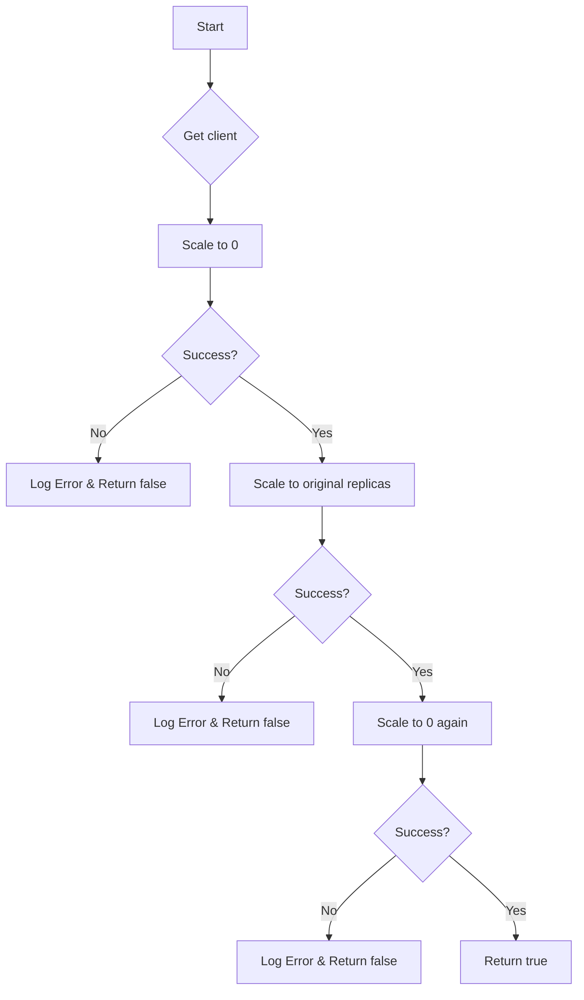

TestScaleDeployment`

> **Location**  
> `github.com/redhat-best-practices-for-k8s/certsuite/tests/lifecycle/scaling/deployment_scaling.go:40`  

## Purpose
`TestScaleDeployment` is a helper used by the CertSuite scaling tests to verify that a Kubernetes Deployment can be scaled up and down within a specified timeout.  
It attempts three successive scale operations on the supplied deployment:

1. **Scale to 0 replicas** – verifies the pod set disappears.
2. **Scale back to the original replica count** – checks that pods are recreated.
3. **Scale again to 0 replicas** – ensures scaling down works after a previous scale‑up.

If any of these steps fail, the function logs an error and returns `false`.  
A successful run returns `true`.

## Signature
```go
func TestScaleDeployment(deployment *appsv1.Deployment,
                         timeout   time.Duration,
                         logger    *log.Logger) bool
```

| Parameter | Type                        | Description |
|-----------|-----------------------------|-------------|
| `deployment` | `*appsv1.Deployment` | The Deployment object to be scaled. |
| `timeout` | `time.Duration` | Maximum wait time for each scaling operation. |
| `logger` | `*log.Logger` | Logger used for progress and error messages. |

## Dependencies & Calls

| Called Function | Purpose in this context |
|-----------------|-------------------------|
| `GetClientsHolder()` | Retrieves the Kubernetes client set needed to interact with the cluster. |
| `scaleDeploymentHelper(clientset, deployment, replicas, timeout)` | Performs a single scale operation and waits for the desired replica count. |
| `AppsV1()` | Helper that returns an AppsV1 interface from the client set (used inside `scaleDeploymentHelper`). |
| `Info(logger, msg)` | Logs informational messages about scaling progress. |
| `Error(logger, err)` | Logs errors encountered during scaling. |

The function internally calls `scaleDeploymentHelper` four times – each time after logging an `Info`.  
If any call returns an error, the corresponding `Error` is logged and the function exits early.

## Side Effects

* **Kubernetes Cluster State** – The deployment’s replica count is altered; pods are created/destroyed accordingly.
* **Logging** – All progress and errors are written to the supplied logger.
* **Return Value** – A boolean flag indicating success (`true`) or failure (`false`).

## Package Context
The `scaling` package contains end‑to‑end tests for Kubernetes resource lifecycle operations.  
`TestScaleDeployment` is part of the *deployment scaling* test suite, used by higher‑level test functions that orchestrate a series of scaling scenarios across various workloads.

---

### Suggested Mermaid Flowchart



This diagram visualizes the sequential scaling steps and error handling flow.
