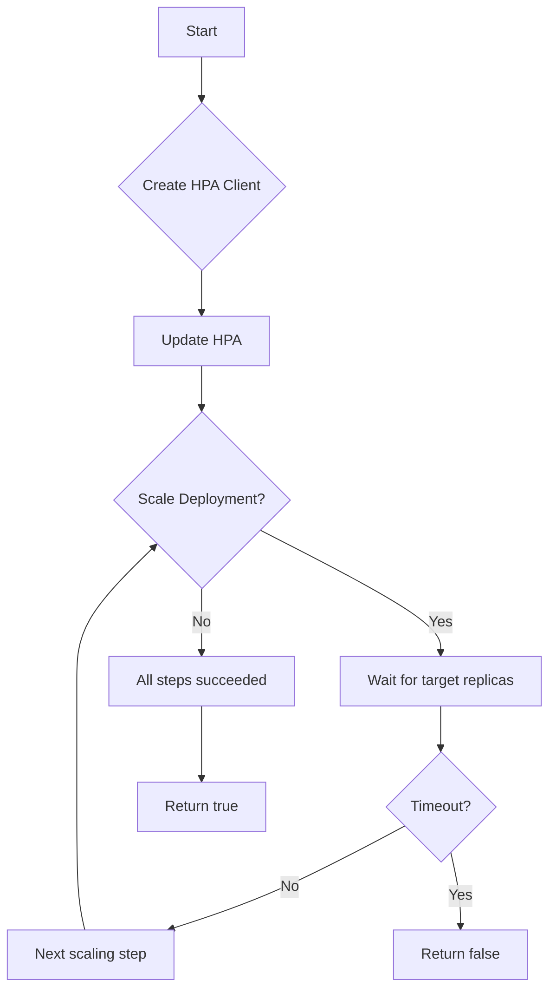

TestScaleHpaDeployment`

> **Location**: `tests/lifecycle/scaling/deployment_scaling.go` (line 113)

## Purpose

`TestScaleHpaDeployment` is a helper used in the CertSuite test suite to validate that a Deployment can be scaled correctly by its associated
[HorizontalPodAutoscaler](https://kubernetes.io/docs/tasks/run-application/horizontal-pod-autoscale/).  
The function repeatedly scales the HPA up and down, verifying that the underlying Deployment’s replica count matches the expected target.

It is *not* exported for external use; it is called by higher‑level test functions that orchestrate a full scaling lifecycle.

## Signature

```go
func TestScaleHpaDeployment(
    dep   *provider.Deployment,
    hpa   *v1autoscaling.HorizontalPodAutoscaler,
    timeout time.Duration,
    log  *log.Logger,
) bool
```

| Parameter | Type | Description |
|-----------|------|-------------|
| `dep`     | `*provider.Deployment` | The Deployment object that will be scaled. |
| `hpa`     | `*v1autoscaling.HorizontalPodAutoscaler` | The HPA controlling the Deployment. |
| `timeout` | `time.Duration` | Maximum time to wait for each scaling operation. |
| `log`     | `*log.Logger` | Logger used for debug output. |

**Return value**

- `true`  – All scale operations succeeded and the Deployment’s replica count matched expectations.
- `false` – One or more steps failed (e.g., HPA creation, scaling, or cleanup).

## Key Steps & Dependencies

1. **Create an HPA client holder**  
   ```go
   ch := GetClientsHolder()
   ```
   *Provides a cached set of Kubernetes clients.*

2. **Get the `autoscaling/v1` interface**  
   ```go
   hpaClient, err := AutoscalingV1(ch)
   ```
   *Allows CRUD operations on HPAs.*

3. **Create or update the HPA**  
   The function calls `scaleHpaDeploymentHelper(dep, hpa, timeout, log)` five times with alternating target replica counts (e.g., 2 → 4 → 2 …).  
   - Each call logs the desired state via `log.Debug`.
   - Internally it sets `hpa.Spec.ScaleTargetRef` to point at `dep`, updates the HPA resource, and waits until the Deployment’s status reflects the target.

4. **Cleanup** (implicit)  
   After scaling back to the original replica count, the test ends. No explicit deletion of the HPA is performed here; higher‑level tests may clean up separately.

### Helper Function `scaleHpaDeploymentHelper`

- Adjusts `hpa.Spec.MinReplicas` / `MaxReplicas` and `ScaleTargetRef`.
- Updates the HPA using `hpaClient.Update(context.TODO(), hpa, metav1.UpdateOptions{})`.
- Waits (polling) until the Deployment’s `.Status.Replicas` equals the desired value or the timeout expires.
- Logs progress via `log.Debug`.

## Side Effects

- **Kubernetes API calls**: creates/updates an HPA and reads the Deployment status.
- **State changes**: The Deployment’s replica count is temporarily altered to match each target in sequence.
- **Logging**: Emits debug messages at every major step.

No global variables are modified; all state lives within the passed objects and local scope.

## How It Fits the Package

The `scaling` package contains end‑to‑end tests that exercise various scaling mechanisms (Horizontal Pod Autoscaler, Cluster Autoscaler, etc.).  
`TestScaleHpaDeployment` is a building block for those tests:

```go
func TestHPA(t *testing.T) {
    dep := createTestDeployment()
    hpa := createTestHPA(dep)
    if !scaling.TestScaleHpaDeployment(dep, hpa, 2*time.Minute, log) {
        t.Fatalf("HPA scaling failed")
    }
}
```

By abstracting the repetitive scaling logic into this function, test writers can focus on orchestration and assertions rather than boilerplate.

---

**Mermaid diagram suggestion**



This diagram visualizes the iterative scaling loop performed by `TestScaleHpaDeployment`.
