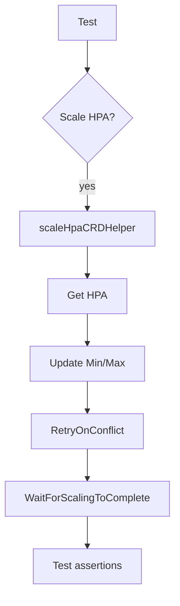

scaleHpaCRDHelper`

**Location**

```
/Users/deliedit/dev/certsuite/tests/lifecycle/scaling/crd_scaling.go:165
```

## Purpose

`scaleHpaCRDHelper` is a low‑level helper used by the scaling tests to adjust the desired replica count of a **HorizontalPodAutoscaler** (HPA) that was created as a Custom Resource Definition (CRD).  
It performs the following steps:

1. Retrieve the current HPA object from the cluster.
2. Update its `Spec.MinReplicas` and/or `Spec.MaxReplicas` to match the target values supplied by the test.
3. Persist the updated HPA back to the API server using a retry loop that handles *conflict* errors (common when multiple actors modify the same resource concurrently).
4. Wait until the scaling controller has finished applying the change, ensuring that the underlying Deployment/ReplicaSet reflects the new replica count before the test proceeds.

The function returns `true` if all steps succeed, otherwise it logs an error and returns `false`.

## Signature

```go
func scaleHpaCRDHelper(
    hps hps.HorizontalPodAutoscalerInterface,
    name string,
    namespace string,
    kind string,
    min int32,
    max int32,
    timeout time.Duration,
    resource schema.GroupResource,
    logger *log.Logger) bool
```

| Parameter | Type                              | Role |
|-----------|-----------------------------------|------|
| `hps`     | `HorizontalPodAutoscalerInterface` | Client for HPA resources. |
| `name`    | `string`                          | Name of the HPA CRD to scale. |
| `namespace` | `string`                      | Namespace where the HPA resides. |
| `kind`    | `string`                          | Kind of the underlying workload (e.g., `"Deployment"`). Used only for log messages. |
| `min`     | `int32`                           | Desired minimum replica count. |
| `max`     | `int32`                           | Desired maximum replica count. |
| `timeout` | `time.Duration`                   | How long to wait for scaling to finish. |
| `resource` | `schema.GroupResource`            | Resource identifier used by the scaling waiter. |
| `logger`  | `*log.Logger`                     | Logger for diagnostics. |

**Return value**

- `true`: scaling succeeded.
- `false`: an error occurred; details are logged.

## Key Dependencies

| Dependency | Role |
|------------|------|
| `RetryOnConflict` | Wraps the update in a retry loop to handle Kubernetes *conflict* errors. |
| `Get` | Retrieves the current HPA object. |
| `Update` | Persists changes back to the API server. |
| `WaitForScalingToComplete` | Blocks until the scaling controller reports that the desired replica count has been reached or the timeout expires. |
| `New` (from `wait`) | Creates a new waiter instance for the specific resource. |

All dependencies are part of the test harness; they do not modify any production code.

## Side‑Effects

- **External**: The function mutates the HPA CRD in the cluster and indirectly causes the associated workload to scale.
- **Logging**: Errors and progress messages are written to `logger`.
- No global state is altered.

## How It Fits Into the Package

The `scaling` package contains end‑to‑end tests that verify Kubernetes operators correctly respond to scaling requests.  
Typical test flow:

1. Create a workload (Deployment, etc.) and an HPA CRD.
2. Invoke `scaleHpaCRDHelper` to change the desired replica range.
3. Verify that the workload scales as expected.

`scaleHpaCRDHelper` encapsulates the boilerplate for safely updating an HPA CRD and waiting for completion, keeping individual tests concise and focused on assertions rather than API mechanics.

## Suggested Mermaid Diagram



This diagram illustrates the helper’s place between the test logic and Kubernetes API interactions.
