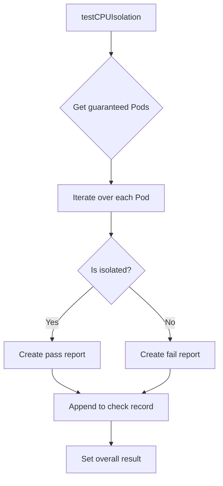

testCPUIsolation` – Lifecycle Test Helper

| Item | Description |
|------|-------------|
| **Package** | `lifecycle` (`github.com/redhat-best-practices-for-k8s/certsuite/tests/lifecycle`) |
| **Signature** | `func testCPUIsolation(c *checksdb.Check, env *provider.TestEnvironment)` |
| **Exported** | No (private helper used by the suite tests) |

## Purpose

`testCPUIsolation` verifies that all **guaranteed** Pods in the test environment are correctly isolated to exclusive CPU cores.  
It is part of the lifecycle test suite and runs after the Kubernetes cluster has been provisioned.

The function:

1. Retrieves the list of guaranteed Pods that request exclusive CPUs (`GetGuaranteedPodsWithExclusiveCPUs`).
2. Checks each Pod’s CPU isolation status with `IsCPUIsolationCompliant`.
3. Builds a report for every inspected Pod.
4. Aggregates the overall compliance result and records it in the provided `checksdb.Check`.

## Inputs

| Parameter | Type | Role |
|-----------|------|------|
| `c` | `*checksdb.Check` | The database record that will receive the test outcome and detailed pod reports. |
| `env` | `*provider.TestEnvironment` | Holds references to the running cluster, namespace, logger, etc., used for API calls and logging. |

## Key Dependencies

- **Kubernetes client** – via `env.ClientSet`, accessed inside helper functions (`GetGuaranteedPodsWithExclusiveCPUs`).
- **Logging helpers** – `LogInfo`, `LogError` write to the test log.
- **Pod reporting utilities** – `NewPodReportObject` creates a structured report entry.
- **Compliance checker** – `IsCPUIsolationCompliant` performs the actual isolation verification logic.
- **Result setter** – `SetResult` updates the `checksdb.Check` status.

## Side‑Effects

| Effect | Explanation |
|--------|-------------|
| Writes log entries via `LogInfo`/`LogError`. | Provides visibility into which Pods are checked and any errors. |
| Creates pod report objects (`NewPodReportObject`) and appends them to the check record. | Stores per‑Pod diagnostics for later inspection. |
| Calls `SetResult` on the `checksdb.Check`. | Marks the test as **pass** or **fail**, influencing overall suite results. |

No global state is mutated; all changes are scoped to the passed `Check` and the logger.

## Workflow Overview

1. **Retrieve Pods**  
   `GetGuaranteedPodsWithExclusiveCPUs(env)` returns a slice of guaranteed Pod objects that request exclusive CPUs.

2. **Iterate & Check**  
   For each Pod, the function:
   - Logs its name.
   - Calls `IsCPUIsolationCompliant(pod, env)` to determine isolation status.

3. **Report Generation**  
   - On success: `NewPodReportObject(pod, true)` → appended to check record.  
   - On failure: same with `false`, plus an error message via `LogError`.

4. **Finalize Result**  
   After all Pods are processed, the overall pass/fail status is set on the `Check` object using `SetResult`.

## Integration in the Package

- The lifecycle test suite invokes `testCPUIsolation` from its `RunTests` flow (typically after provisioning the cluster).
- It contributes to the final compliance report that certsuite produces for a Kubernetes installation.
- Because it only reads the environment and writes to the provided `Check`, it can be reused in other suites or extended tests.

--- 

**Bottom line:**  
`testCPUIsolation` is a lightweight, read‑only helper that validates CPU isolation for guaranteed Pods and records detailed results in the test database.
