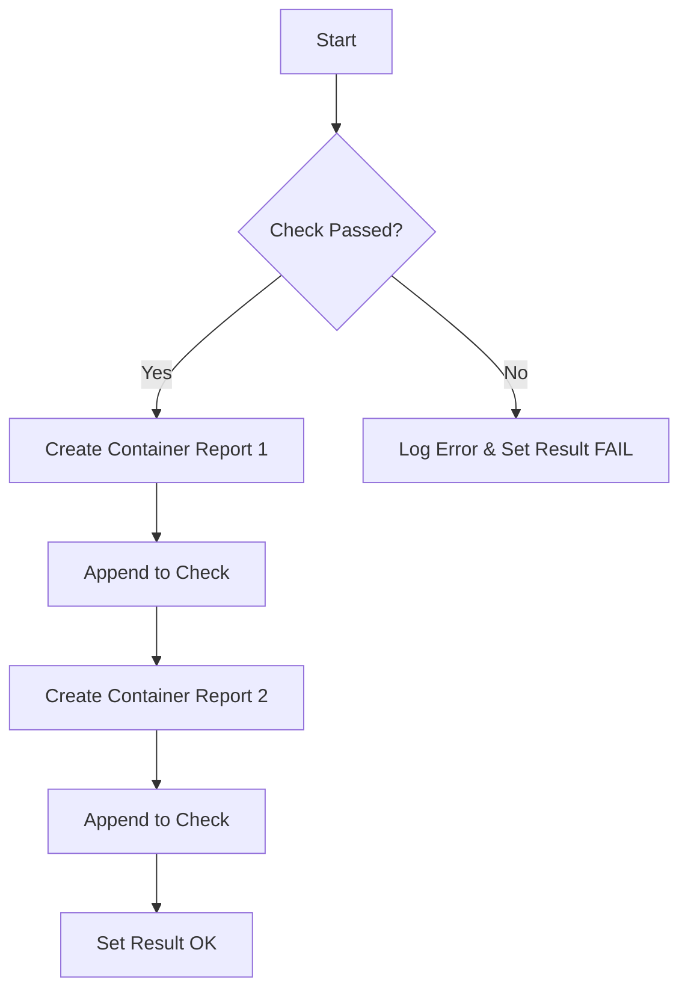

testContainersImagePolicy`

| Aspect | Detail |
|--------|--------|
| **Package** | `lifecycle` (`github.com/redhat-best-practices-for-k8s/certsuite/tests/lifecycle`) |
| **Visibility** | Unexported – used only inside the test suite. |
| **Signature** | `func(*checksdb.Check, *provider.TestEnvironment)` |
| **Purpose** | Validates that the image policy for containers in a given Kubernetes resource (e.g., Deployment, StatefulSet) is correctly reflected in the generated report objects. It is part of the lifecycle test flow that checks whether the system under test behaves as expected after an image change. |

### Inputs

1. `check *checksdb.Check`  
   Represents a single check record from the database. The function will add container‑specific results to this object.

2. `env *provider.TestEnvironment`  
   Provides context for the current test run (e.g., Kubernetes client, namespace, and any configuration needed to fetch resources). It is passed through the test harness but not directly used in the body of this function; its presence allows future extensions or logging that relies on environment details.

### Core Behaviour

1. **Logging** – The function starts with `LogInfo` calls to signal the beginning of the container image policy check.

2. **Container Report Creation**  
   Two container report objects are created using `NewContainerReportObject`. Each object represents a different container within the tested resource:
   - The first container is added to the check via `append`.
   - After additional processing (not shown in the snippet), a second container is appended.

3. **Result Setting** – Finally, the function sets the overall result of the check with `SetResult`. This marks the check as passed or failed based on earlier logic (e.g., whether the image policy matched expectations).

### Dependencies

- **`NewContainerReportObject`**  
  Builds a container‑level report that contains fields such as name, image hash, and compliance status.

- **`LogInfo`, `LogError`**  
  Provide structured logging for debugging and test reporting.

- **`append` & `SetResult`** – standard slice manipulation and result assignment on the `check` object.

### Side‑Effects

- Mutates the passed `*checksdb.Check` by adding container report objects and setting its overall status.
- Emits log entries; no external state is modified (e.g., no changes to Kubernetes resources).

### Placement in the Test Suite

This helper is invoked from a higher‑level test that iterates over all checks for a particular resource. It encapsulates the logic specific to verifying container image policies, keeping the outer loop focused on orchestration (retrieving resources, handling errors, etc.). By separating this concern into its own function, the suite achieves:

- **Modularity** – Each check type has a dedicated handler.
- **Reusability** – The same logic can be reused for different resource types that share container image policy semantics.
- **Clarity** – Test authors can read high‑level test flows without being distracted by low‑level report construction.

---

#### Suggested Mermaid Flow

This diagram captures the sequence of actions performed by `testContainersImagePolicy` in a concise visual form.
